# FinOps AWS - Guia Funcional

## Índice

1. [Introdução](#1-introdução)
2. [Capacidades da Solução](#2-capacidades-da-solução)
3. [Módulos Funcionais](#3-módulos-funcionais)
4. [Catálogo de Serviços AWS](#4-catálogo-de-serviços-aws)
5. [Análise de Custos](#5-análise-de-custos)
6. [Recomendações de Otimização](#6-recomendações-de-otimização)
7. [Monitoramento e Alertas](#7-monitoramento-e-alertas)
8. [Governança Multi-Conta](#8-governança-multi-conta)
9. [Relatórios e Dashboards](#9-relatórios-e-dashboards)
10. [Casos de Uso](#10-casos-de-uso)

---

## 1. Introdução

### 1.1 O que é FinOps AWS?

FinOps AWS é uma solução enterprise-grade para **gestão financeira de infraestrutura AWS**. A plataforma oferece:

- **Visibilidade Total**: Análise de 253 serviços AWS
- **Otimização Inteligente**: Recomendações baseadas em dados reais
- **Automação**: Execução serverless via AWS Lambda
- **Escalabilidade**: Suporte multi-conta e multi-região

### 1.2 Proposta de Valor

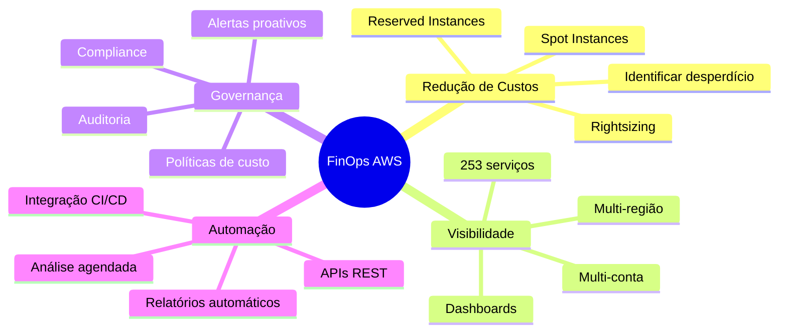

### 1.3 Benefícios Esperados

| Benefício | Descrição | Impacto Típico |
|-----------|-----------|----------------|
| **Redução de Custos** | Identificação de recursos ociosos e subdimensionados | 20-40% |
| **Visibilidade** | Dashboard unificado de todos os serviços | 100% cobertura |
| **Tempo** | Automação de análises manuais | 90% menos tempo |
| **Compliance** | Conformidade com políticas de custo | 100% auditável |

---

## 2. Capacidades da Solução

### 2.1 Visão Geral das Capacidades

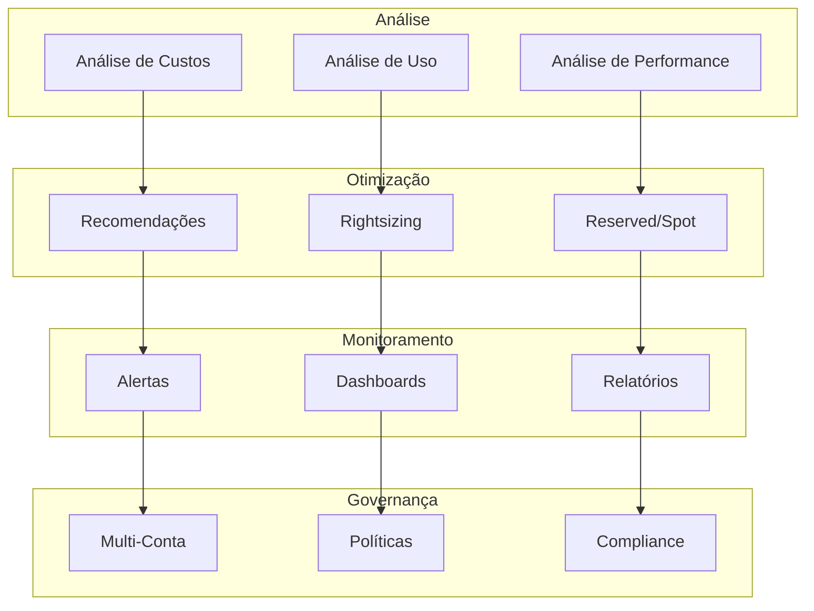

### 2.2 Matriz de Capacidades por Serviço

| Capacidade | Compute | Storage | Database | Network | Security | AI/ML |
|------------|---------|---------|----------|---------|----------|-------|
| Análise de Custo | ✅ | ✅ | ✅ | ✅ | ✅ | ✅ |
| Análise de Uso | ✅ | ✅ | ✅ | ✅ | ✅ | ✅ |
| Recomendações | ✅ | ✅ | ✅ | ✅ | ✅ | ✅ |
| Rightsizing | ✅ | ✅ | ✅ | ⚠️ | ❌ | ✅ |
| Reserved Instances | ✅ | ❌ | ✅ | ❌ | ❌ | ✅ |
| Spot Instances | ✅ | ❌ | ❌ | ❌ | ❌ | ✅ |
| Alertas | ✅ | ✅ | ✅ | ✅ | ✅ | ✅ |

**Legenda**: ✅ Disponível | ⚠️ Parcial | ❌ Não aplicável

---

## 3. Módulos Funcionais

### 3.1 Diagrama de Módulos

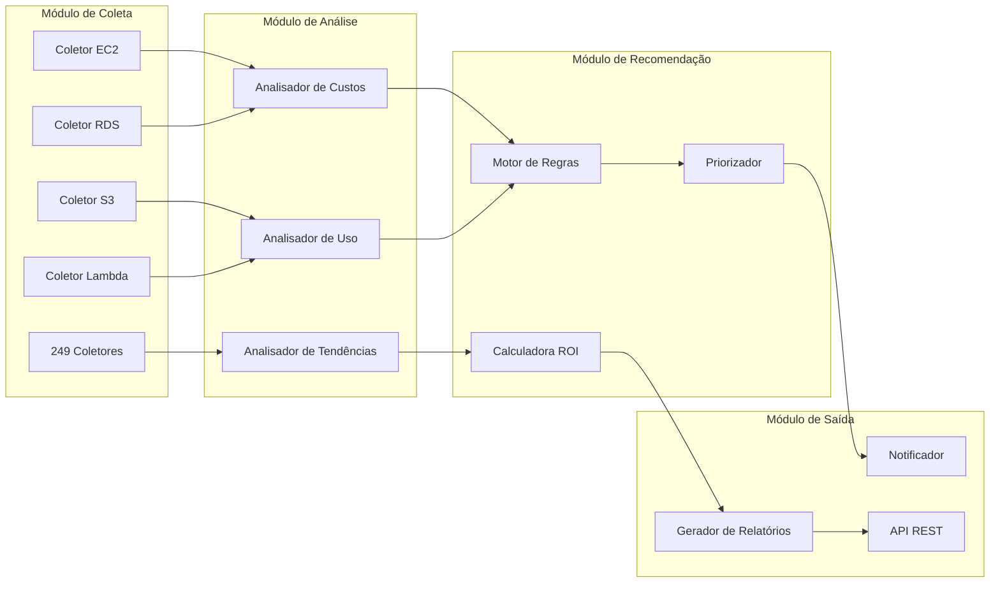

### 3.2 Módulo de Análise de Custos

**Funcionalidades:**
- Breakdown de custos por serviço, conta, região, tag
- Análise de tendências (diária, semanal, mensal)
- Detecção de anomalias de custo
- Previsão de gastos futuros

**Entradas:**
- Dados do AWS Cost Explorer
- Métricas do CloudWatch
- Inventário de recursos

**Saídas:**
- Relatório de custos detalhado
- Gráficos de tendência
- Alertas de anomalias
- Projeções de gastos

### 3.3 Módulo de Recomendações

**Tipos de Recomendações:**

| Tipo | Descrição | Economia Típica |
|------|-----------|-----------------|
| **Rightsizing** | Ajustar tamanho de instâncias | 15-30% |
| **Reserved Instances** | Comprar capacidade reservada | 30-60% |
| **Spot Instances** | Usar capacidade ociosa | 60-90% |
| **Recursos Ociosos** | Desligar/remover não utilizados | 100% do recurso |
| **Storage Tiering** | Mover para classes mais baratas | 40-80% |
| **Savings Plans** | Compromissos flexíveis | 20-40% |

---

## 4. Catálogo de Serviços AWS

### 4.1 Cobertura por Categoria

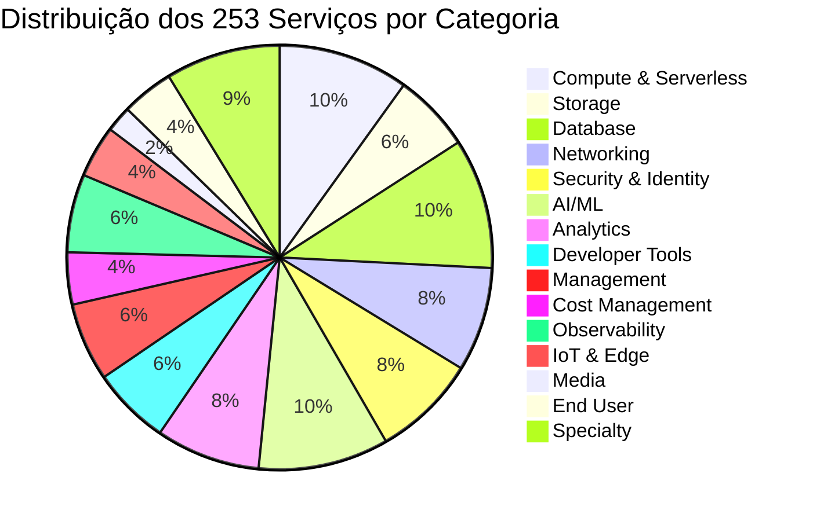

### 4.2 Serviços por Categoria

#### Compute & Serverless (25 serviços)
| Serviço | Descrição | Análises Disponíveis |
|---------|-----------|---------------------|
| EC2 | Instâncias virtuais | Uso, Custo, Rightsizing, RI |
| Lambda | Funções serverless | Invocações, Duração, Memória |
| ECS | Containers gerenciados | Tasks, CPU, Memória |
| EKS | Kubernetes gerenciado | Nodes, Pods, Custos |
| Batch | Processamento em lote | Jobs, Filas, Compute |
| Lightsail | VPS simplificado | Instâncias, Snapshots |
| App Runner | Deploy automático | Requests, Latência |
| Elastic Beanstalk | PaaS | Environments, Deploy |
| Lambda@Edge | Edge computing | Execuções, Latência |
| Outposts | Infraestrutura local | Capacidade, Uso |
| Local Zones | Zonas locais | Latência, Disponibilidade |
| Wavelength | 5G edge | Conexões, Latência |

#### Database (25 serviços)
| Serviço | Descrição | Análises Disponíveis |
|---------|-----------|---------------------|
| RDS | Banco relacional | IOPS, Conexões, Storage |
| Aurora | MySQL/PostgreSQL | Replicas, Performance |
| DynamoDB | NoSQL | RCU/WCU, Latência |
| ElastiCache | Cache in-memory | Hits/Misses, Memória |
| Redshift | Data warehouse | Queries, Storage |
| DocumentDB | MongoDB compatível | Connections, IOPS |
| Neptune | Graph database | Queries, Storage |
| Keyspaces | Cassandra | Throughput, Storage |
| Timestream | Time series | Writes, Queries |
| QLDB | Ledger | Transactions, Storage |

#### Security & Identity (20 serviços)
| Serviço | Descrição | Análises Disponíveis |
|---------|-----------|---------------------|
| IAM | Identity management | Users, Policies, Roles |
| Security Hub | Central de segurança | Findings, Compliance |
| GuardDuty | Detecção de ameaças | Threats, Events |
| Macie | Proteção de dados | Sensitive data, S3 |
| Inspector | Vulnerabilidades | Findings, Scans |
| KMS | Gerenciamento de chaves | Keys, Usage |
| Secrets Manager | Segredos | Secrets, Rotations |
| WAF | Web firewall | Rules, Requests |
| Shield | DDoS protection | Attacks, Mitigation |
| Cognito | Autenticação | Users, Signins |

### 4.3 Fases de Implementação

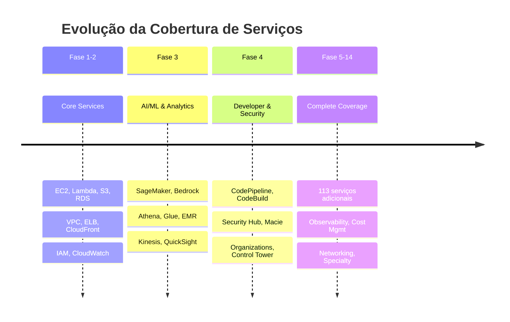

---

## 5. Análise de Custos

### 5.1 Fluxo de Análise de Custos

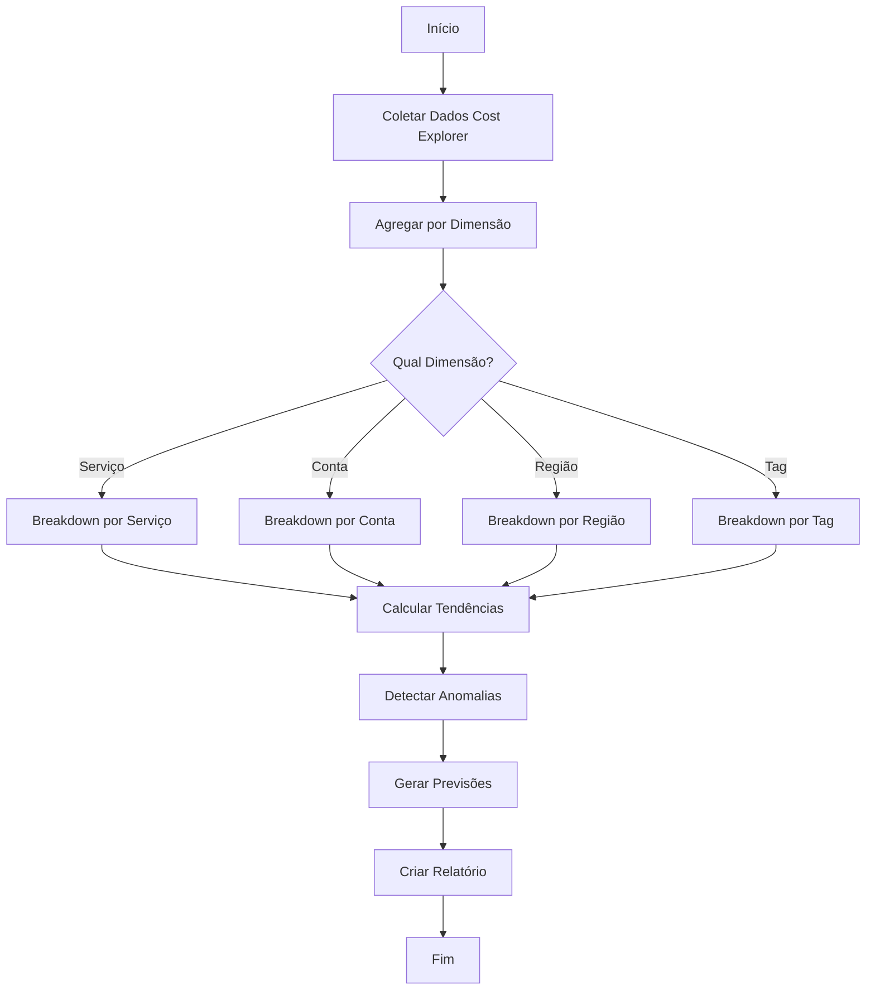

### 5.2 Métricas de Custo Coletadas

| Métrica | Descrição | Granularidade |
|---------|-----------|---------------|
| **Custo Total** | Soma de todos os custos | Diário, Mensal |
| **Custo por Serviço** | Breakdown por serviço AWS | Diário |
| **Custo por Conta** | Multi-account breakdown | Diário |
| **Custo por Região** | Distribuição geográfica | Diário |
| **Custo por Tag** | Por centro de custo/projeto | Diário |
| **Custo On-Demand** | Uso sob demanda | Diário |
| **Custo Reserved** | Instâncias reservadas | Mensal |
| **Custo Spot** | Instâncias spot | Diário |
| **Créditos/Descontos** | Abatimentos aplicados | Mensal |

### 5.3 Exemplo de Relatório de Custos

```
╔══════════════════════════════════════════════════════════════╗
║              RELATÓRIO DE CUSTOS - NOVEMBRO 2025             ║
╠══════════════════════════════════════════════════════════════╣
║                                                              ║
║  Custo Total do Mês: $45,234.56                             ║
║  Variação vs Mês Anterior: +12.3% ($4,987.00)               ║
║  Previsão Fim do Mês: $48,500.00                            ║
║                                                              ║
╠══════════════════════════════════════════════════════════════╣
║  TOP 5 SERVIÇOS POR CUSTO                                    ║
╠══════════════════════════════════════════════════════════════╣
║  1. Amazon EC2              $18,234.00   (40.3%)            ║
║  2. Amazon RDS              $12,567.00   (27.8%)            ║
║  3. Amazon S3                $5,432.00   (12.0%)            ║
║  4. AWS Lambda               $3,456.00    (7.6%)            ║
║  5. Amazon CloudFront        $2,345.00    (5.2%)            ║
║     Outros                   $3,200.56    (7.1%)            ║
║                                                              ║
╠══════════════════════════════════════════════════════════════╣
║  ANOMALIAS DETECTADAS                                        ║
╠══════════════════════════════════════════════════════════════╣
║  ⚠ EC2: Aumento de 45% em i3.xlarge (us-east-1)            ║
║  ⚠ S3: Transferência de dados 3x acima do normal           ║
║                                                              ║
╚══════════════════════════════════════════════════════════════╝
```

---

## 6. Recomendações de Otimização

### 6.1 Motor de Recomendações

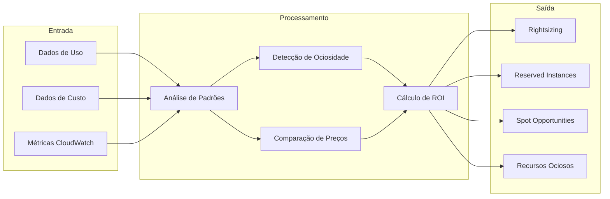

### 6.2 Tipos de Recomendações

#### 6.2.1 Rightsizing EC2

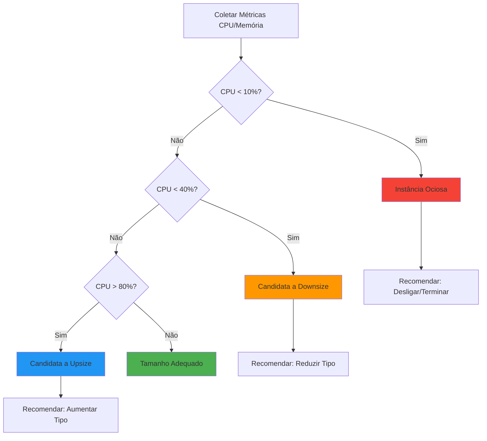

#### 6.2.2 Reserved Instances

| Critério | Descrição | Ação |
|----------|-----------|------|
| Uso > 70% do tempo | Instância consistentemente utilizada | Recomendar 1-year RI |
| Uso > 90% do tempo | Instância crítica | Recomendar 3-year RI |
| Workload previsível | Padrão de uso estável | Recomendar Savings Plans |
| Workload variável | Picos ocasionais | Manter On-Demand |

### 6.3 Priorização de Recomendações

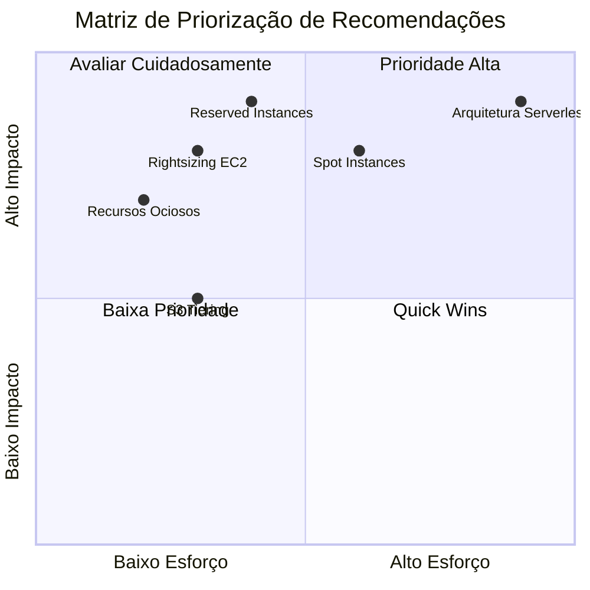

---

## 7. Monitoramento e Alertas

### 7.1 Sistema de Alertas

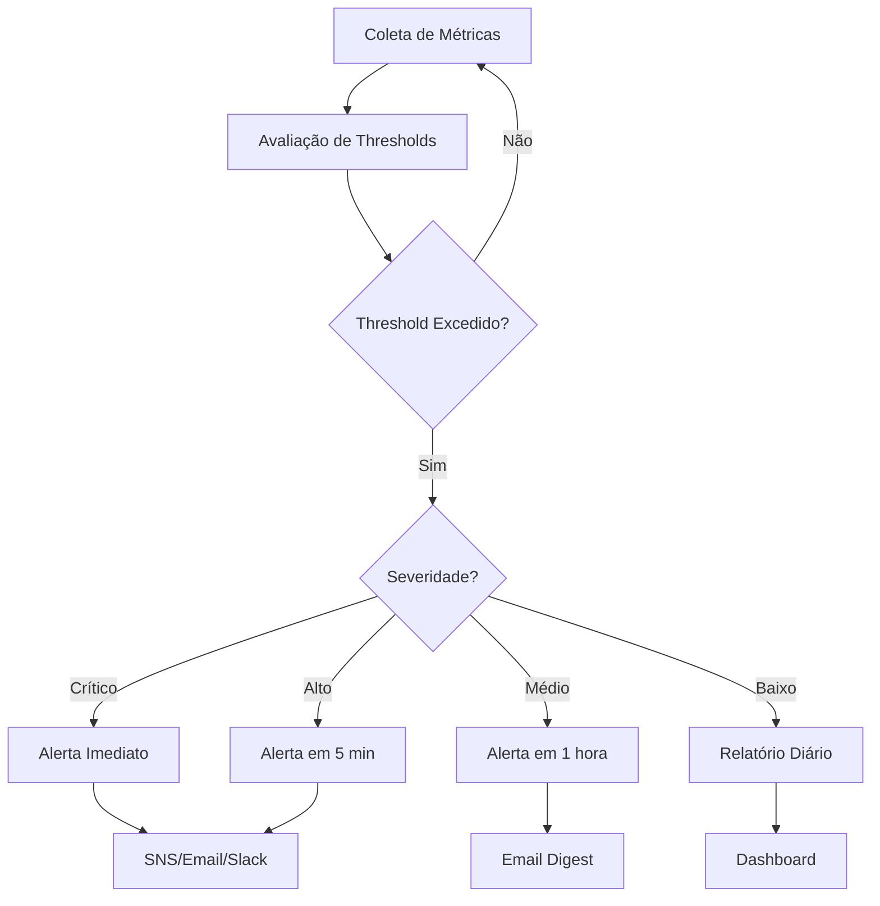

### 7.2 Tipos de Alertas

| Tipo | Trigger | Severidade | Canal |
|------|---------|------------|-------|
| **Budget Exceeded** | Custo > Budget | Crítico | SNS + Email |
| **Anomaly Detected** | Desvio > 2σ | Alto | Email |
| **Underutilized Resource** | CPU < 10% por 7 dias | Médio | Relatório |
| **RI Expiring** | RI expira em 30 dias | Médio | Email |
| **Security Finding** | GuardDuty/SecurityHub | Alto | SNS |
| **Cost Spike** | Aumento > 50% diário | Alto | SNS + Email |

### 7.3 Dashboard de Monitoramento

```
┌─────────────────────────────────────────────────────────────┐
│                    FINOPS DASHBOARD                          │
├─────────────────────────────────────────────────────────────┤
│                                                              │
│  CUSTO ATUAL     TENDÊNCIA      ECONOMIA      ALERTAS       │
│  ┌──────────┐   ┌──────────┐   ┌──────────┐   ┌──────────┐  │
│  │ $45,234  │   │   ↑12%   │   │  $8,500  │   │    3     │  │
│  │  /mês    │   │ vs. prev │   │ potencial │   │ ativos   │  │
│  └──────────┘   └──────────┘   └──────────┘   └──────────┘  │
│                                                              │
├─────────────────────────────────────────────────────────────┤
│  CUSTO POR SERVIÇO                                          │
│  ████████████████████████████░░░░░░░░░░ EC2 (40%)          │
│  ███████████████████░░░░░░░░░░░░░░░░░░░ RDS (28%)          │
│  ████████░░░░░░░░░░░░░░░░░░░░░░░░░░░░░░ S3 (12%)           │
│  █████░░░░░░░░░░░░░░░░░░░░░░░░░░░░░░░░░ Lambda (8%)        │
│  ████░░░░░░░░░░░░░░░░░░░░░░░░░░░░░░░░░░ Outros (12%)       │
│                                                              │
├─────────────────────────────────────────────────────────────┤
│  RECOMENDAÇÕES PENDENTES                                    │
│  ┌────────────────────────────────────────────────────────┐ │
│  │ ⚠ 5 instâncias EC2 subutilizadas - Economia: $2,340   │ │
│  │ 💡 3 candidatas a Reserved Instance - Economia: $4,200 │ │
│  │ 🗑 12 recursos não utilizados - Economia: $890         │ │
│  └────────────────────────────────────────────────────────┘ │
│                                                              │
└─────────────────────────────────────────────────────────────┘
```

---

## 8. Governança Multi-Conta

### 8.1 Arquitetura Multi-Conta

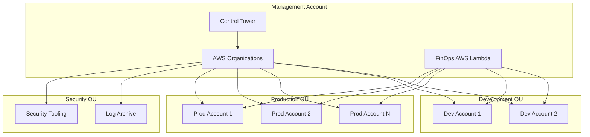

### 8.2 Consolidação de Custos

| Dimensão | Descrição | Uso |
|----------|-----------|-----|
| **Por OU** | Organizational Unit | Departamentos |
| **Por Conta** | AWS Account | Projetos/Times |
| **Por Tag** | Cost Allocation Tags | Centros de Custo |
| **Por Região** | AWS Region | Localização |
| **Por Ambiente** | Prod/Dev/Staging | Ciclo de vida |

### 8.3 Políticas de Custo

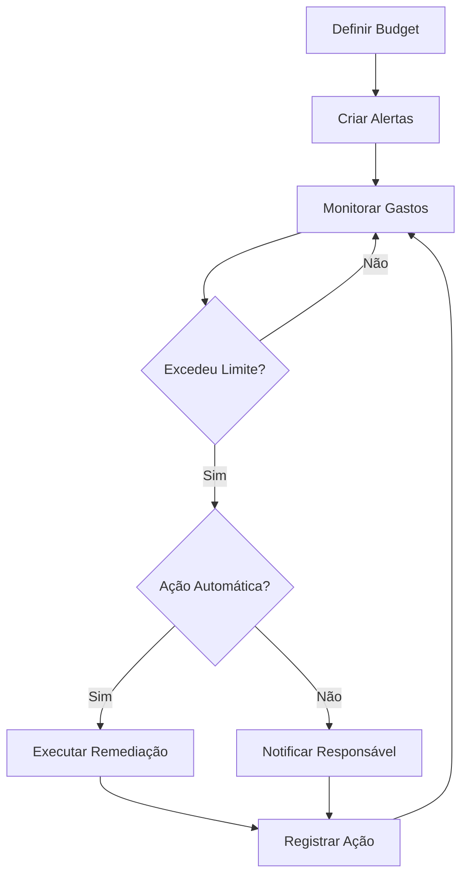

---

## 9. Relatórios e Dashboards

### 9.1 Tipos de Relatórios

| Relatório | Frequência | Audiência | Conteúdo |
|-----------|------------|-----------|----------|
| **Executive Summary** | Mensal | C-Level | KPIs, Tendências, ROI |
| **Cost Breakdown** | Semanal | Finance | Custos detalhados |
| **Optimization Report** | Diário | DevOps/SRE | Recomendações |
| **Anomaly Report** | Real-time | Operations | Desvios detectados |
| **Compliance Report** | Mensal | Security | Conformidade |

### 9.2 Formato de Saída

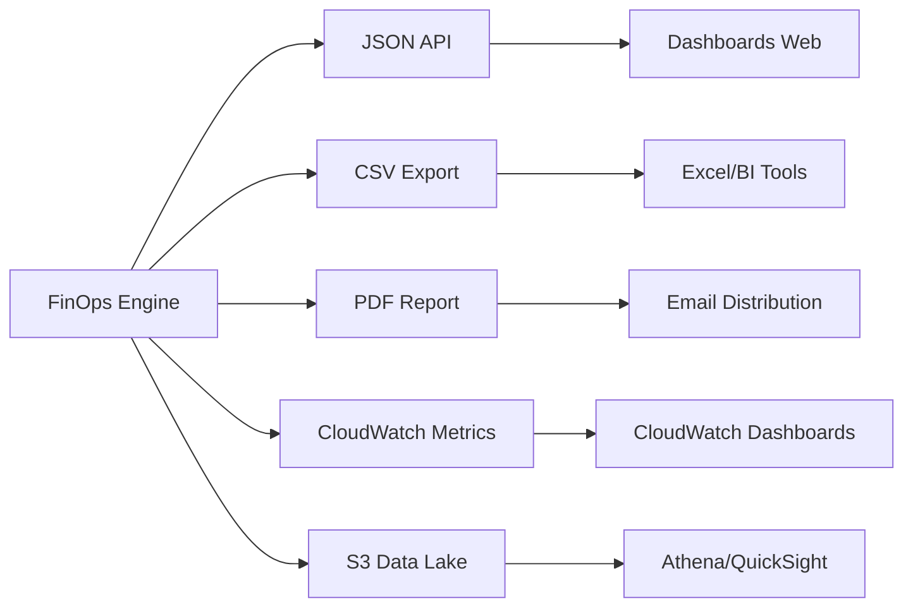

---

## 10. Casos de Uso

### 10.1 Caso 1: Redução de Custos EC2

**Cenário**: Empresa com 500 instâncias EC2 gastando $100k/mês

**Análise FinOps**:
1. Identificou 50 instâncias com CPU < 5%
2. Detectou 100 instâncias candidatas a RI
3. Encontrou 30 instâncias para rightsizing

**Resultado**:
- Economia com instâncias ociosas: $10k/mês
- Economia com RI (1-year): $18k/mês
- Economia com rightsizing: $7k/mês
- **Total: $35k/mês (35% de redução)**

### 10.2 Caso 2: Otimização de Storage S3

**Cenário**: 500TB em S3 Standard gastando $12k/mês

**Análise FinOps**:
1. 200TB não acessados há 90+ dias
2. 150TB acessados raramente (< 1x/mês)
3. 50TB são logs de retenção

**Resultado**:
- Migrar 200TB para Glacier: -$4k/mês
- Migrar 150TB para IA: -$2k/mês
- Lifecycle para logs: -$1k/mês
- **Total: $7k/mês (58% de redução)**

### 10.3 Caso 3: Governança Multi-Conta

**Cenário**: 20 contas AWS sem visibilidade consolidada

**Implementação FinOps**:
1. Deploy centralizado na conta management
2. Cross-account IAM roles configuradas
3. Tags de cost allocation padronizadas
4. Budgets por OU/conta

**Resultado**:
- Visibilidade 100% consolidada
- Identificação de shadow IT
- Chargeback por departamento
- **Redução de 25% em gastos**

---

## Conclusão

O FinOps AWS oferece uma solução completa para gestão financeira de infraestrutura AWS, cobrindo:

- **253 serviços AWS** com análise detalhada
- **Recomendações inteligentes** baseadas em dados reais
- **Monitoramento proativo** com alertas configuráveis
- **Governança enterprise** para ambientes multi-conta

Para informações técnicas detalhadas, consulte o [Guia Técnico](TECHNICAL_GUIDE.md).
Para instruções de uso, consulte o [Manual do Usuário](USER_MANUAL.md).

---

*Documento gerado em: Novembro 2025*
*Versão: 1.0*

---

## 11. Fluxos de Trabalho Detalhados

### 11.1 Fluxo de Análise Completa

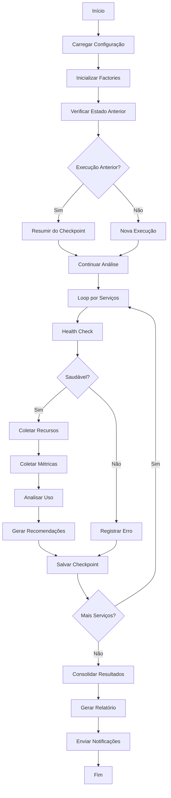

### 11.2 Fluxo de Recomendação

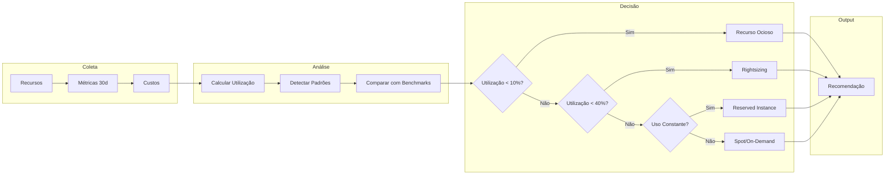

---

## 12. Casos de Uso Avançados

### 12.1 Multi-Account FinOps

```
┌─────────────────────────────────────────────────────────────────────────────┐
│                      CENÁRIO: MULTI-ACCOUNT FINOPS                         │
├─────────────────────────────────────────────────────────────────────────────┤
│                                                                             │
│  ESTRUTURA ORGANIZACIONAL                                                   │
│  ─────────────────────────────────────────────────────────────────────      │
│                                                                             │
│                    ┌──────────────────┐                                     │
│                    │  Management      │                                     │
│                    │  Account         │                                     │
│                    └────────┬─────────┘                                     │
│                             │                                               │
│           ┌─────────────────┼─────────────────┐                             │
│           │                 │                 │                             │
│    ┌──────▼──────┐   ┌──────▼──────┐   ┌──────▼──────┐                     │
│    │   Prod      │   │    Dev      │   │   Staging   │                     │
│    │  Account    │   │  Account    │   │  Account    │                     │
│    │  $50k/mês   │   │  $15k/mês   │   │  $8k/mês    │                     │
│    └─────────────┘   └─────────────┘   └─────────────┘                     │
│                                                                             │
│  IMPLEMENTAÇÃO                                                              │
│  ─────────────────────────────────────────────────────────────────────      │
│                                                                             │
│  1. IAM Role com trust para conta de management                            │
│  2. FinOps AWS assume role em cada conta                                   │
│  3. Coleta dados de todas as contas                                        │
│  4. Consolida em relatório único                                           │
│  5. Gera recomendações cross-account                                       │
│                                                                             │
│  BENEFÍCIOS                                                                 │
│  ─────────────────────────────────────────────────────────────────────      │
│                                                                             │
│  • Visão unificada de custos                                               │
│  • Comparação entre ambientes                                               │
│  • Identificação de recursos duplicados                                    │
│  • Reserved Instance sharing                                                │
│  • Savings Plans organizacionais                                            │
│                                                                             │
└─────────────────────────────────────────────────────────────────────────────┘
```

### 12.2 Análise de Containers (ECS/EKS)

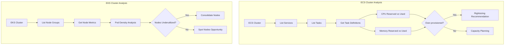

### 12.3 Análise de Data Analytics

```
┌─────────────────────────────────────────────────────────────────────────────┐
│                    CENÁRIO: DATA ANALYTICS OPTIMIZATION                     │
├─────────────────────────────────────────────────────────────────────────────┤
│                                                                             │
│  SERVIÇOS ANALISADOS                                                        │
│  ─────────────────────────────────────────────────────────────────────      │
│                                                                             │
│  ┌─────────────┐  ┌─────────────┐  ┌─────────────┐  ┌─────────────┐        │
│  │   Redshift  │  │     EMR     │  │    Athena   │  │    Glue     │        │
│  │  Warehouse  │  │   Clusters  │  │   Queries   │  │    Jobs     │        │
│  └─────────────┘  └─────────────┘  └─────────────┘  └─────────────┘        │
│                                                                             │
│  ANÁLISES ESPECÍFICAS                                                       │
│  ─────────────────────────────────────────────────────────────────────      │
│                                                                             │
│  REDSHIFT:                                                                  │
│  • Utilização de nós (CPU, Storage)                                        │
│  • Concurrency Scaling usage                                               │
│  • Reserved Nodes opportunity                                              │
│  • Pause/Resume scheduling                                                 │
│                                                                             │
│  EMR:                                                                       │
│  • Cluster runtime analysis                                                │
│  • Instance Fleet optimization                                             │
│  • Spot Instance usage                                                      │
│  • Auto-scaling effectiveness                                               │
│                                                                             │
│  ATHENA:                                                                    │
│  • Query cost per GB scanned                                               │
│  • Partitioning opportunities                                              │
│  • Result caching effectiveness                                            │
│  • Workgroup cost allocation                                               │
│                                                                             │
│  GLUE:                                                                      │
│  • DPU utilization                                                         │
│  • Job duration optimization                                               │
│  • Crawler efficiency                                                       │
│  • Data Catalog usage                                                       │
│                                                                             │
└─────────────────────────────────────────────────────────────────────────────┘
```

---

## 13. Relatórios e Dashboards

### 13.1 Estrutura do Relatório

```
┌─────────────────────────────────────────────────────────────────────────────┐
│                     ESTRUTURA DO RELATÓRIO FINOPS                           │
├─────────────────────────────────────────────────────────────────────────────┤
│                                                                             │
│  SEÇÃO 1: SUMÁRIO EXECUTIVO                                                 │
│  ─────────────────────────────────────────────────────────────────────      │
│  • Total de custos do período                                               │
│  • Top 5 serviços por custo                                                │
│  • Total de economia potencial identificada                                │
│  • Recomendações de alta prioridade                                        │
│                                                                             │
│  SEÇÃO 2: ANÁLISE DE CUSTOS                                                 │
│  ─────────────────────────────────────────────────────────────────────      │
│  • Breakdown por serviço                                                    │
│  • Breakdown por conta/região                                              │
│  • Tendência histórica                                                      │
│  • Projeção para próximo mês                                               │
│                                                                             │
│  SEÇÃO 3: RECOMENDAÇÕES                                                     │
│  ─────────────────────────────────────────────────────────────────────      │
│  • Lista priorizada de recomendações                                       │
│  • Economia estimada por recomendação                                      │
│  • Esforço de implementação                                                │
│  • Riscos e mitigações                                                     │
│                                                                             │
│  SEÇÃO 4: MÉTRICAS DE UTILIZAÇÃO                                           │
│  ─────────────────────────────────────────────────────────────────────      │
│  • CPU/Memory/Storage por serviço                                          │
│  • Recursos ociosos identificados                                          │
│  • Oportunidades de rightsizing                                            │
│                                                                             │
│  SEÇÃO 5: RESERVED INSTANCES                                                │
│  ─────────────────────────────────────────────────────────────────────      │
│  • Cobertura atual de RI/SP                                                │
│  • Oportunidades de compra                                                 │
│  • ROI de reservas existentes                                              │
│                                                                             │
│  SEÇÃO 6: COMPLIANCE E GOVERNANÇA                                          │
│  ─────────────────────────────────────────────────────────────────────      │
│  • Recursos sem tags obrigatórias                                          │
│  • Recursos fora de política                                               │
│  • Alertas e anomalias                                                      │
│                                                                             │
└─────────────────────────────────────────────────────────────────────────────┘
```

---

## 14. Integração com CI/CD

### 14.1 Pipeline de FinOps

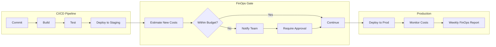

### 14.2 GitHub Actions Integration

```yaml
# .github/workflows/finops-check.yml
name: FinOps Cost Analysis

on:
  pull_request:
    branches: [main]
  schedule:
    - cron: '0 6 * * 1'  # Weekly Monday 6 AM

jobs:
  finops-analysis:
    runs-on: ubuntu-latest
    steps:
      - uses: actions/checkout@v4
      
      - name: Setup Python
        uses: actions/setup-python@v4
        with:
          python-version: '3.11'
      
      - name: Install Dependencies
        run: pip install -r requirements.txt
      
      - name: Run FinOps Analysis
        env:
          AWS_ACCESS_KEY_ID: ${{ secrets.AWS_ACCESS_KEY_ID }}
          AWS_SECRET_ACCESS_KEY: ${{ secrets.AWS_SECRET_ACCESS_KEY }}
        run: python run_with_aws.py --output json > finops_report.json
      
      - name: Check Cost Threshold
        run: |
          TOTAL_COST=$(jq '.total_cost' finops_report.json)
          if (( $(echo "$TOTAL_COST > 50000" | bc -l) )); then
            echo "::warning::Monthly cost exceeds $50,000 threshold"
          fi
      
      - name: Upload Report
        uses: actions/upload-artifact@v3
        with:
          name: finops-report
          path: finops_report.json
```

---

*Guia Funcional FinOps AWS - Versão 2.0 Expandida*
*Novembro 2025*
