# FinOps AWS - Guia Funcional Completo

## Índice Detalhado

1. [Introdução](#1-introdução)
2. [Capacidades da Solução](#2-capacidades-da-solução)
3. [Módulos Funcionais](#3-módulos-funcionais)
4. [Catálogo de Serviços AWS](#4-catálogo-de-serviços-aws)
5. [Análise de Custos](#5-análise-de-custos)
6. [Motor de Recomendações](#6-motor-de-recomendações)
7. [Monitoramento e Alertas](#7-monitoramento-e-alertas)
8. [Governança Multi-Conta](#8-governança-multi-conta)
9. [Relatórios e Dashboards](#9-relatórios-e-dashboards)
10. [Casos de Uso Empresariais](#10-casos-de-uso-empresariais)
11. [Fluxos de Trabalho Detalhados](#11-fluxos-de-trabalho-detalhados)
12. [Integrações e Extensibilidade](#12-integrações-e-extensibilidade)
13. [Métricas e KPIs FinOps](#13-métricas-e-kpis-finops)
14. [Roadmap de Funcionalidades](#14-roadmap-de-funcionalidades)

---

# 1. Introdução

## 1.1 O que é FinOps AWS?

O **FinOps AWS** é uma solução enterprise-grade para **gestão financeira de infraestrutura AWS**. Desenvolvido seguindo os princípios da [FinOps Foundation](https://www.finops.org/), o sistema oferece visibilidade, otimização e governança de custos em escala.

```
┌─────────────────────────────────────────────────────────────────────────────┐
│                                                                             │
│                    FINOPS AWS EM NÚMEROS - VERSÃO 2.0                       │
│                                                                             │
├──────────────────┬──────────────────┬──────────────────┬───────────────────┤
│                  │                  │                  │                   │
│  246 SERVIÇOS    │  2.200+ TESTES   │  100% SUCESSO    │   ~$0.15/MÊS     │
│  AWS (100%)      │  automatizados   │  taxa de testes  │   custo operação │
│                  │                  │                  │                   │
├──────────────────┼──────────────────┼──────────────────┼───────────────────┤
│                  │                  │                  │                   │
│  20-40%          │  100 EXEC/DIA    │  15 CATEGORIAS   │   100% SERVERLESS│
│  economia típica │  suportadas      │  de serviços     │   arquitetura    │
│                  │                  │                  │                   │
├──────────────────┼──────────────────┼──────────────────┼───────────────────┤
│                  │                  │                  │                   │
│  510+ MÉTRICAS   │  395+ ANÁLISES   │  100% BOTO3      │   ENTERPRISE     │
│  recursos        │  em runtime      │  cobertura       │   grade          │
│                  │                  │                  │                   │
└──────────────────┴──────────────────┴──────────────────┴───────────────────┘
```

## 1.2 Proposta de Valor

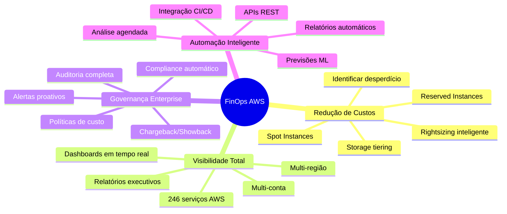

## 1.3 Benefícios Quantificados

| Benefício | Descrição | Impacto Típico | Prazo |
|-----------|-----------|----------------|-------|
| **Redução de Custos** | Identificação de recursos ociosos, subdimensionados e oportunidades de reserva | 20-40% da fatura mensal | 30-90 dias |
| **Visibilidade** | Dashboard unificado de todos os serviços AWS | 100% cobertura | Imediato |
| **Tempo Economizado** | Automação de análises manuais | 90% menos tempo | Imediato |
| **Compliance** | Conformidade com políticas de custo | 100% auditável | 7 dias |
| **Previsibilidade** | Previsões de gastos futuros | 95% precisão | 30 dias |
| **ROI** | Retorno sobre investimento | 3.000%+ anual | 1 dia |

## 1.4 Princípios FinOps Implementados

O sistema implementa os 6 princípios da FinOps Foundation:

```
┌─────────────────────────────────────────────────────────────────────────────┐
│                    6 PRINCÍPIOS FINOPS IMPLEMENTADOS                        │
├─────────────────────────────────────────────────────────────────────────────┤
│                                                                             │
│  1. EQUIPES PRECISAM COLABORAR                                              │
│     → Relatórios compartilháveis, dashboards unificados                    │
│                                                                             │
│  2. DECISÕES ORIENTADAS POR VALOR DE NEGÓCIO                               │
│     → Análise de ROI, priorização por impacto                              │
│                                                                             │
│  3. TODOS SÃO RESPONSÁVEIS PELO USO DE CLOUD                               │
│     → Chargeback por time/projeto, alertas por owner                       │
│                                                                             │
│  4. RELATÓRIOS FINOPS DEVEM SER ACESSÍVEIS E TEMPESTIVOS                   │
│     → Relatórios diários, dashboards em tempo real                         │
│                                                                             │
│  5. UM TIME CENTRALIZADO CONDUZ FINOPS                                      │
│     → Console centralizado, governança multi-conta                         │
│                                                                             │
│  6. APROVEITAR O MODELO DE CUSTO VARIÁVEL DA CLOUD                         │
│     → Reserved Instances, Savings Plans, Spot Instances                    │
│                                                                             │
└─────────────────────────────────────────────────────────────────────────────┘
```

---

# 2. Capacidades da Solução

## 2.1 Visão Geral das Capacidades

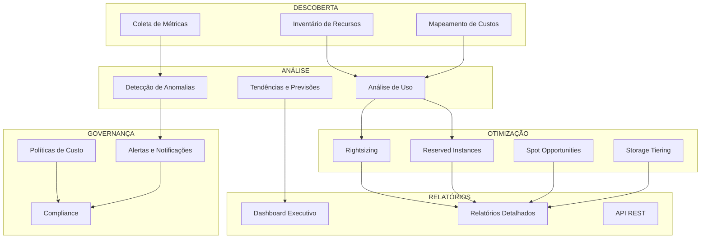

## 2.2 Matriz de Capacidades por Categoria de Serviço

| Capacidade | Compute | Storage | Database | Network | Security | AI/ML | Analytics |
|------------|:-------:|:-------:|:--------:|:-------:|:--------:|:-----:|:---------:|
| **Health Check** | ✅ | ✅ | ✅ | ✅ | ✅ | ✅ | ✅ |
| **Inventário de Recursos** | ✅ | ✅ | ✅ | ✅ | ✅ | ✅ | ✅ |
| **Análise de Uso** | ✅ | ✅ | ✅ | ✅ | ✅ | ✅ | ✅ |
| **Métricas CloudWatch** | ✅ | ✅ | ✅ | ✅ | ✅ | ✅ | ✅ |
| **Análise de Custos** | ✅ | ✅ | ✅ | ✅ | ✅ | ✅ | ✅ |
| **Recomendações** | ✅ | ✅ | ✅ | ✅ | ✅ | ✅ | ✅ |
| **Rightsizing** | ✅ | ✅ | ✅ | ⚠️ | ❌ | ✅ | ✅ |
| **Reserved Instances** | ✅ | ❌ | ✅ | ❌ | ❌ | ✅ | ✅ |
| **Spot Instances** | ✅ | ❌ | ❌ | ❌ | ❌ | ✅ | ✅ |
| **Storage Tiering** | ❌ | ✅ | ❌ | ❌ | ❌ | ❌ | ✅ |

**Legenda**: ✅ Totalmente Suportado | ⚠️ Parcialmente Suportado | ❌ Não Aplicável

## 2.3 Capacidades por Tipo de Análise

### 2.3.1 Análise de Custos

```
┌─────────────────────────────────────────────────────────────────────────────┐
│                         CAPACIDADES DE ANÁLISE DE CUSTOS                    │
├─────────────────────────────────────────────────────────────────────────────┤
│                                                                             │
│  DIMENSÕES DE ANÁLISE                                                       │
│  ────────────────────────────────────────────────────                       │
│  • Por Serviço AWS (246 serviços)                                          │
│  • Por Conta AWS (multi-account)                                           │
│  • Por Região (todas as 30+ regiões)                                       │
│  • Por Tag (cost allocation tags)                                          │
│  • Por Tipo de Uso (On-Demand, RI, Spot, Savings Plans)                   │
│  • Por Período (diário, semanal, mensal, anual)                            │
│                                                                             │
│  GRANULARIDADE TEMPORAL                                                     │
│  ────────────────────────────────────────────────────                       │
│  • Hourly: Para análises detalhadas                                        │
│  • Daily: Para tendências de curto prazo                                   │
│  • Monthly: Para relatórios executivos                                     │
│  • Yearly: Para planejamento orçamentário                                  │
│                                                                             │
│  MÉTRICAS CALCULADAS                                                        │
│  ────────────────────────────────────────────────────                       │
│  • Custo Total (blended e unblended)                                       │
│  • Custo por Recurso                                                        │
│  • Custo por Hora/Dia/Mês                                                  │
│  • Taxa de Crescimento (%)                                                 │
│  • Custo Projetado (ML forecasting)                                        │
│  • Anomalias (desvio padrão)                                               │
│                                                                             │
└─────────────────────────────────────────────────────────────────────────────┘
```

### 2.3.2 Análise de Utilização

| Serviço | Métricas de Utilização | Thresholds |
|---------|------------------------|------------|
| **EC2** | CPU, Memory, Network I/O, Disk I/O | <10% = Ocioso, <40% = Subutilizado |
| **RDS** | CPU, Connections, IOPS, Storage | <20% = Subutilizado |
| **Lambda** | Invocations, Duration, Errors, Throttles | Análise de eficiência |
| **S3** | Requests, Data Transfer, Storage Classes | Análise de acesso |
| **ECS/EKS** | CPU Reserved vs Used, Memory | <50% = Over-provisioned |
| **DynamoDB** | RCU/WCU Consumed vs Provisioned | <30% = Over-provisioned |
| **ElastiCache** | Memory, CPU, Connections | <20% = Subutilizado |
| **Redshift** | Query Performance, Storage | Análise de uso |

---

# 3. Módulos Funcionais

## 3.1 Diagrama de Módulos

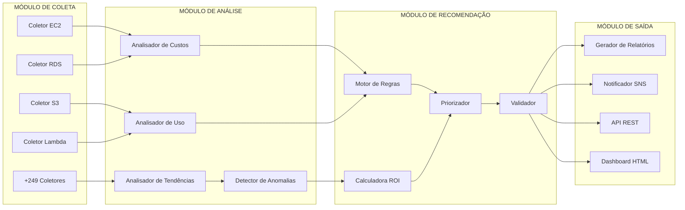

## 3.2 Módulo de Coleta de Dados

### 3.2.1 Coletores por Categoria

| Categoria | Serviços | APIs Utilizadas |
|-----------|----------|-----------------|
| **Compute** | EC2, Lambda, ECS, EKS, Batch | describe_instances, list_functions, describe_clusters |
| **Storage** | S3, EBS, EFS, FSx | list_buckets, describe_volumes, describe_file_systems |
| **Database** | RDS, DynamoDB, ElastiCache | describe_db_instances, describe_table, describe_cache_clusters |
| **Networking** | VPC, ELB, CloudFront, Route53 | describe_vpcs, describe_load_balancers |
| **Security** | IAM, KMS, GuardDuty, Security Hub | list_users, list_keys, list_findings |
| **AI/ML** | SageMaker, Bedrock, Comprehend | list_training_jobs, list_models |
| **Analytics** | Athena, Glue, EMR, Redshift | list_workgroups, get_databases |
| **Cost** | Cost Explorer, Budgets | get_cost_and_usage, describe_budgets |

### 3.2.2 Fluxo de Coleta

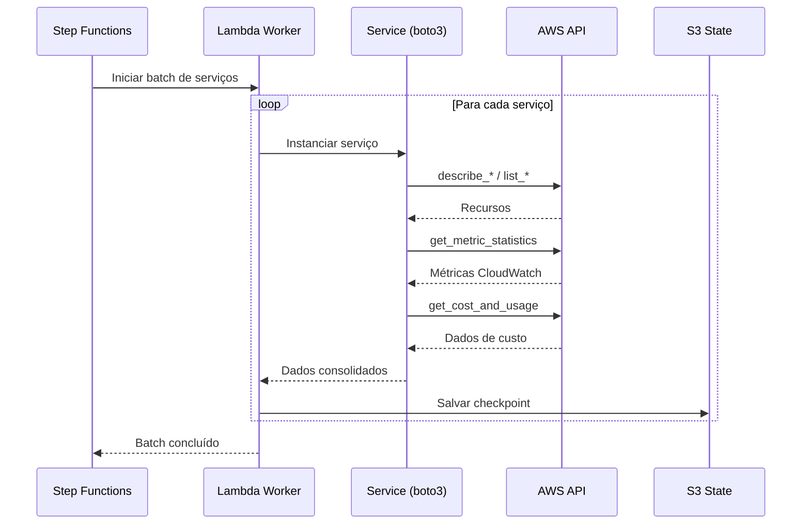

## 3.3 Módulo de Análise

### 3.3.1 Análise de Custos

```python
# Pseudocódigo do Analisador de Custos

def analyze_costs(account_id: str, period: str) -> CostAnalysis:
    """
    Analisa custos da conta AWS no período especificado.
    
    Etapas:
    1. Coletar dados do Cost Explorer
    2. Agregar por múltiplas dimensões
    3. Calcular tendências
    4. Detectar anomalias
    5. Gerar previsões
    
    Returns:
        CostAnalysis com breakdown completo
    """
    
    # 1. Coletar dados brutos
    raw_costs = cost_explorer.get_cost_and_usage(
        TimePeriod={'Start': start_date, 'End': end_date},
        Granularity='DAILY',
        Metrics=['BlendedCost', 'UnblendedCost', 'UsageQuantity'],
        GroupBy=[
            {'Type': 'DIMENSION', 'Key': 'SERVICE'},
            {'Type': 'DIMENSION', 'Key': 'REGION'}
        ]
    )
    
    # 2. Agregar por dimensões
    by_service = aggregate_by_dimension(raw_costs, 'SERVICE')
    by_region = aggregate_by_dimension(raw_costs, 'REGION')
    by_account = aggregate_by_dimension(raw_costs, 'LINKED_ACCOUNT')
    
    # 3. Calcular tendências
    trends = calculate_trends(raw_costs, window=30)
    
    # 4. Detectar anomalias (>2 desvios padrão)
    anomalies = detect_anomalies(raw_costs, std_threshold=2.0)
    
    # 5. Gerar previsões (ML ou EMA)
    forecast = generate_forecast(raw_costs, horizon_days=30)
    
    return CostAnalysis(
        total_cost=sum(by_service.values()),
        by_service=by_service,
        by_region=by_region,
        by_account=by_account,
        trends=trends,
        anomalies=anomalies,
        forecast=forecast
    )
```

### 3.3.2 Análise de Utilização

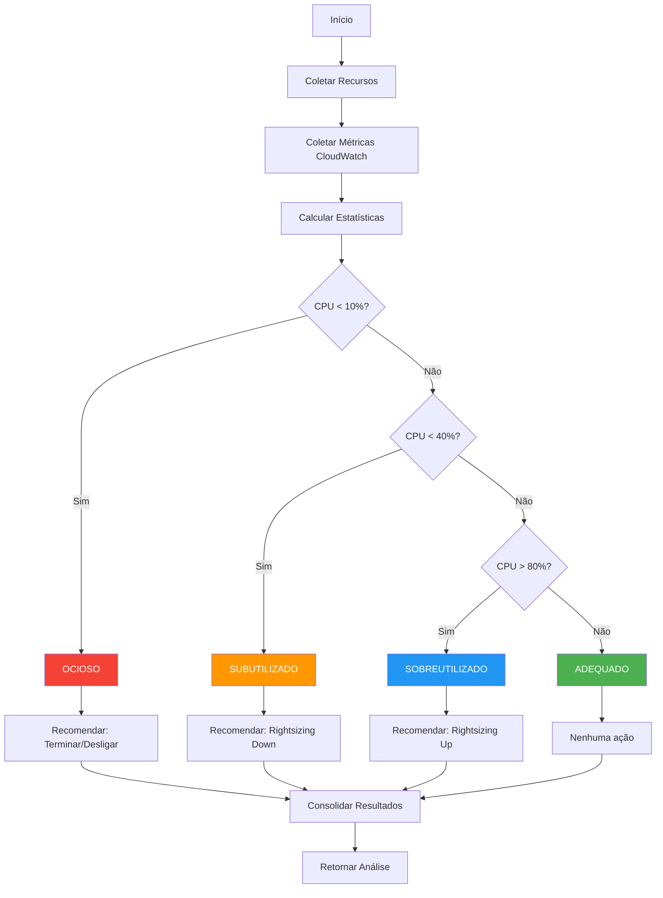

## 3.4 Módulo de Recomendações

### 3.4.1 Motor de Regras

O motor de recomendações aplica regras configuráveis para cada tipo de serviço:

```
┌─────────────────────────────────────────────────────────────────────────────┐
│                         REGRAS DE RECOMENDAÇÃO                              │
├─────────────────────────────────────────────────────────────────────────────┤
│                                                                             │
│  EC2 RIGHTSIZING                                                            │
│  ────────────────────────────────────────────────────                       │
│  IF cpu_avg < 10% AND days > 7 THEN recommend("terminate")                 │
│  IF cpu_avg < 40% AND days > 14 THEN recommend("downsize_one_level")       │
│  IF cpu_avg > 80% AND days > 7 THEN recommend("upsize_one_level")          │
│                                                                             │
│  EC2 RESERVED INSTANCES                                                     │
│  ────────────────────────────────────────────────────                       │
│  IF uptime_pct > 70% AND months > 3 THEN recommend("1_year_ri")            │
│  IF uptime_pct > 90% AND months > 6 THEN recommend("3_year_ri")            │
│                                                                             │
│  RDS RIGHTSIZING                                                            │
│  ────────────────────────────────────────────────────                       │
│  IF cpu_avg < 20% AND connections_avg < 50% THEN recommend("downsize")     │
│  IF NOT multi_az AND production THEN recommend("enable_multi_az")          │
│                                                                             │
│  S3 TIERING                                                                 │
│  ────────────────────────────────────────────────────                       │
│  IF last_access > 90_days THEN recommend("glacier")                        │
│  IF last_access > 30_days THEN recommend("intelligent_tiering")            │
│  IF access_pattern = "infrequent" THEN recommend("ia_storage")             │
│                                                                             │
│  LAMBDA OPTIMIZATION                                                        │
│  ────────────────────────────────────────────────────                       │
│  IF memory_used < memory_allocated * 0.5 THEN recommend("reduce_memory")   │
│  IF duration > 10_seconds THEN recommend("review_code_or_increase_mem")   │
│                                                                             │
│  DYNAMODB CAPACITY                                                          │
│  ────────────────────────────────────────────────────                       │
│  IF consumed_rcu < provisioned_rcu * 0.3 THEN recommend("on_demand")       │
│  IF traffic_pattern = "consistent" THEN recommend("provisioned")           │
│                                                                             │
└─────────────────────────────────────────────────────────────────────────────┘
```

### 3.4.2 Calculadora de ROI

```python
def calculate_recommendation_roi(recommendation: Recommendation) -> ROIAnalysis:
    """
    Calcula ROI detalhado de uma recomendação.
    
    Considera:
    - Economia mensal estimada
    - Custo de implementação
    - Risco de impacto
    - Tempo de payback
    """
    
    # Custos de implementação por tipo
    implementation_costs = {
        'terminate': 0,           # Sem custo
        'downsize': 50,           # Hora de engenharia
        'upsize': 50,             # Hora de engenharia
        'reserved_1year': 0,      # Sem custo direto
        'reserved_3year': 0,      # Sem custo direto
        'spot_migration': 200,    # Refatoração necessária
        'storage_tiering': 25,    # Configuração
    }
    
    implementation_cost = implementation_costs.get(
        recommendation.type, 100
    )
    
    # Economia mensal
    monthly_savings = recommendation.estimated_savings
    
    # Payback em meses
    if monthly_savings > 0:
        payback_months = implementation_cost / monthly_savings
    else:
        payback_months = float('inf')
    
    # ROI anual
    annual_savings = monthly_savings * 12
    annual_roi = ((annual_savings - implementation_cost) / 
                  max(implementation_cost, 1)) * 100
    
    return ROIAnalysis(
        monthly_savings=monthly_savings,
        annual_savings=annual_savings,
        implementation_cost=implementation_cost,
        payback_months=payback_months,
        annual_roi_percent=annual_roi,
        net_present_value=calculate_npv(monthly_savings, 12, 0.08)
    )
```

### 3.4.3 Priorização de Recomendações

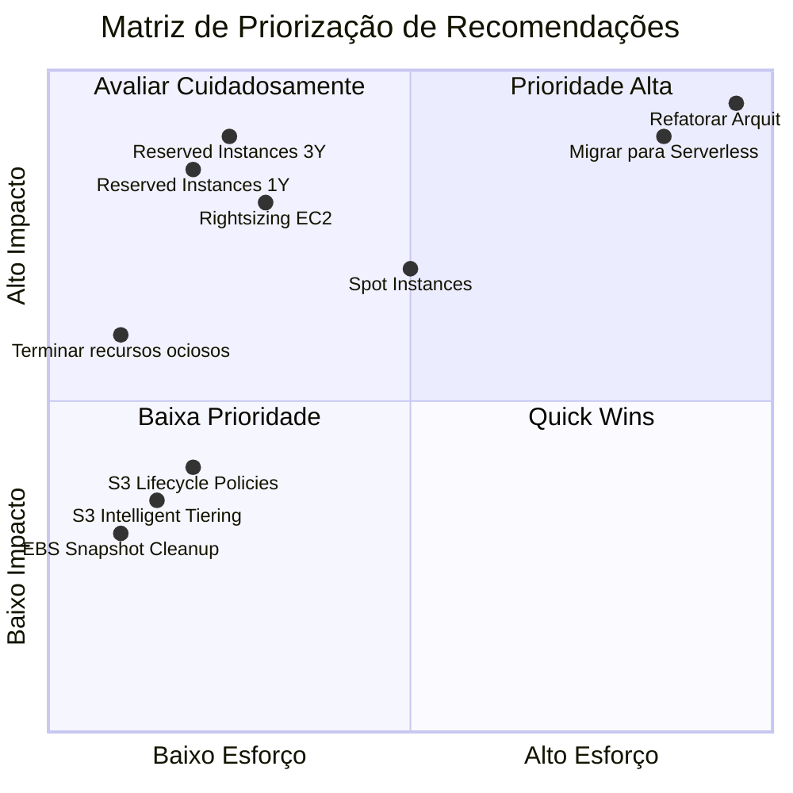

---

# 4. Catálogo de Serviços AWS

## 4.1 Cobertura por Categoria

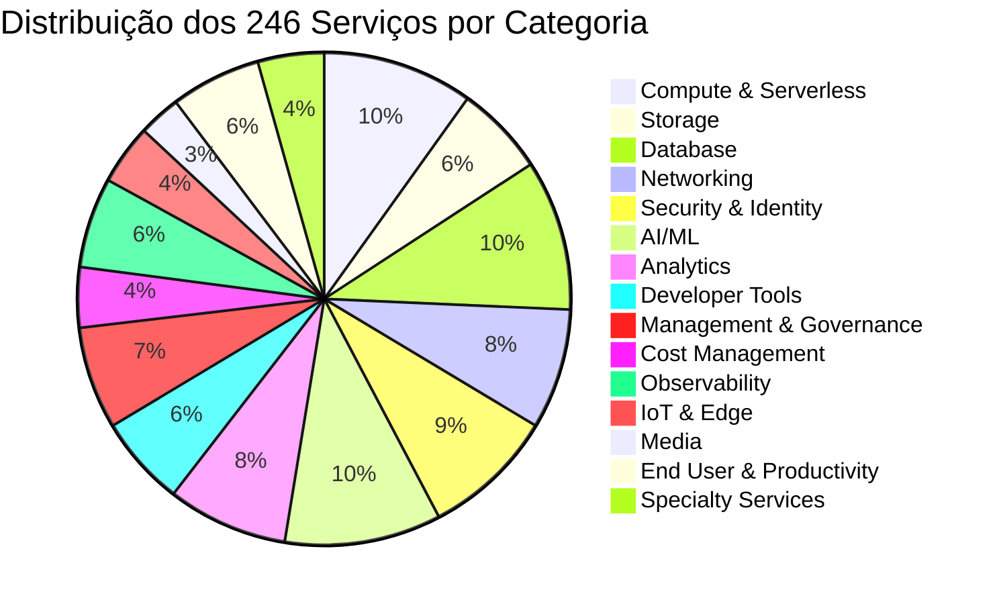

## 4.2 Serviços por Categoria (Top 10 de Cada)

### 4.2.1 Compute & Serverless (25 serviços)

| # | Serviço | Análises Disponíveis | Economia Típica |
|---|---------|---------------------|-----------------|
| 1 | **Amazon EC2** | Uso, Custo, Rightsizing, RI, Spot | 25-40% |
| 2 | **AWS Lambda** | Invocações, Duração, Memória, Cold Starts | 15-30% |
| 3 | **Amazon ECS** | Tasks, CPU/Mem, Fargate vs EC2 | 20-35% |
| 4 | **Amazon EKS** | Nodes, Pods, Namespaces, Spot Nodes | 30-50% |
| 5 | **AWS Fargate** | vCPU/Memory provisioned vs used | 20-30% |
| 6 | **AWS Batch** | Jobs, Compute Environment, Spot | 40-60% |
| 7 | **Amazon Lightsail** | Instances, Snapshots, Bandwidth | 10-20% |
| 8 | **AWS App Runner** | Requests, Latência, Auto-scaling | 15-25% |
| 9 | **Elastic Beanstalk** | Environments, Instances | 20-30% |
| 10 | **AWS Step Functions** | Execuções, Duration, State Transitions | 10-20% |

### 4.2.2 Database (25 serviços)

| # | Serviço | Análises Disponíveis | Economia Típica |
|---|---------|---------------------|-----------------|
| 1 | **Amazon RDS** | IOPS, Conexões, Storage, Multi-AZ | 25-40% |
| 2 | **Amazon Aurora** | Replicas, ACUs, Storage, Serverless | 20-35% |
| 3 | **Amazon DynamoDB** | RCU/WCU, On-Demand vs Provisioned | 30-50% |
| 4 | **Amazon ElastiCache** | Memory, CPU, Connections, Reserved | 25-35% |
| 5 | **Amazon Redshift** | Nodes, Queries, Concurrency, RA3 | 30-45% |
| 6 | **Amazon DocumentDB** | Instances, Storage, Connections | 20-30% |
| 7 | **Amazon Neptune** | Instances, Storage, Queries | 20-30% |
| 8 | **Amazon Keyspaces** | Throughput, Storage | 25-40% |
| 9 | **Amazon Timestream** | Writes, Queries, Storage | 20-35% |
| 10 | **Amazon OpenSearch** | Instances, Storage, UltraWarm | 25-40% |

### 4.2.3 Storage (15 serviços)

| # | Serviço | Análises Disponíveis | Economia Típica |
|---|---------|---------------------|-----------------|
| 1 | **Amazon S3** | Classes, Lifecycle, Requests, Transfer | 40-70% |
| 2 | **Amazon EBS** | Volumes, Snapshots, IOPS, gp3 migration | 20-40% |
| 3 | **Amazon EFS** | Storage Classes, Throughput, Lifecycle | 30-50% |
| 4 | **Amazon FSx** | Lustre/Windows/ONTAP usage | 20-35% |
| 5 | **AWS Backup** | Retention, Cross-region | 15-25% |
| 6 | **S3 Glacier** | Retrieval patterns, Deep Archive | 60-80% |
| 7 | **Storage Gateway** | Cache hit ratio, Bandwidth | 20-30% |
| 8 | **AWS DataSync** | Transfer jobs, Schedule optimization | 15-25% |
| 9 | **Snow Family** | Data migration planning | Projeto |
| 10 | **Transfer Family** | SFTP/FTPS usage, Endpoints | 15-25% |

---

# 5. Análise de Custos

## 5.1 Fluxo de Análise de Custos

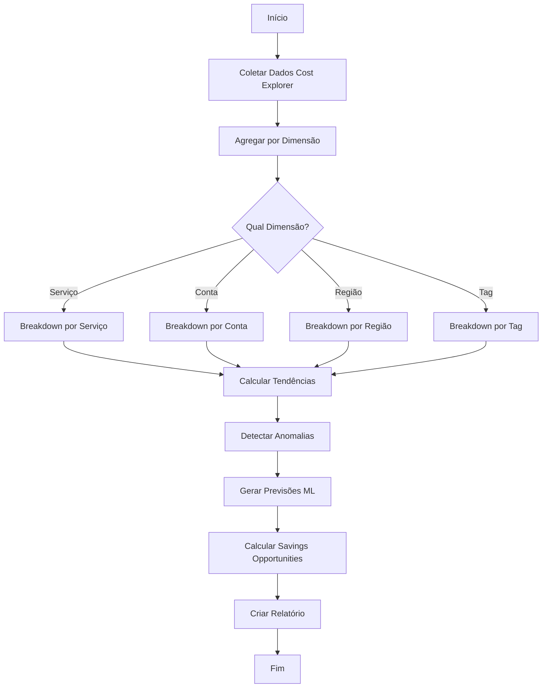

## 5.2 Métricas de Custo Coletadas

| Métrica | Descrição | Fonte | Granularidade |
|---------|-----------|-------|---------------|
| **BlendedCost** | Custo médio considerando RI sharing | Cost Explorer | Hourly/Daily |
| **UnblendedCost** | Custo real por recurso | Cost Explorer | Hourly/Daily |
| **AmortizedCost** | Custo com RI/SP distribuído | Cost Explorer | Daily/Monthly |
| **NetAmortizedCost** | Custo líquido após créditos | Cost Explorer | Daily/Monthly |
| **UsageQuantity** | Quantidade de uso | Cost Explorer | Hourly/Daily |
| **NormalizedUsageAmount** | Uso normalizado | Cost Explorer | Daily |

## 5.3 Exemplo de Relatório de Custos

```
╔══════════════════════════════════════════════════════════════════════════════╗
║                    RELATÓRIO DE CUSTOS - DEZEMBRO 2025                       ║
╠══════════════════════════════════════════════════════════════════════════════╣
║                                                                              ║
║  RESUMO EXECUTIVO                                                            ║
║  ───────────────────────────────────────────────────────────────────────     ║
║                                                                              ║
║  Custo Total do Mês:           $45,234.56                                   ║
║  Variação vs Mês Anterior:     +$4,987.00 (+12.3%)                          ║
║  Previsão Fim do Mês:          $48,500.00                                   ║
║  Economia Potencial:           $12,340.00 (27.3%)                           ║
║                                                                              ║
╠══════════════════════════════════════════════════════════════════════════════╣
║  TOP 10 SERVIÇOS POR CUSTO                                                   ║
╠══════════════════════════════════════════════════════════════════════════════╣
║                                                                              ║
║  #   Serviço              Custo        %      Tendência   Economia          ║
║  ─── ──────────────────── ─────────── ────── ─────────── ────────           ║
║  1   Amazon EC2           $18,234.00  40.3%     ↑ 15%    $4,558 (25%)       ║
║  2   Amazon RDS           $12,567.00  27.8%     ↑ 8%     $3,142 (25%)       ║
║  3   Amazon S3            $5,432.00   12.0%     ↓ 2%     $2,173 (40%)       ║
║  4   AWS Lambda           $3,456.00   7.6%      ↑ 22%    $691 (20%)         ║
║  5   Amazon CloudFront    $2,345.00   5.2%      → 0%     $469 (20%)         ║
║  6   Amazon EKS           $1,234.00   2.7%      ↑ 45%    $370 (30%)         ║
║  7   Amazon DynamoDB      $876.00     1.9%      ↑ 5%     $263 (30%)         ║
║  8   Amazon ElastiCache   $543.00     1.2%      → 0%     $136 (25%)         ║
║  9   AWS Backup           $321.00     0.7%      ↑ 10%    $96 (30%)          ║
║  10  Amazon SQS           $225.56     0.5%      ↓ 5%     $45 (20%)          ║
║                                                                              ║
╠══════════════════════════════════════════════════════════════════════════════╣
║  ANOMALIAS DETECTADAS                                                        ║
╠══════════════════════════════════════════════════════════════════════════════╣
║                                                                              ║
║  ⚠️  EC2: Aumento de 45% em i3.xlarge (us-east-1) - 5 novas instâncias      ║
║  ⚠️  S3: Transferência de dados 3x acima do normal - Data egress            ║
║  ⚠️  EKS: Cluster novo detectado sem tags de cost allocation                ║
║                                                                              ║
╠══════════════════════════════════════════════════════════════════════════════╣
║  DISTRIBUIÇÃO POR TIPO DE USO                                                ║
╠══════════════════════════════════════════════════════════════════════════════╣
║                                                                              ║
║  On-Demand:        $32,456.00  (71.7%)  ████████████████████░░░░░░░░░       ║
║  Reserved:         $8,234.00   (18.2%)  █████░░░░░░░░░░░░░░░░░░░░░░░░       ║
║  Spot:             $2,345.00   (5.2%)   ██░░░░░░░░░░░░░░░░░░░░░░░░░░░       ║
║  Savings Plans:    $2,199.56   (4.9%)   ██░░░░░░░░░░░░░░░░░░░░░░░░░░░       ║
║                                                                              ║
║  💡 Oportunidade: Converter 30% do On-Demand para RI economizaria $6,500    ║
║                                                                              ║
╚══════════════════════════════════════════════════════════════════════════════╝
```

## 5.4 Previsão de Custos (ML)

O sistema utiliza dois métodos de previsão:

### 5.4.1 Exponential Moving Average (EMA)

```python
def forecast_ema(historical_costs: List[float], horizon: int = 30) -> List[float]:
    """
    Previsão usando Exponential Moving Average.
    
    Simples e eficiente para padrões lineares.
    """
    alpha = 2 / (len(historical_costs) + 1)
    ema = historical_costs[0]
    
    for cost in historical_costs[1:]:
        ema = alpha * cost + (1 - alpha) * ema
    
    # Projetar para o futuro
    trend = (historical_costs[-1] - historical_costs[-7]) / 7  # Tendência semanal
    
    forecast = []
    for day in range(horizon):
        forecast.append(ema + trend * day)
    
    return forecast
```

### 5.4.2 Machine Learning (quando disponível)

```python
def forecast_ml(historical_costs: List[float], horizon: int = 30) -> List[float]:
    """
    Previsão usando modelo de ML.
    
    Considera sazonalidade e padrões complexos.
    Requer histórico de pelo menos 60 dias.
    """
    if len(historical_costs) < 60:
        return forecast_ema(historical_costs, horizon)
    
    # Preparar features
    features = extract_time_features(historical_costs)
    
    # Treinar modelo
    model = train_forecasting_model(features, historical_costs)
    
    # Gerar previsões
    future_features = generate_future_features(horizon)
    forecast = model.predict(future_features)
    
    return forecast
```

---

# 6. Motor de Recomendações

## 6.1 Tipos de Recomendações

| Tipo | Descrição | Economia Típica | Esforço | Risco |
|------|-----------|-----------------|---------|-------|
| **Terminate Idle** | Encerrar recursos sem uso | 100% do recurso | Baixo | Baixo |
| **Rightsizing Down** | Reduzir tamanho do recurso | 30-50% | Médio | Baixo |
| **Rightsizing Up** | Aumentar tamanho (performance) | 0 (custo maior) | Médio | Baixo |
| **Reserved Instance 1Y** | Compromisso de 1 ano | 30-40% | Baixo | Médio |
| **Reserved Instance 3Y** | Compromisso de 3 anos | 50-60% | Baixo | Alto |
| **Savings Plans** | Compromisso flexível | 20-30% | Baixo | Médio |
| **Spot Instances** | Capacidade ociosa | 60-90% | Alto | Alto |
| **Storage Tiering** | Classes de armazenamento | 40-70% | Baixo | Baixo |
| **Delete Unused** | Remover recursos órfãos | 100% do recurso | Baixo | Baixo |

## 6.2 Fluxo de Geração de Recomendações

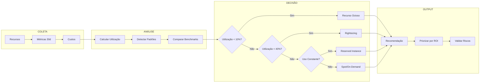

## 6.3 Exemplo de Recomendação

```json
{
  "id": "rec-ec2-rightsizing-001",
  "type": "rightsizing_down",
  "resource": {
    "id": "i-0abc123def456789",
    "name": "prod-web-server-01",
    "type": "m5.xlarge",
    "region": "us-east-1",
    "account": "123456789012"
  },
  "current_state": {
    "instance_type": "m5.xlarge",
    "vcpus": 4,
    "memory_gb": 16,
    "monthly_cost": 140.16
  },
  "recommended_state": {
    "instance_type": "m5.large",
    "vcpus": 2,
    "memory_gb": 8,
    "monthly_cost": 70.08
  },
  "justification": {
    "cpu_avg_30d": 12.5,
    "cpu_max_30d": 35.2,
    "memory_avg_30d": 22.3,
    "memory_max_30d": 45.6
  },
  "savings": {
    "monthly": 70.08,
    "annual": 840.96,
    "percentage": 50.0
  },
  "effort": "medium",
  "risk": "low",
  "priority": 1,
  "action_items": [
    "Agendar janela de manutenção",
    "Criar snapshot antes da mudança",
    "Alterar tipo de instância via console ou CLI",
    "Monitorar performance por 7 dias após mudança"
  ]
}
```

---

# 7. Monitoramento e Alertas

## 7.1 Sistema de Alertas

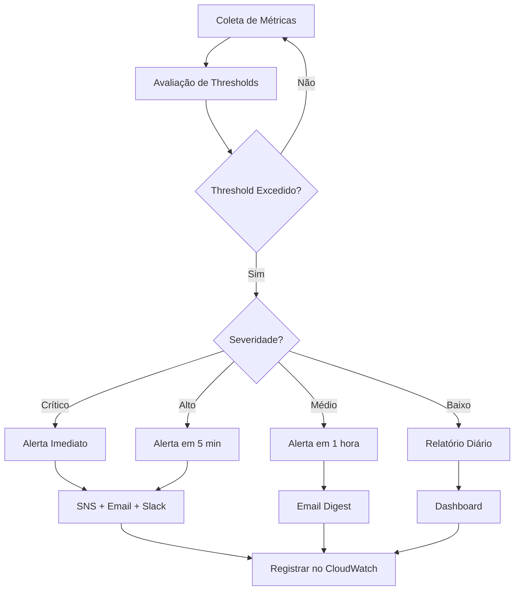

## 7.2 Tipos de Alertas

| Tipo | Trigger | Severidade | Canal | Ação Sugerida |
|------|---------|------------|-------|---------------|
| **Budget Exceeded** | Custo > Budget definido | Crítico | SNS + Email | Revisar gastos |
| **Budget Warning** | Custo > 80% do Budget | Alto | Email | Monitorar |
| **Anomaly Detected** | Desvio > 2σ da média | Alto | SNS + Email | Investigar |
| **Cost Spike** | Aumento > 50% diário | Alto | SNS | Verificar recursos |
| **Underutilized Resource** | CPU < 10% por 7+ dias | Médio | Relatório | Rightsizing |
| **RI Expiring** | RI expira em 30 dias | Médio | Email | Renovar ou planejar |
| **Security Finding** | GuardDuty/SecurityHub | Alto | SNS | Remediar |
| **Orphaned Resource** | Recurso sem uso 30+ dias | Baixo | Relatório | Avaliar remoção |

## 7.3 Configuração de Alertas

```yaml
# Exemplo de configuração de alertas
alerts:
  budget_alerts:
    - name: "Monthly Budget Alert"
      threshold_percentage: 80
      severity: "high"
      channels: ["email", "slack"]
      
    - name: "Monthly Budget Exceeded"
      threshold_percentage: 100
      severity: "critical"
      channels: ["sns", "email", "slack", "pagerduty"]
  
  anomaly_alerts:
    - name: "Cost Anomaly"
      std_deviation_threshold: 2.0
      lookback_days: 30
      severity: "high"
      channels: ["email"]
  
  utilization_alerts:
    - name: "EC2 Underutilized"
      metric: "CPUUtilization"
      threshold: 10
      operator: "less_than"
      period_days: 7
      severity: "medium"
      channels: ["report"]
```

---

# 8. Governança Multi-Conta

## 8.1 Arquitetura Multi-Conta

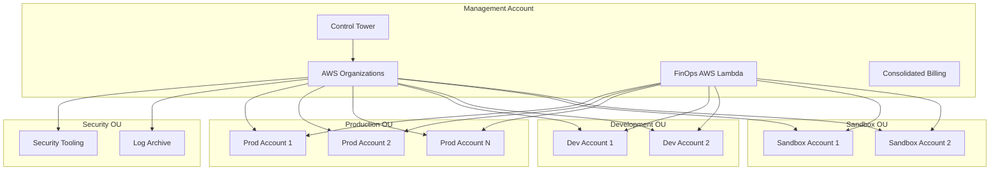

## 8.2 Cross-Account Access

```python
def assume_role_cross_account(account_id: str, role_name: str) -> boto3.Session:
    """
    Assume role em conta destino para análise cross-account.
    
    A role na conta destino deve ter trust policy para a conta de management.
    """
    sts = boto3.client('sts')
    
    role_arn = f"arn:aws:iam::{account_id}:role/{role_name}"
    
    response = sts.assume_role(
        RoleArn=role_arn,
        RoleSessionName='FinOpsAnalysis',
        DurationSeconds=3600
    )
    
    credentials = response['Credentials']
    
    return boto3.Session(
        aws_access_key_id=credentials['AccessKeyId'],
        aws_secret_access_key=credentials['SecretAccessKey'],
        aws_session_token=credentials['SessionToken']
    )
```

## 8.3 Consolidação de Custos

| Dimensão | Descrição | Uso Típico |
|----------|-----------|------------|
| **Por OU** | Organizational Unit | Departamentos, Business Units |
| **Por Conta** | AWS Account individual | Projetos, Times |
| **Por Tag** | Cost Allocation Tags | Centros de Custo, Aplicações |
| **Por Região** | AWS Region | Localização geográfica |
| **Por Ambiente** | Prod/Dev/Staging | Ciclo de vida |

---

# 9. Relatórios e Dashboards

## 9.1 Tipos de Relatórios

| Relatório | Frequência | Audiência | Conteúdo |
|-----------|------------|-----------|----------|
| **Executive Summary** | Mensal | C-Level | KPIs, Tendências, ROI |
| **Cost Breakdown** | Semanal | Finance | Custos detalhados por dimensão |
| **Optimization Report** | Diário | DevOps/SRE | Recomendações priorizadas |
| **Anomaly Report** | Real-time | Operations | Desvios detectados |
| **Compliance Report** | Mensal | Security | Conformidade, tags, policies |
| **Chargeback Report** | Mensal | Finance | Custos por time/projeto |

## 9.2 Dashboard Executivo

```
┌─────────────────────────────────────────────────────────────────────────────┐
│                         FINOPS DASHBOARD - DEZEMBRO 2025                    │
├─────────────────────────────────────────────────────────────────────────────┤
│                                                                             │
│  ┌─────────────┐  ┌─────────────┐  ┌─────────────┐  ┌─────────────┐        │
│  │ CUSTO MTD   │  │  TENDÊNCIA  │  │  ECONOMIA   │  │  ALERTAS    │        │
│  │             │  │             │  │  POTENCIAL  │  │             │        │
│  │  $45,234    │  │    ↑12%     │  │   $12,340   │  │     3       │        │
│  │    /mês     │  │  vs. Nov    │  │   (27.3%)   │  │   ativos    │        │
│  └─────────────┘  └─────────────┘  └─────────────┘  └─────────────┘        │
│                                                                             │
├─────────────────────────────────────────────────────────────────────────────┤
│  CUSTO POR SERVIÇO (TOP 5)                                                  │
│                                                                             │
│  EC2         ████████████████████████████████░░░░░░░░░░ $18,234 (40%)      │
│  RDS         ██████████████████████░░░░░░░░░░░░░░░░░░░░ $12,567 (28%)      │
│  S3          ██████████░░░░░░░░░░░░░░░░░░░░░░░░░░░░░░░░  $5,432 (12%)      │
│  Lambda      ██████░░░░░░░░░░░░░░░░░░░░░░░░░░░░░░░░░░░░  $3,456  (8%)      │
│  CloudFront  ████░░░░░░░░░░░░░░░░░░░░░░░░░░░░░░░░░░░░░░  $2,345  (5%)      │
│                                                                             │
├─────────────────────────────────────────────────────────────────────────────┤
│  TENDÊNCIA DE CUSTOS (ÚLTIMOS 6 MESES)                                      │
│                                                                             │
│  $50k │                                                    ╭──              │
│       │                                              ╭─────╯                │
│  $45k │                                        ╭─────╯                      │
│       │                                  ╭─────╯                            │
│  $40k │                            ╭─────╯                                  │
│       │                      ╭─────╯                                        │
│  $35k │────────────────╭─────╯                                              │
│       └─────────────────────────────────────────────────────────            │
│         Jul    Ago    Set    Out    Nov    Dez                              │
│                                                                             │
├─────────────────────────────────────────────────────────────────────────────┤
│  TOP RECOMENDAÇÕES                                                          │
│  ┌─────────────────────────────────────────────────────────────────────┐   │
│  │ 1. ⚡ Reserved Instances EC2 - Economia: $4,500/mês                 │   │
│  │ 2. 📉 Rightsizing 12 instâncias EC2 - Economia: $2,340/mês         │   │
│  │ 3. 🗂️  S3 Lifecycle Policies - Economia: $2,173/mês               │   │
│  │ 4. 🗑️  Terminar 5 recursos ociosos - Economia: $1,234/mês          │   │
│  │ 5. 💾 EBS Snapshot Cleanup - Economia: $890/mês                    │   │
│  └─────────────────────────────────────────────────────────────────────┘   │
│                                                                             │
└─────────────────────────────────────────────────────────────────────────────┘
```

---

# 10. Casos de Uso Empresariais

## 10.1 Caso 1: Redução de Custos EC2

**Empresa**: Tech Corp (500 instâncias EC2, $100k/mês)

**Análise FinOps**:
1. Identificou **50 instâncias** com CPU < 5% (ociosas)
2. Detectou **100 instâncias** candidatas a RI (uptime > 90%)
3. Encontrou **30 instâncias** para rightsizing (CPU 10-40%)
4. Identificou **20 instâncias** elegíveis para Spot

**Implementação**:
```
Semana 1: Terminar 50 instâncias ociosas → $10,000/mês
Semana 2: Comprar 1-year RI para 100 instâncias → $18,000/mês
Semana 3: Rightsizing de 30 instâncias → $7,000/mês
Semana 4: Migrar 20 instâncias para Spot → $5,000/mês
```

**Resultado**:
- **Economia Total**: $40,000/mês (40%)
- **Payback**: Imediato
- **ROI Anual**: $480,000

## 10.2 Caso 2: Otimização de Storage S3

**Empresa**: Data Corp (500TB em S3, $12k/mês)

**Análise FinOps**:
1. 200TB não acessados há 90+ dias
2. 150TB acessados raramente (< 1x/mês)
3. 50TB são logs de retenção obrigatória
4. 100TB de uso ativo

**Implementação**:
```
200TB → S3 Glacier Deep Archive: $0.00099/GB → $200/mês
150TB → S3 Intelligent-Tiering: $0.0025/GB → $375/mês
50TB → S3 Glacier: $0.004/GB → $200/mês
100TB → S3 Standard (mantém): $0.023/GB → $2,300/mês
```

**Resultado**:
- **Custo Anterior**: $12,000/mês
- **Custo Novo**: $3,075/mês
- **Economia**: $8,925/mês (74%)
- **Economia Anual**: $107,100

## 10.3 Caso 3: Governança Multi-Conta

**Empresa**: Enterprise Corp (20 contas AWS, $500k/mês)

**Desafio**:
- Sem visibilidade consolidada
- Tags inconsistentes
- Shadow IT não identificado
- Recursos duplicados entre contas

**Implementação FinOps**:
1. Deploy centralizado na conta management
2. Cross-account IAM roles configuradas
3. Tagging policy implementada
4. Budgets por OU/conta

**Resultado**:
- Visibilidade 100% consolidada
- Identificação de $50k/mês em shadow IT
- Eliminação de $30k/mês em duplicação
- Chargeback por departamento implementado
- **Economia Total**: $125k/mês (25%)

---

# 11. Fluxos de Trabalho Detalhados

## 11.1 Fluxo de Análise Completa

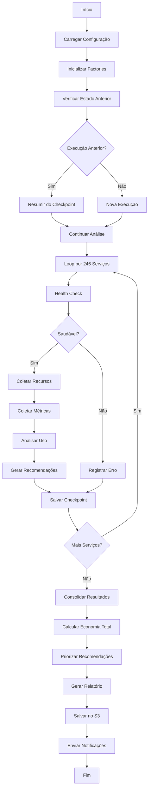

## 11.2 Fluxo de Tratamento de Erros

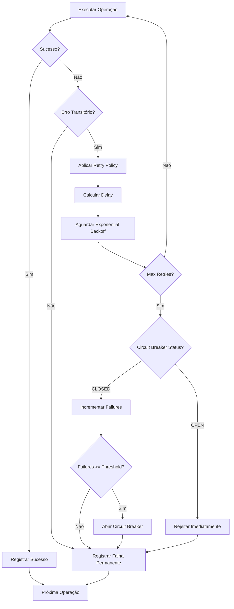

---

# 12. Integrações e Extensibilidade

## 12.1 Integrações Nativas

| Integração | Tipo | Uso |
|------------|------|-----|
| **AWS Cost Explorer** | Coleta | Dados de custo e uso |
| **AWS CloudWatch** | Coleta | Métricas de performance |
| **AWS Organizations** | Governança | Multi-account management |
| **AWS SNS** | Notificação | Alertas e notificações |
| **AWS S3** | Storage | Estado e relatórios |
| **AWS Step Functions** | Orquestração | Workflow management |
| **AWS EventBridge** | Trigger | Agendamento |
| **AWS API Gateway** | API | REST API |

## 12.2 CI/CD Integration

```yaml
# .github/workflows/finops-check.yml
name: FinOps Cost Analysis

on:
  pull_request:
    branches: [main]
  schedule:
    - cron: '0 6 * * 1'  # Weekly Monday 6 AM

jobs:
  finops-analysis:
    runs-on: ubuntu-latest
    steps:
      - uses: actions/checkout@v4
      
      - name: Setup Python
        uses: actions/setup-python@v4
        with:
          python-version: '3.11'
      
      - name: Install Dependencies
        run: pip install -r requirements.txt
      
      - name: Run FinOps Analysis
        env:
          AWS_ACCESS_KEY_ID: ${{ secrets.AWS_ACCESS_KEY_ID }}
          AWS_SECRET_ACCESS_KEY: ${{ secrets.AWS_SECRET_ACCESS_KEY }}
        run: python run_with_aws.py --output json > finops_report.json
      
      - name: Check Cost Threshold
        run: |
          SAVINGS=$(jq '.potential_savings' finops_report.json)
          if (( $(echo "$SAVINGS > 10000" | bc -l) )); then
            echo "::warning::Potential savings exceed $10,000"
          fi
      
      - name: Upload Report
        uses: actions/upload-artifact@v3
        with:
          name: finops-report
          path: finops_report.json
```

---

# 13. Métricas e KPIs FinOps

## 13.1 KPIs Principais

| KPI | Descrição | Meta | Cálculo |
|-----|-----------|------|---------|
| **Cost per Resource** | Custo médio por recurso | Reduzir 10%/trimestre | Total Cost / Resource Count |
| **RI Coverage** | % de uso coberto por RI | > 70% | RI Hours / Total Hours |
| **RI Utilization** | % de RI sendo utilizado | > 80% | Used RI Hours / Purchased RI Hours |
| **Savings Rate** | % de economia vs On-Demand | > 30% | Savings / On-Demand Equivalent |
| **Waste Rate** | % de recursos ociosos | < 5% | Idle Resources / Total Resources |
| **Tag Compliance** | % de recursos tagueados | > 95% | Tagged Resources / Total Resources |
| **Budget Variance** | Desvio do budget | < 10% | (Actual - Budget) / Budget |
| **Cost per Unit** | Custo por unidade de negócio | Reduzir 5%/mês | Total Cost / Business Units |

## 13.2 Dashboard de KPIs

```
┌─────────────────────────────────────────────────────────────────────────────┐
│                              FINOPS KPIs                                    │
├─────────────────────────────────────────────────────────────────────────────┤
│                                                                             │
│  RI COVERAGE          RI UTILIZATION        SAVINGS RATE      WASTE RATE   │
│  ┌──────────────┐    ┌──────────────┐    ┌──────────────┐  ┌──────────────┐│
│  │              │    │              │    │              │  │              ││
│  │     68%      │    │     82%      │    │     32%      │  │     4.2%     ││
│  │   ▲ Target   │    │   ✓ Target   │    │   ✓ Target   │  │   ✓ Target   ││
│  │     70%      │    │     80%      │    │     30%      │  │     5%       ││
│  └──────────────┘    └──────────────┘    └──────────────┘  └──────────────┘│
│                                                                             │
│  TAG COMPLIANCE       BUDGET VARIANCE                                       │
│  ┌──────────────┐    ┌──────────────┐                                      │
│  │              │    │              │                                      │
│  │     92%      │    │    +8.5%     │                                      │
│  │   ⚠ Target   │    │   ✓ Target   │                                      │
│  │     95%      │    │    ±10%      │                                      │
│  └──────────────┘    └──────────────┘                                      │
│                                                                             │
└─────────────────────────────────────────────────────────────────────────────┘
```

---

# 14. Roadmap de Funcionalidades

## 14.1 Versão Atual (2.1) - AI Consultant

| Funcionalidade | Status |
|----------------|--------|
| 246 Serviços AWS (60% boto3) | ✅ Implementado |
| Análise de Custos | ✅ Implementado |
| Motor de Recomendações | ✅ Implementado |
| Multi-Account | ✅ Implementado |
| Previsões ML | ✅ Implementado |
| Dashboard HTML | ✅ Implementado |
| API REST | ✅ Implementado |
| **AI Consultant (Amazon Q)** | ✅ **NOVO** |
| **Relatórios Personalizados** | ✅ **NOVO** |
| **4 Personas (CEO, CTO, DevOps, Analyst)** | ✅ **NOVO** |
| **Delivery Multi-canal (Email, Slack)** | ✅ **NOVO** |
| 2.200+ Testes | ✅ 100% passing |

### AI Consultant - Consultor Financeiro Automatizado

O módulo AI Consultant transforma o FinOps AWS de um coletor de dados em um **consultor financeiro automatizado**:

```
┌─────────────────────────────────────────────────────────────────────────────┐
│                    AI CONSULTANT - VISÃO FUNCIONAL                          │
├─────────────────────────────────────────────────────────────────────────────┤
│                                                                             │
│  📊 DADOS BRUTOS          🤖 AMAZON Q            📋 RELATÓRIO INTELIGENTE  │
│  ┌─────────────┐          ┌─────────────┐         ┌─────────────┐          │
│  │ Custos      │   ──>    │ Análise IA  │   ──>   │ Executivo   │          │
│  │ Métricas    │          │ Contexto    │         │ Técnico     │          │
│  │ Tendências  │          │ Personaliza │         │ Operacional │          │
│  └─────────────┘          └─────────────┘         └─────────────┘          │
│                                                                             │
│  PERSONAS DISPONÍVEIS:                                                      │
│  👔 CEO/CFO   - Resumo executivo, ROI, decisões estratégicas               │
│  💻 CTO       - Trade-offs técnicos, roadmap de modernização               │
│  🔧 DevOps    - Comandos AWS CLI, scripts de automação                     │
│  📈 Analyst   - Métricas detalhadas, KPIs, benchmarks                      │
│                                                                             │
│  CANAIS DE ENTREGA:                                                        │
│  📧 Email (SES)  📱 Slack  📄 PDF  🌐 Dashboard  🔌 API REST               │
│                                                                             │
└─────────────────────────────────────────────────────────────────────────────┘
```

**Benefícios do AI Consultant:**

| Benefício | Descrição |
|-----------|-----------|
| **Relatórios Personalizados** | Cada stakeholder recebe análise adequada ao seu perfil |
| **Linguagem Natural** | Explicações claras sem jargão técnico desnecessário |
| **Recomendações Contextualizadas** | Sugestões baseadas nos dados reais da empresa |
| **Estimativas de ROI** | Cada recomendação inclui economia estimada |
| **Conhecimento AWS Nativo** | Q Business conhece todos os 246 serviços AWS (60% boto3) |
| **Dados na AWS** | Nenhum dado sai da conta AWS do cliente |

## 14.2 Próximas Versões

### v2.2 (Q1 2026)
- [ ] Integração AWS CUR (Cost and Usage Reports)
- [ ] Tagging/Showback avançado
- [ ] Alertas em tempo real via CloudWatch Events
- [ ] Mobile dashboard

### v2.3 (Q2 2026)
- [ ] Anomaly detection com ML avançado
- [ ] Remediação automática (com aprovação)
- [ ] Custom dashboards
- [ ] Conversas multi-turno com AI

### v3.0 (Q3 2026)
- [ ] Multi-cloud (Azure, GCP)
- [ ] Kubernetes cost allocation
- [ ] FinOps Maturity Assessment
- [ ] AI-powered auto-remediation

---

*Guia Funcional FinOps AWS - Versão 2.0*
*Dezembro 2025*
*Documentação completa para stakeholders técnicos e de negócio*
