# FinOps AWS - Guia Técnico Detalhado

## Índice

1. [Visão Geral da Arquitetura](#1-visão-geral-da-arquitetura)
2. [Padrões de Projeto](#2-padrões-de-projeto)
3. [Estrutura de Camadas](#3-estrutura-de-camadas)
4. [Componentes Core](#4-componentes-core)
5. [Camada de Serviços](#5-camada-de-serviços)
6. [Fluxo de Execução](#6-fluxo-de-execução)
7. [Gerenciamento de Estado](#7-gerenciamento-de-estado)
8. [Resiliência e Retry](#8-resiliência-e-retry)
9. [Integração AWS Lambda](#9-integração-aws-lambda)
10. [Segurança e Compliance](#10-segurança-e-compliance)
11. [Testes e Qualidade](#11-testes-e-qualidade)

---

## 1. Visão Geral da Arquitetura

O FinOps AWS é uma solução enterprise-grade para análise de custos, monitoramento de uso e otimização de recursos AWS. A arquitetura segue os princípios de **Clean Architecture** e **Domain-Driven Design (DDD)**.

### 1.1 Diagrama de Arquitetura de Alto Nível

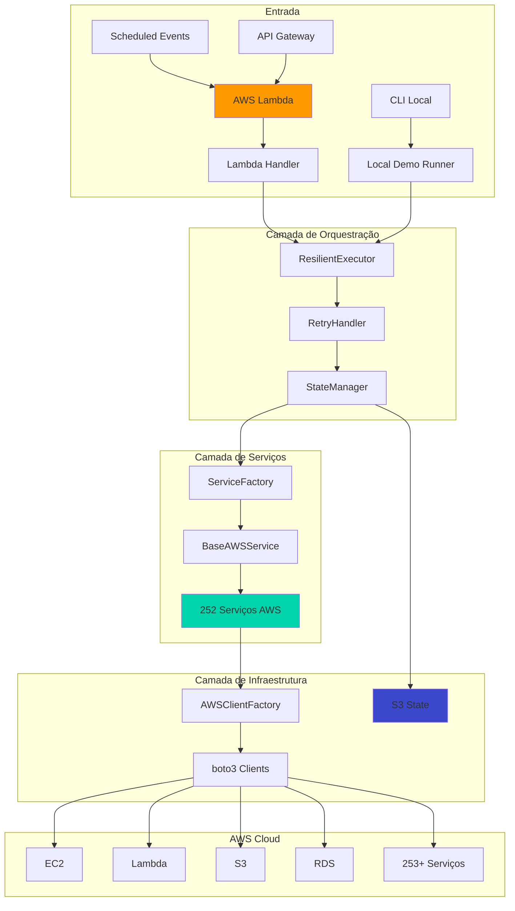

### 1.2 Diagrama de Deployment

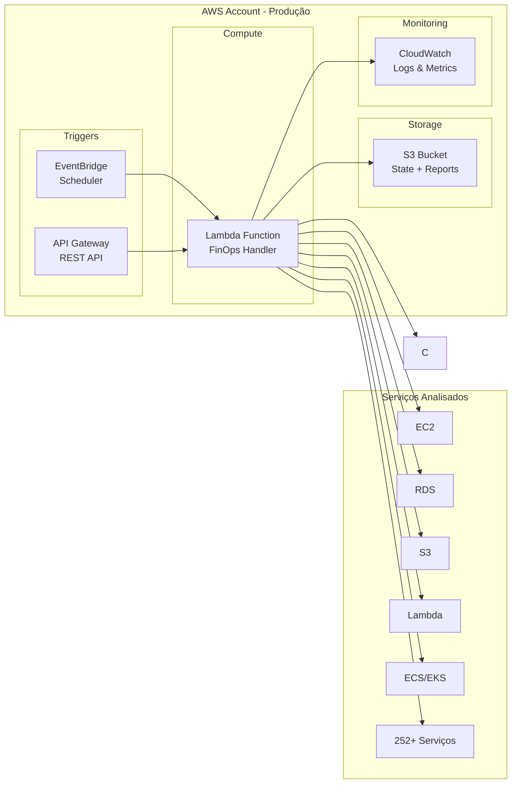

---

## 2. Padrões de Projeto

### 2.1 Padrões Implementados

| Padrão | Componente | Propósito |
|--------|------------|-----------|
| **Factory** | `ServiceFactory`, `AWSClientFactory` | Criação centralizada de objetos |
| **Singleton** | `ServiceFactory._instance` | Instância única com cache |
| **Template Method** | `BaseAWSService` | Interface comum para serviços |
| **Strategy** | `RetryPolicy` | Políticas de retry configuráveis |
| **State** | `S3StateManager` | Gerenciamento de estado de execução |
| **Circuit Breaker** | `ResilientExecutor` | Proteção contra falhas em cascata |
| **Decorator** | `@with_retry` | Retry automático em funções |

### 2.2 Diagrama de Padrões

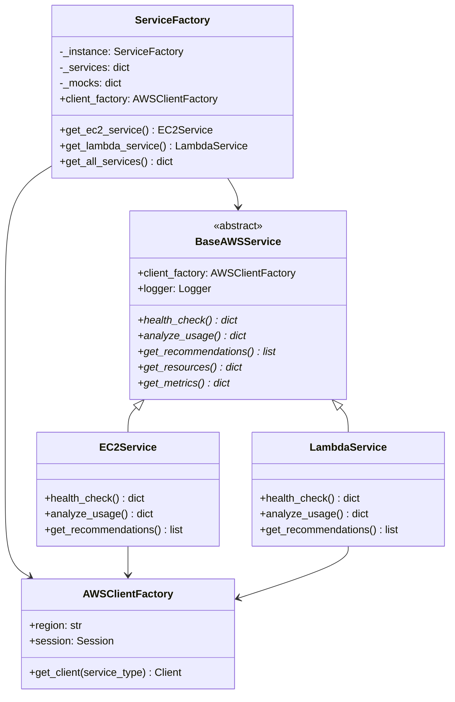

---

## 3. Estrutura de Camadas

### 3.1 Organização do Projeto

```
src/finops_aws/
├── __init__.py                 # Módulo principal
├── core/                       # Núcleo da aplicação
│   ├── __init__.py
│   ├── factories.py            # ServiceFactory + AWSClientFactory
│   ├── s3_state_manager.py        # Gerenciamento de estado (S3)
│   ├── resilient_executor.py   # Executor com resiliência
│   ├── retry_handler.py        # Políticas de retry
│   ├── state_manager.py        # State manager local
│   └── cleanup_manager.py      # Limpeza de recursos
├── models/                     # Modelos de domínio
│   ├── __init__.py
│   └── finops_models.py        # Dataclasses e entidades
├── services/                   # 252 serviços AWS
│   ├── __init__.py
│   ├── base_service.py         # Classe base abstrata
│   ├── ec2_service.py          # Serviço EC2
│   ├── lambda_service.py       # Serviço Lambda
│   ├── s3_service.py           # Serviço S3
│   └── ... (249 outros)
└── utils/                      # Utilitários
    ├── __init__.py
    └── logger.py               # Configuração de logging
```

### 3.2 Diagrama de Dependências entre Camadas

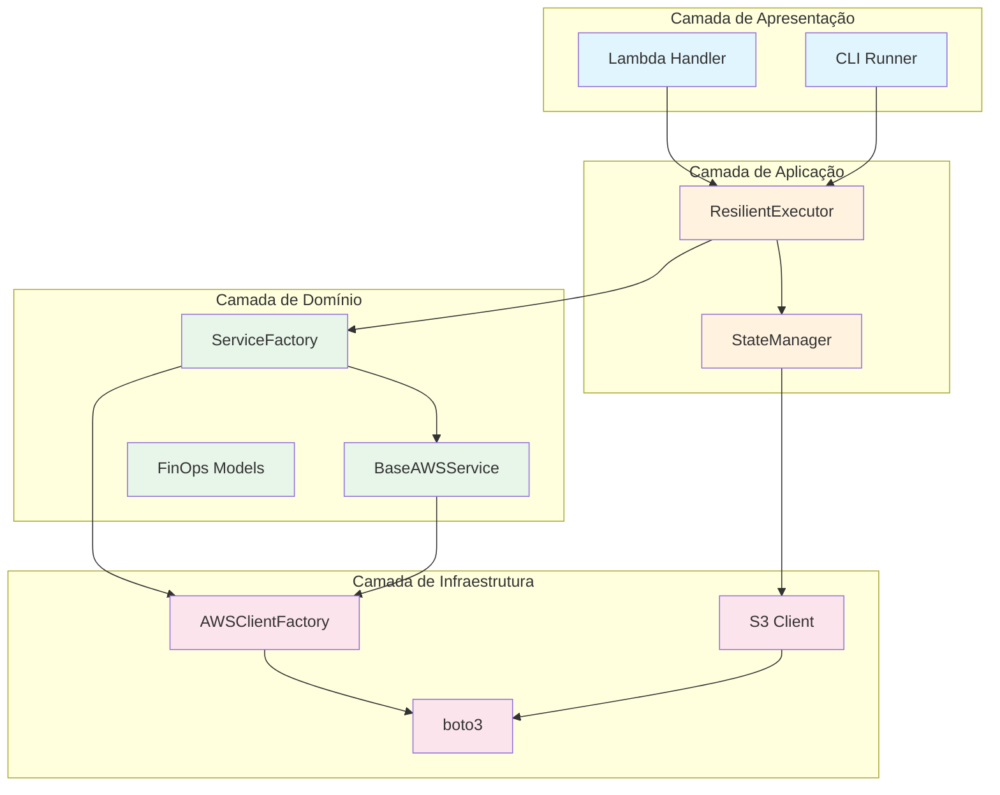

---

## 4. Componentes Core

### 4.1 AWSClientFactory

Responsável pela criação centralizada de clientes boto3.

```python
class AWSClientFactory:
    """
    Factory para criação de clientes AWS boto3.
    
    Características:
    - Cache de clientes para reutilização
    - Suporte a múltiplas regiões
    - Configuração de timeouts e retries
    - Injeção de mocks para testes
    """
    
    def __init__(self, region: str = 'us-east-1'):
        self.region = region
        self._clients = {}
        self._session = boto3.Session()
    
    def get_client(self, service_type: AWSServiceType) -> Any:
        """Obtém cliente boto3 com cache"""
        if service_type not in self._clients:
            self._clients[service_type] = self._session.client(
                service_type.value,
                region_name=self.region
            )
        return self._clients[service_type]
```

### 4.2 ServiceFactory

Padrão Factory para criação de serviços FinOps.

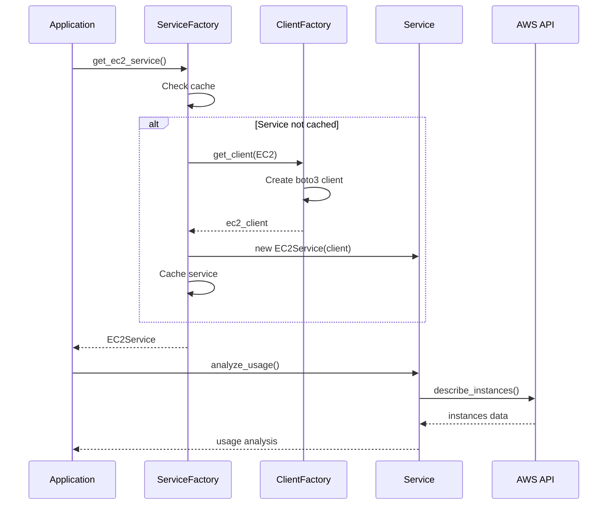

### 4.3 Enum AWSServiceType

```python
class AWSServiceType(Enum):
    """
    Enumeração de todos os 255 tipos de serviços AWS suportados.
    
    Categorias:
    - Compute: EC2, Lambda, Batch, etc.
    - Storage: S3, EBS, EFS, etc.
    - Database: RDS, DynamoDB, Aurora, etc.
    - Networking: VPC, ELB, CloudFront, etc.
    - Security: IAM, KMS, GuardDuty, etc.
    - AI/ML: SageMaker, Bedrock, Rekognition, etc.
    - Analytics: Athena, Glue, Redshift, etc.
    """
    
    # Compute
    EC2 = 'ec2'
    LAMBDA = 'lambda'
    BATCH = 'batch'
    # ... 252 outros
```

---

## 5. Camada de Serviços

### 5.1 BaseAWSService

Classe abstrata que define a interface comum para todos os serviços.

```python
from abc import ABC, abstractmethod
from dataclasses import dataclass
from typing import Dict, List, Any

class BaseAWSService(ABC):
    """
    Classe base abstrata para todos os serviços AWS FinOps.
    
    Métodos obrigatórios:
    - health_check(): Verifica saúde do serviço
    - analyze_usage(): Analisa uso e consumo
    - get_recommendations(): Retorna recomendações de otimização
    - get_resources(): Lista recursos do serviço
    - get_metrics(): Obtém métricas de performance
    """
    
    def __init__(self, client_factory: AWSClientFactory):
        self._client_factory = client_factory
        self.logger = setup_logger(self.__class__.__name__)
    
    @abstractmethod
    def health_check(self) -> Dict[str, Any]:
        """Verifica se o serviço está acessível e funcionando"""
        pass
    
    @abstractmethod
    def analyze_usage(self) -> Dict[str, Any]:
        """Analisa padrões de uso e consumo"""
        pass
    
    @abstractmethod
    def get_recommendations(self) -> List[Dict[str, Any]]:
        """Retorna recomendações de otimização de custos"""
        pass
    
    @abstractmethod
    def get_resources(self) -> Dict[str, Any]:
        """Lista todos os recursos do serviço"""
        pass
    
    @abstractmethod
    def get_metrics(self) -> Dict[str, Any]:
        """Obtém métricas de performance e custo"""
        pass
```

### 5.2 Diagrama de Herança de Serviços

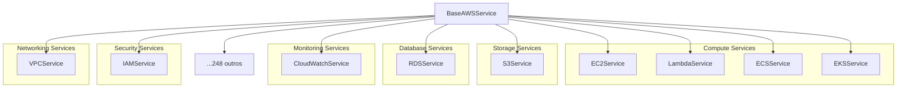

### 5.3 Exemplo de Implementação de Serviço

```python
class EC2Service(BaseAWSService):
    """
    Serviço de análise FinOps para Amazon EC2.
    
    Capacidades:
    - Análise de utilização de instâncias
    - Detecção de instâncias ociosas
    - Recomendações de rightsizing
    - Análise de Reserved Instances
    - Monitoramento de Spot Instances
    """
    
    def __init__(self, client_factory: AWSClientFactory):
        super().__init__(client_factory)
        self._ec2_client = client_factory.get_client(AWSServiceType.EC2)
        self._cloudwatch = client_factory.get_client(AWSServiceType.CLOUDWATCH)
        self._cost_explorer = client_factory.get_client(AWSServiceType.COST_EXPLORER)
    
    def health_check(self) -> Dict[str, Any]:
        """Verifica conectividade com EC2 API"""
        try:
            self._ec2_client.describe_instances(MaxResults=5)
            return {'status': 'healthy', 'service': 'ec2'}
        except Exception as e:
            return {'status': 'unhealthy', 'error': str(e)}
    
    def analyze_usage(self) -> Dict[str, Any]:
        """
        Analisa utilização de instâncias EC2.
        
        Métricas analisadas:
        - CPU Utilization
        - Network I/O
        - Disk I/O
        - Memory (se CloudWatch Agent instalado)
        """
        instances = self._get_all_instances()
        analysis = {
            'total_instances': len(instances),
            'running': 0,
            'stopped': 0,
            'underutilized': [],
            'overutilized': [],
            'recommendations': []
        }
        
        for instance in instances:
            metrics = self._get_instance_metrics(instance['InstanceId'])
            if metrics['cpu_avg'] < 10:
                analysis['underutilized'].append(instance)
            elif metrics['cpu_avg'] > 80:
                analysis['overutilized'].append(instance)
        
        return analysis
```

---

## 6. Fluxo de Execução

### 6.1 Fluxo Principal de Análise

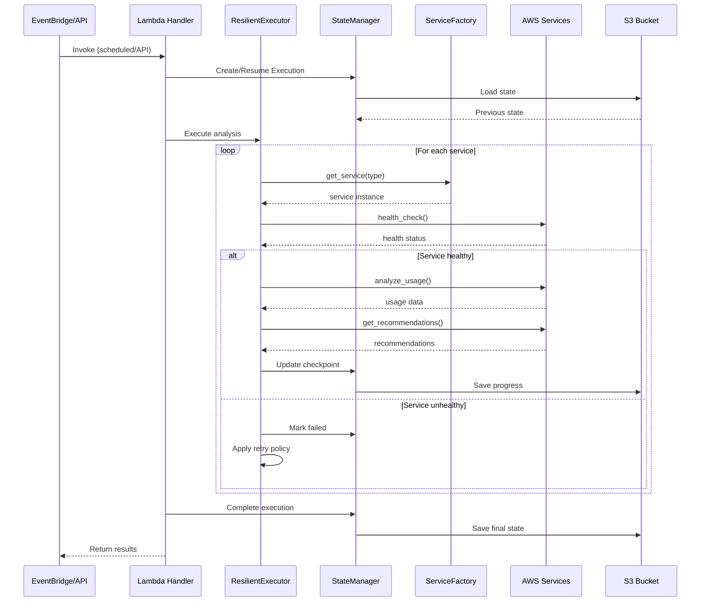

### 6.2 Fluxo de Retry e Resiliência

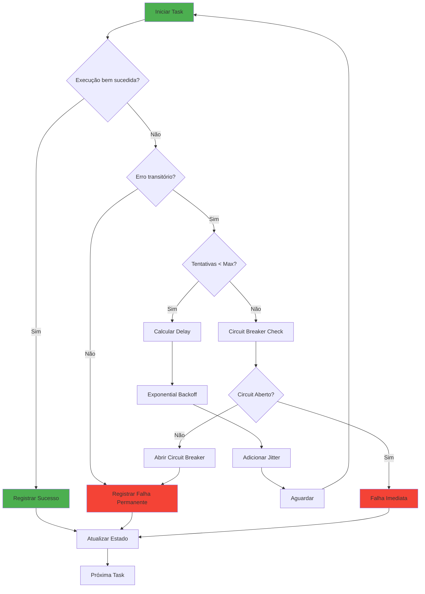

---

## 7. Gerenciamento de Estado

### 7.1 S3StateManager

```python
@dataclass
class ExecutionRecord:
    """
    Registro de execução no S3.
    
    Campos:
    - execution_id: ID único da execução
    - started_at: Timestamp de início
    - status: pending, running, completed, failed
    - services_completed: Lista de serviços processados
    - current_service: Serviço em processamento
    - checkpoint_data: Dados de checkpoint
    - results: Resultados parciais/finais
    """
    execution_id: str
    started_at: str
    status: str
    services_completed: List[str]
    current_service: Optional[str]
    checkpoint_data: Dict[str, Any]
    results: Dict[str, Any]
```

### 7.2 Diagrama de Estados de Execução

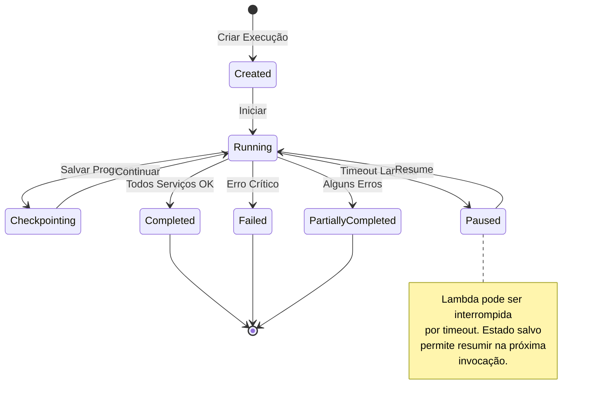

### 7.3 Estrutura S3

```
s3://finops-aws-{account-id}/
├── state/
│   └── executions/{execution_id}/
│       └── state.json              # Estado da execução
├── checkpoints/
│   └── {execution_id}/
│       └── {service}.json          # Checkpoint por serviço
├── reports/
│   ├── YYYY/MM/DD/{execution_id}/
│   │   ├── report.json             # Relatório completo
│   │   └── summary.json            # Resumo executivo
│   └── latest/
│       └── report.json             # Último relatório
└── archives/
    └── (relatórios antigos)
```

**Lifecycle Rules:**
- `state/`: Expira em 7 dias
- `checkpoints/`: Expira em 3 dias
- `reports/`: Expira em 90 dias
- `archives/`: Glacier após 90 dias, deleta após 365 dias

---

## 8. Resiliência e Retry

### 8.1 RetryPolicy

```python
@dataclass
class RetryPolicy:
    """
    Política de retry configurável.
    
    Parâmetros:
    - max_attempts: Máximo de tentativas (default: 3)
    - base_delay: Delay base em segundos (default: 1.0)
    - max_delay: Delay máximo em segundos (default: 60.0)
    - exponential_base: Base para backoff exponencial (default: 2)
    - jitter: Adicionar variação aleatória (default: True)
    - retryable_exceptions: Exceções que permitem retry
    """
    max_attempts: int = 3
    base_delay: float = 1.0
    max_delay: float = 60.0
    exponential_base: int = 2
    jitter: bool = True
    retryable_exceptions: Tuple[Type[Exception], ...] = (
        ConnectionError,
        TimeoutError,
        ClientError,  # Throttling, ServiceUnavailable
    )
    
    def calculate_delay(self, attempt: int) -> float:
        """Calcula delay com exponential backoff e jitter"""
        delay = min(
            self.base_delay * (self.exponential_base ** attempt),
            self.max_delay
        )
        if self.jitter:
            delay *= random.uniform(0.5, 1.5)
        return delay
```

### 8.2 Circuit Breaker

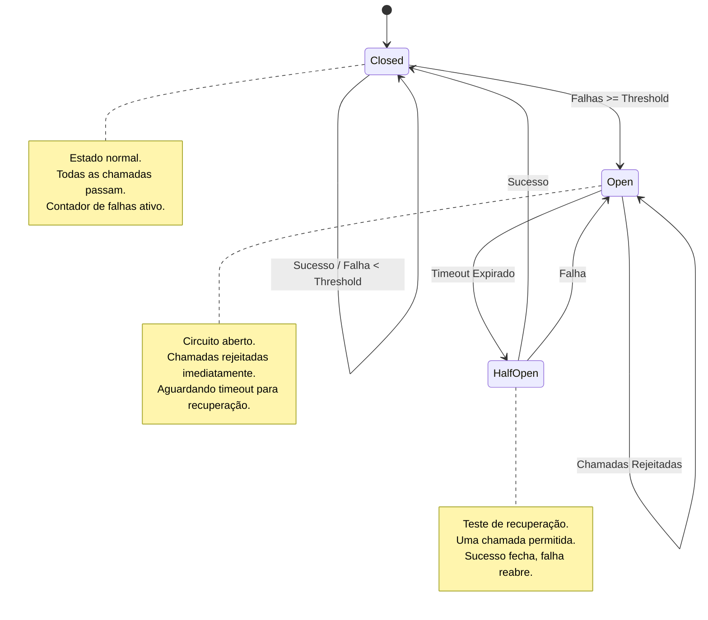

---

## 9. Integração AWS Lambda

### 9.1 Handler Principal

```python
def lambda_handler(event: Dict, context: Any) -> Dict:
    """
    Handler principal do AWS Lambda.
    
    Eventos suportados:
    - Scheduled (EventBridge): Execução agendada
    - API Gateway: Execução sob demanda via REST
    - Direct Invoke: Invocação programática
    
    Retorno:
    - statusCode: 200 (sucesso), 500 (erro)
    - body: JSON com resultados ou erro
    """
    try:
        # Inicialização
        client_factory = AWSClientFactory(region=os.environ.get('AWS_REGION', 'us-east-1'))
        service_factory = ServiceFactory(client_factory)
        state_manager = S3StateManager(client_factory)
        executor = ResilientExecutor(service_factory, state_manager)
        
        # Verificar execução anterior
        execution = state_manager.get_or_create_execution()
        
        # Executar análise
        results = executor.execute_all_services(
            timeout=context.get_remaining_time_in_millis() - 30000  # 30s buffer
        )
        
        # Salvar estado final
        state_manager.complete_execution(execution.execution_id, results)
        
        return {
            'statusCode': 200,
            'body': json.dumps(results)
        }
        
    except Exception as e:
        logger.exception("Lambda execution failed")
        return {
            'statusCode': 500,
            'body': json.dumps({'error': str(e)})
        }
```

### 9.2 Diagrama de Deployment Lambda

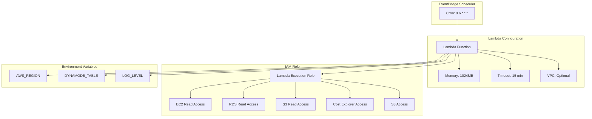

---

## 10. Segurança e Compliance

### 10.1 Princípios de Segurança

| Princípio | Implementação |
|-----------|---------------|
| **Least Privilege** | IAM policies mínimas por serviço |
| **Encryption at Rest** | S3 com KMS (SSE-KMS) |
| **Encryption in Transit** | TLS 1.2+ obrigatório |
| **No Hardcoded Secrets** | AWS Secrets Manager / Env vars |
| **Audit Trail** | CloudTrail logging |
| **Network Isolation** | VPC opcional para Lambda |

### 10.2 IAM Policy Mínima

```json
{
    "Version": "2012-10-17",
    "Statement": [
        {
            "Sid": "ReadOnlyAccess",
            "Effect": "Allow",
            "Action": [
                "ec2:Describe*",
                "rds:Describe*",
                "s3:GetBucket*",
                "s3:List*",
                "lambda:List*",
                "lambda:Get*",
                "cloudwatch:GetMetric*",
                "ce:GetCostAndUsage",
                "ce:GetReservation*"
            ],
            "Resource": "*"
        },
        {
            "Sid": "S3State",
            "Effect": "Allow",
            "Action": [
                "s3:GetObject",
                "s3:PutObject",
                "s3:ListBucket",
                "s3:DeleteObject"
            ],
            "Resource": [
                "arn:aws:s3:::finops-aws-*",
                "arn:aws:s3:::finops-aws-*/*"
            ]
        }
    ]
}
```

---

## 11. Testes e Qualidade

### 11.1 Estratégia de Testes

```mermaid
pyramid
    title Pirâmide de Testes
    "E2E" : 5
    "Integration" : 20
    "Unit" : 75
```

### 11.2 Cobertura de Testes

| Componente | Testes | Cobertura |
|------------|--------|-----------|
| Core (factories, executors) | 200+ | 95% |
| Services (252 serviços) | 1500+ | 85% |
| Models | 50+ | 100% |
| Utils | 50+ | 90% |
| **Total** | **1842** | **~90%** |

### 11.3 Executando Testes

```bash
# Todos os testes
pytest tests/unit/ -v

# Testes específicos de serviço
pytest tests/unit/test_phase5_14_services.py -v

# Com cobertura
pytest tests/unit/ --cov=src/finops_aws --cov-report=html

# Testes paralelos
pytest tests/unit/ -n auto
```

### 11.4 Mocking com Moto

```python
import pytest
from moto import mock_ec2, mock_s3, mock_dynamodb

@mock_ec2
def test_ec2_service_analyze_usage():
    """Testa análise de uso EC2 com AWS mockado"""
    # Setup: criar instâncias mock
    ec2 = boto3.client('ec2', region_name='us-east-1')
    ec2.run_instances(ImageId='ami-12345', MinCount=2, MaxCount=2)
    
    # Execute
    service = EC2Service(AWSClientFactory())
    result = service.analyze_usage()
    
    # Assert
    assert result['total_instances'] == 2
    assert 'recommendations' in result
```

---

## Apêndices

### A. Glossário Técnico

| Termo | Definição |
|-------|-----------|
| **FinOps** | Financial Operations - práticas de gestão financeira em cloud |
| **Rightsizing** | Ajustar tamanho de recursos ao uso real |
| **Reserved Instance** | Instância com desconto por compromisso de uso |
| **Spot Instance** | Instância com desconto por uso de capacidade ociosa |
| **Circuit Breaker** | Padrão para prevenir falhas em cascata |

### B. Referências

- [AWS Well-Architected Framework](https://aws.amazon.com/architecture/well-architected/)
- [FinOps Foundation](https://www.finops.org/)
- [Clean Architecture - Robert C. Martin](https://blog.cleancoder.com/uncle-bob/2012/08/13/the-clean-architecture.html)
- [Domain-Driven Design - Eric Evans](https://domainlanguage.com/ddd/)

---

*Documento gerado em: Novembro 2025*
*Versão: 1.0*
*Autor: FinOps AWS Team*

---

## 12. Detalhes de Implementação por Componente

### 12.1 ServiceFactory - Implementação Interna

```python
# Arquitetura interna do ServiceFactory

class ServiceFactory:
    """
    Factory para criação de serviços AWS.
    Implementa padrões Singleton e Factory Method.
    """
    
    _instance = None
    _services_cache = {}
    
    def __new__(cls, *args, **kwargs):
        # Padrão Singleton
        if cls._instance is None:
            cls._instance = super().__new__(cls)
        return cls._instance
    
    def __init__(self, client_factory: AWSClientFactory = None):
        self.client_factory = client_factory or AWSClientFactory()
        self._register_all_services()
    
    def _register_all_services(self):
        """
        Registra todos os 252+ serviços disponíveis.
        Usa lazy loading para otimizar uso de memória.
        """
        # Mapeamento enum -> getter method
        self._service_map = {
            AWSServiceType.EC2: self.get_ec2_service,
            AWSServiceType.LAMBDA: self.get_lambda_service,
            AWSServiceType.S3: self.get_s3_service,
            # ... 249 outros serviços
        }
    
    def get_service(self, service_type: AWSServiceType):
        """
        Obtém serviço por tipo (com cache).
        """
        if service_type not in self._services_cache:
            getter = self._service_map.get(service_type)
            if getter:
                self._services_cache[service_type] = getter()
        return self._services_cache.get(service_type)
    
    def get_all_services(self) -> Dict[str, BaseAWSService]:
        """
        Retorna dicionário com todos os serviços instanciados.
        """
        return {
            svc_type.value: self.get_service(svc_type)
            for svc_type in AWSServiceType
        }
```

### 12.2 RetryHandler - Estratégias de Retry

```python
# Implementação do RetryHandler

class RetryHandler:
    """
    Handler para retry com exponential backoff.
    """
    
    def __init__(
        self,
        max_retries: int = 3,
        base_delay: float = 1.0,
        max_delay: float = 60.0,
        exponential_base: float = 2.0,
        jitter: bool = True
    ):
        self.max_retries = max_retries
        self.base_delay = base_delay
        self.max_delay = max_delay
        self.exponential_base = exponential_base
        self.jitter = jitter
    
    def calculate_delay(self, attempt: int) -> float:
        """
        Calcula delay com exponential backoff.
        
        Fórmula: delay = min(base * (exp ^ attempt), max)
        Com jitter opcional para evitar thundering herd.
        """
        delay = min(
            self.base_delay * (self.exponential_base ** attempt),
            self.max_delay
        )
        if self.jitter:
            delay *= random.uniform(0.5, 1.5)
        return delay
    
    def should_retry(self, exception: Exception) -> bool:
        """
        Determina se exceção é retryable.
        """
        retryable_exceptions = [
            'Throttling',
            'RequestLimitExceeded',
            'ProvisionedThroughputExceededException',
            'ServiceUnavailable',
            'InternalError'
        ]
        error_code = getattr(exception, 'response', {}).get('Error', {}).get('Code', '')
        return error_code in retryable_exceptions
```

### 12.3 ResilientExecutor - Circuit Breaker

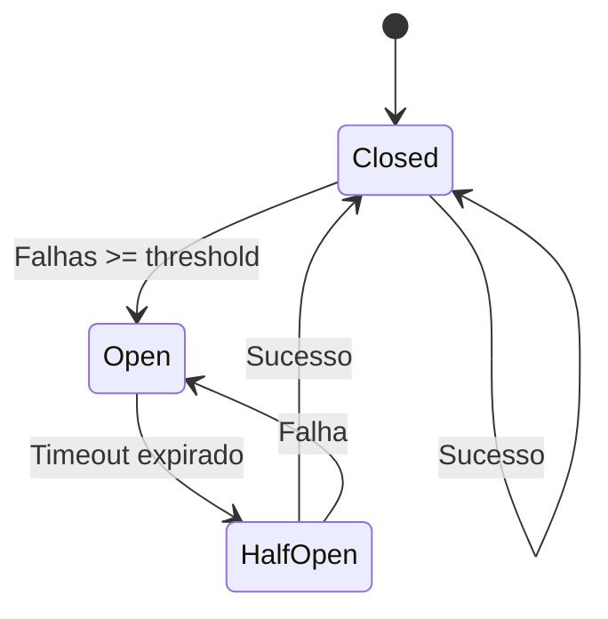

```python
# Implementação do Circuit Breaker

class CircuitBreaker:
    """
    Implementação do padrão Circuit Breaker.
    Estados: CLOSED, OPEN, HALF_OPEN
    """
    
    def __init__(
        self,
        failure_threshold: int = 5,
        recovery_timeout: int = 30,
        half_open_max_calls: int = 3
    ):
        self.failure_threshold = failure_threshold
        self.recovery_timeout = recovery_timeout
        self.half_open_max_calls = half_open_max_calls
        self.state = CircuitState.CLOSED
        self.failure_count = 0
        self.last_failure_time = None
    
    def can_execute(self) -> bool:
        if self.state == CircuitState.CLOSED:
            return True
        elif self.state == CircuitState.OPEN:
            if self._recovery_timeout_expired():
                self.state = CircuitState.HALF_OPEN
                return True
            return False
        else:  # HALF_OPEN
            return self.half_open_calls < self.half_open_max_calls
    
    def record_success(self):
        self.failure_count = 0
        self.state = CircuitState.CLOSED
    
    def record_failure(self):
        self.failure_count += 1
        self.last_failure_time = time.time()
        if self.failure_count >= self.failure_threshold:
            self.state = CircuitState.OPEN
```

---

## 13. Estrutura de Dados e Modelos

### 13.1 Dataclasses Principais

```python
from dataclasses import dataclass, field
from typing import List, Dict, Optional
from datetime import datetime
from enum import Enum

@dataclass
class InstanceMetrics:
    """Métricas coletadas de uma instância."""
    instance_id: str
    instance_type: str
    cpu_average: float
    cpu_max: float
    memory_average: Optional[float]
    network_in_bytes: int
    network_out_bytes: int
    disk_read_ops: int
    disk_write_ops: int
    collection_period_days: int = 30

@dataclass
class CostBreakdown:
    """Breakdown de custos por recurso."""
    resource_id: str
    resource_type: str
    service: str
    region: str
    hourly_cost: float
    daily_cost: float
    monthly_cost: float
    tags: Dict[str, str] = field(default_factory=dict)

@dataclass  
class Recommendation:
    """Recomendação de otimização."""
    id: str
    type: RecommendationType
    resource_id: str
    title: str
    description: str
    current_cost: float
    estimated_savings: float
    implementation_effort: EffortLevel
    risk_level: RiskLevel
    priority: int
    action_items: List[str] = field(default_factory=list)
    
@dataclass
class AnalysisResult:
    """Resultado completo de análise."""
    execution_id: str
    timestamp: datetime
    account_id: str
    region: str
    services_analyzed: int
    resources_analyzed: int
    total_cost: float
    recommendations: List[Recommendation]
    metrics: Dict[str, Any]
    errors: List[str] = field(default_factory=list)
```

### 13.2 Enums de Tipos

```python
class AWSServiceType(Enum):
    """Enum com todos os 255 tipos de serviço AWS."""
    
    # Compute & Serverless
    EC2 = "ec2"
    LAMBDA = "lambda"
    BATCH = "batch"
    LIGHTSAIL = "lightsail"
    APP_RUNNER = "apprunner"
    ELASTIC_BEANSTALK = "elasticbeanstalk"
    # ... 249 outros
    
class RecommendationType(Enum):
    """Tipos de recomendação."""
    RIGHTSIZING_DOWN = "rightsizing_down"
    RIGHTSIZING_UP = "rightsizing_up"
    RESERVED_INSTANCE = "reserved_instance"
    SAVINGS_PLAN = "savings_plan"
    SPOT_INSTANCE = "spot_instance"
    IDLE_RESOURCE = "idle_resource"
    STORAGE_TIERING = "storage_tiering"
    DELETE_UNUSED = "delete_unused"

class EffortLevel(Enum):
    """Nível de esforço para implementação."""
    LOW = "low"      # < 1 hora
    MEDIUM = "medium"  # 1-8 horas
    HIGH = "high"    # > 8 horas

class RiskLevel(Enum):
    """Nível de risco da recomendação."""
    LOW = "low"      # Sem impacto em produção
    MEDIUM = "medium"  # Impacto mínimo possível
    HIGH = "high"    # Requer janela de manutenção
```

---

## 14. APIs e Interfaces

### 14.1 Lambda Handler API

```python
def lambda_handler(event: Dict[str, Any], context: Any) -> Dict[str, Any]:
    """
    Handler principal do AWS Lambda.
    
    Args:
        event: Evento de entrada (API Gateway, EventBridge, etc)
        context: Contexto de execução Lambda
        
    Returns:
        Dict com statusCode, headers, body
        
    Event Types Suportados:
        - scheduled: Execução agendada via EventBridge
        - api: Requisição via API Gateway
        - sns: Trigger via SNS
    """
    
    # Response format
    return {
        "statusCode": 200,
        "headers": {
            "Content-Type": "application/json",
            "X-Request-Id": context.aws_request_id
        },
        "body": json.dumps({
            "execution_id": "exec-123",
            "status": "completed",
            "summary": {
                "services_analyzed": 252,
                "recommendations_count": 45,
                "total_savings": 12500.00
            },
            "report_url": "s3://bucket/reports/..."
        })
    }
```

### 14.2 Interface BaseAWSService

```python
from abc import ABC, abstractmethod

class BaseAWSService(ABC):
    """
    Classe base abstrata para todos os serviços AWS.
    Define interface comum para análise e recomendações.
    """
    
    def __init__(self, client_factory: AWSClientFactory):
        self.client_factory = client_factory
        self.logger = get_logger(self.__class__.__name__)
    
    @abstractmethod
    def health_check(self) -> Dict[str, Any]:
        """
        Verifica saúde do serviço.
        
        Returns:
            {"status": "healthy"|"degraded"|"unhealthy", "details": {...}}
        """
        pass
    
    @abstractmethod
    def get_resources(self) -> List[Dict[str, Any]]:
        """
        Lista todos os recursos do serviço.
        
        Returns:
            Lista de recursos com metadados
        """
        pass
    
    @abstractmethod
    def get_metrics(self, resource_id: str, period_days: int = 30) -> Dict[str, Any]:
        """
        Coleta métricas de um recurso específico.
        """
        pass
    
    @abstractmethod
    def analyze_usage(self) -> Dict[str, Any]:
        """
        Analisa uso e gera insights.
        """
        pass
    
    @abstractmethod
    def get_recommendations(self) -> List[Recommendation]:
        """
        Gera recomendações de otimização.
        """
        pass
```

---

## 15. Segurança e Best Practices

### 15.1 Princípios de Segurança

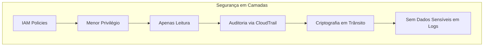

### 15.2 IAM Policy Recomendada

```json
{
    "Version": "2012-10-17",
    "Statement": [
        {
            "Sid": "FinOpsReadOnly",
            "Effect": "Allow",
            "Action": [
                "ec2:Describe*",
                "rds:Describe*",
                "s3:GetBucket*",
                "s3:List*",
                "lambda:List*",
                "lambda:Get*",
                "cloudwatch:GetMetric*",
                "cloudwatch:List*",
                "ce:Get*",
                "pricing:Get*",
                "compute-optimizer:Get*",
                "organizations:Describe*",
                "organizations:List*",
                "tag:Get*",
                "sts:GetCallerIdentity"
            ],
            "Resource": "*"
        },
        {
            "Sid": "FinOpsStateManagement",
            "Effect": "Allow",
            "Action": [
                "dynamodb:GetItem",
                "dynamodb:PutItem",
                "dynamodb:UpdateItem",
                "dynamodb:Query"
            ],
            "Resource": "arn:aws:dynamodb:*:*:table/finops-*"
        },
        {
            "Sid": "FinOpsReports",
            "Effect": "Allow",
            "Action": [
                "s3:PutObject",
                "s3:GetObject"
            ],
            "Resource": "arn:aws:s3:::finops-reports-*/*"
        }
    ]
}
```

---

## 16. Performance e Otimizações

### 16.1 Estratégias de Performance

| Estratégia | Implementação | Ganho |
|------------|---------------|-------|
| **Lazy Loading** | Serviços carregados sob demanda | -50% memória inicial |
| **Connection Pooling** | boto3 session reutilizada | -30% latência API |
| **Pagination** | Paginas de 100 itens | Suporta milhões de recursos |
| **Caching** | Cache de serviços por execução | -40% chamadas API |
| **Batch Operations** | Requisições em lote quando possível | -60% tempo total |

### 16.2 Diagrama de Fluxo Otimizado

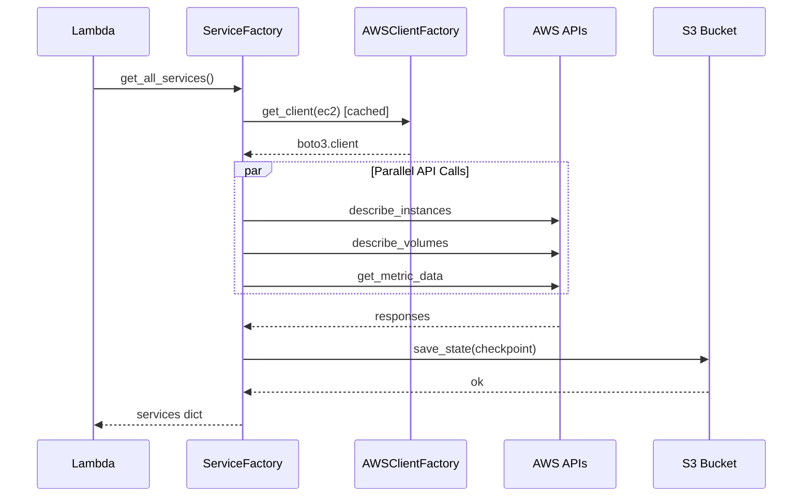

---

*Guia Técnico FinOps AWS - Versão 2.0 Expandida*
*Novembro 2025*
