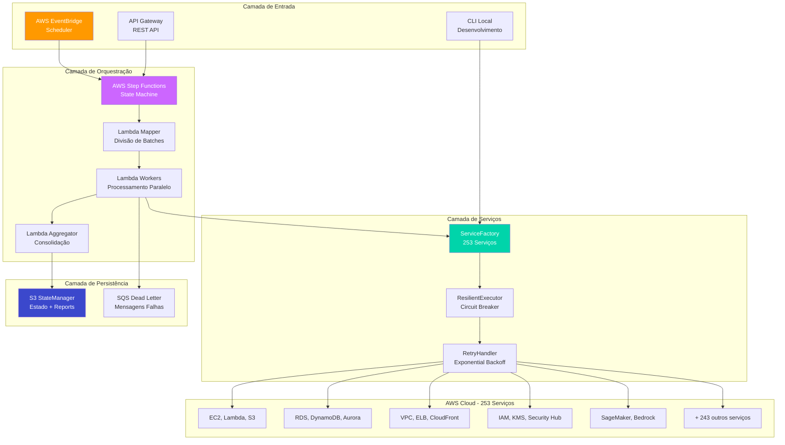
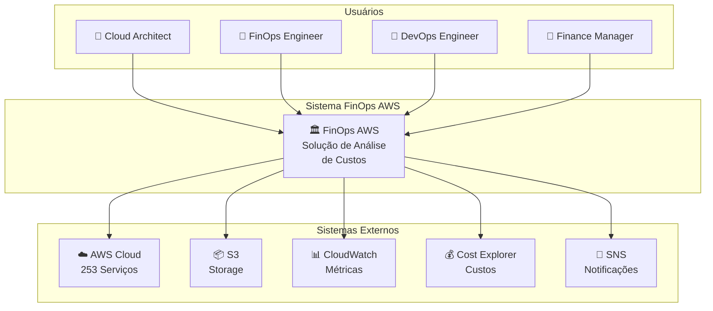
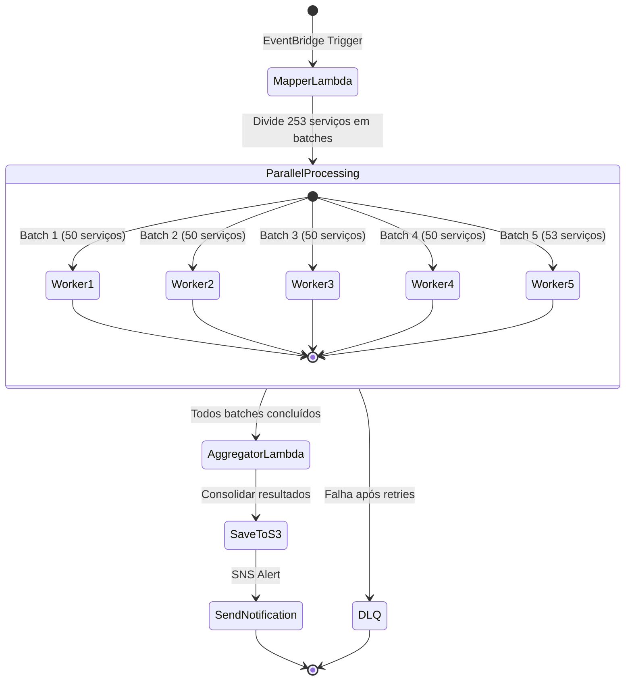
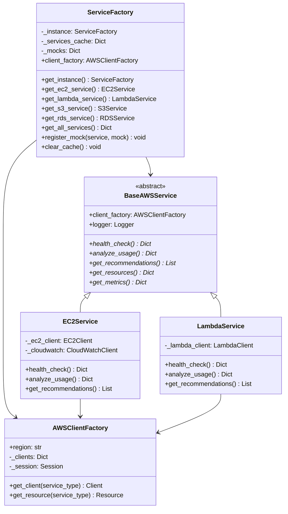
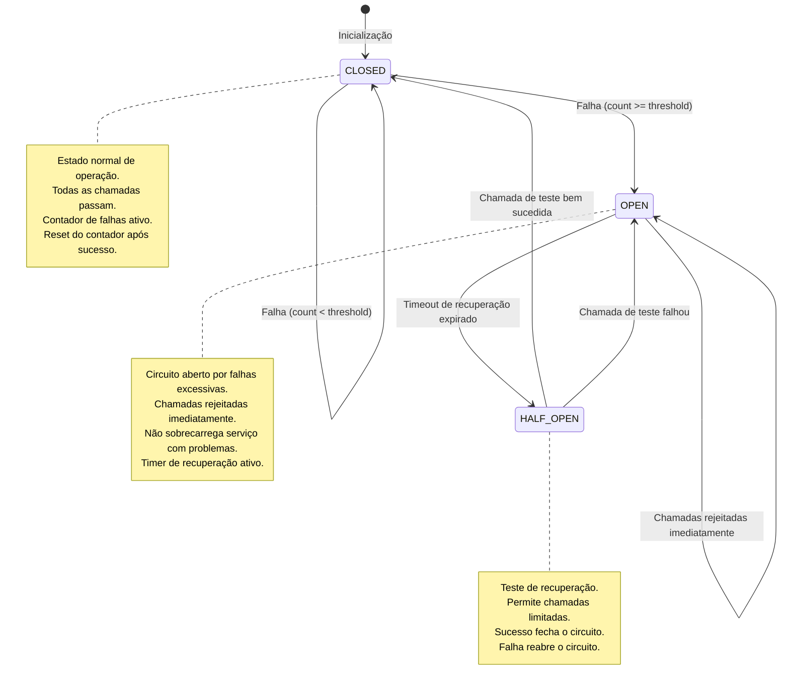
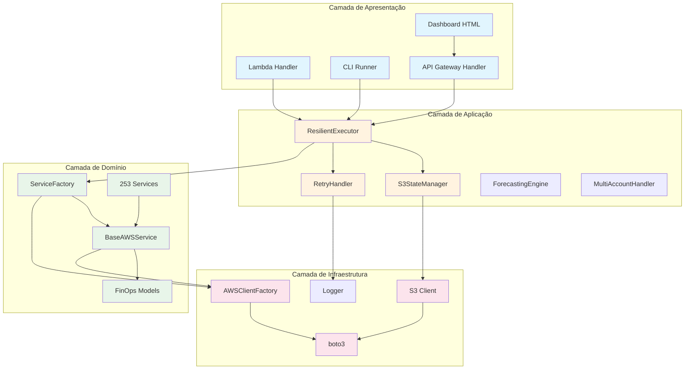
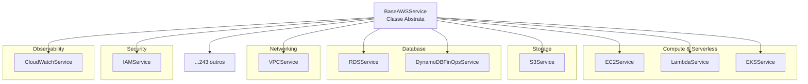
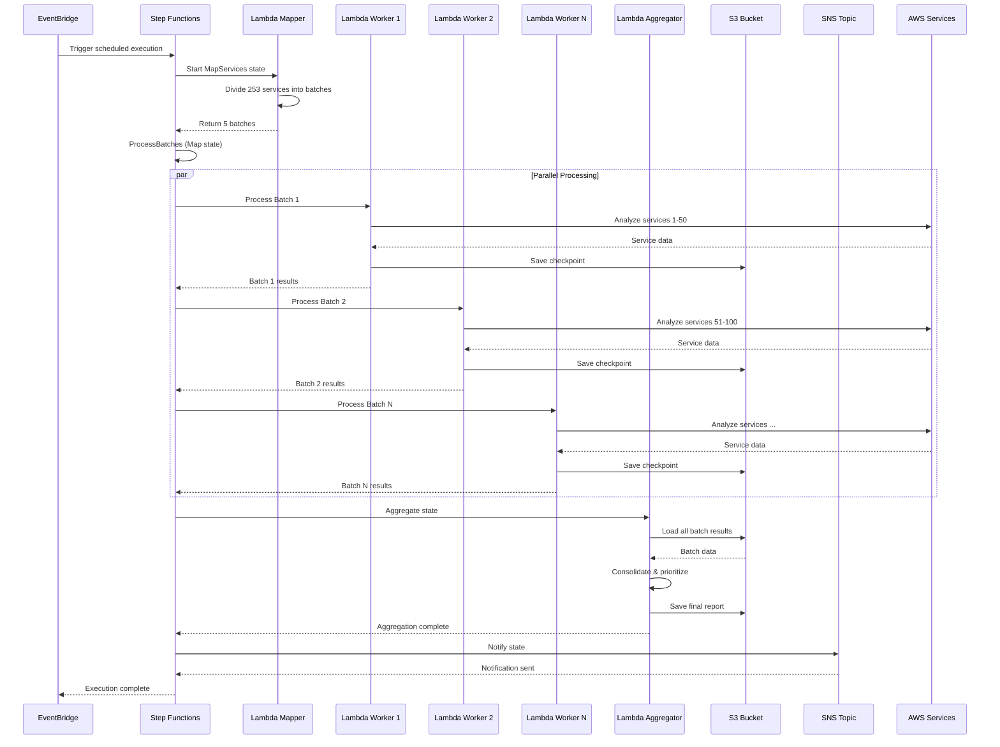
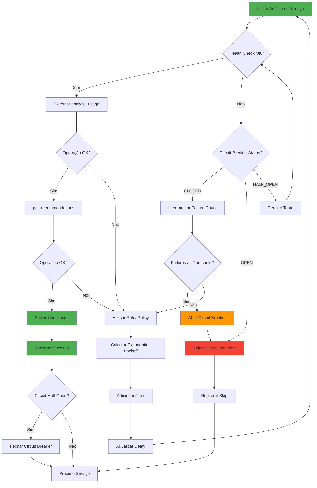
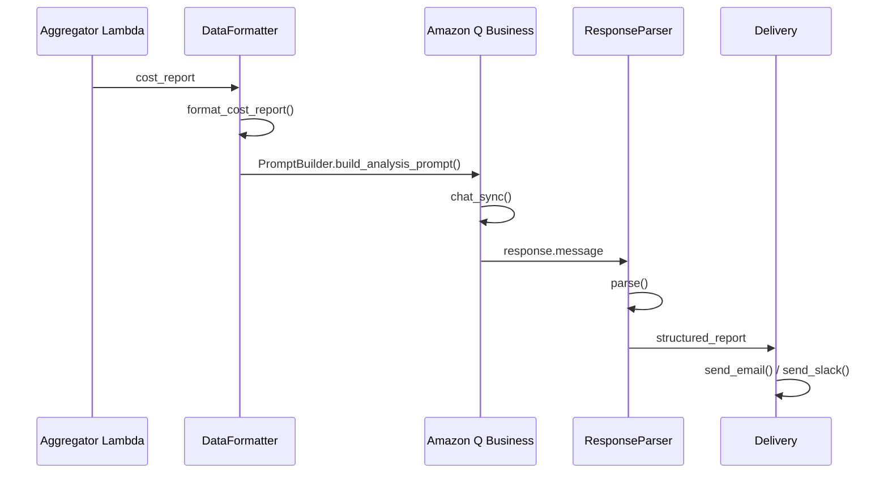

# FinOps AWS - Guia Técnico Completo

## Índice Detalhado

1. [Introdução e Contexto](#1-introdução-e-contexto)
2. [Visão Geral da Arquitetura](#2-visão-geral-da-arquitetura)
3. [Arquitetura Step Functions + S3](#3-arquitetura-step-functions--s3)
4. [Padrões de Projeto Aplicados](#4-padrões-de-projeto-aplicados)
5. [Estrutura de Camadas](#5-estrutura-de-camadas)
6. [Componentes Core Detalhados](#6-componentes-core-detalhados)
7. [Camada de Serviços AWS](#7-camada-de-serviços-aws)
8. [Fluxo de Execução Completo](#8-fluxo-de-execução-completo)
9. [Gerenciamento de Estado com S3](#9-gerenciamento-de-estado-com-s3)
10. [Resiliência e Mecanismos de Retry](#10-resiliência-e-mecanismos-de-retry)
11. [Integração AWS Lambda e Step Functions](#11-integração-aws-lambda-e-step-functions)
12. [Segurança e Compliance](#12-segurança-e-compliance)
13. [Testes e Qualidade de Software](#13-testes-e-qualidade-de-software)
14. [Infraestrutura como Código (Terraform)](#14-infraestrutura-como-código-terraform)
15. [Modelos de Dados e Dataclasses](#15-modelos-de-dados-e-dataclasses)
16. [APIs e Interfaces](#16-apis-e-interfaces)
17. [Performance e Otimizações](#17-performance-e-otimizações)
18. [Troubleshooting e Debugging](#18-troubleshooting-e-debugging)
19. [Apêndices Técnicos](#19-apêndices-técnicos)

---

# 1. Introdução e Contexto

## 1.1 Propósito deste Documento

Este guia técnico destina-se a **arquitetos de software**, **engenheiros de plataforma** e **desenvolvedores senior** que precisam compreender profundamente a implementação do FinOps AWS. O documento detalha cada componente, padrão de projeto, decisão arquitetural e fluxo de dados da solução.

## 1.2 Escopo Técnico

O FinOps AWS é uma solução **enterprise-grade** para análise de custos AWS com as seguintes características técnicas:

| Característica | Especificação |
|----------------|---------------|
| **Linguagem** | Python 3.11 |
| **Arquitetura** | Clean Architecture + DDD |
| **Serviços Cobertos** | 253 serviços AWS |
| **Infraestrutura** | Serverless (Lambda + Step Functions + S3) |
| **Testes** | 2.013 testes automatizados |
| **Taxa de Sucesso** | 99,6% (7 testes skipped por limitações Moto) |
| **Terraform LOC** | 3.006 linhas |
| **Execuções Diárias** | Otimizado para 100/dia |

## 1.3 Filosofia de Design

A solução segue princípios fundamentais de engenharia de software:

```
┌─────────────────────────────────────────────────────────────────────────────┐
│                        PRINCÍPIOS DE DESIGN                                 │
├─────────────────────────────────────────────────────────────────────────────┤
│                                                                             │
│  ┌─────────────────┐   ┌─────────────────┐   ┌─────────────────┐           │
│  │   SOLID         │   │  Clean Code     │   │  12-Factor      │           │
│  │  Principles     │   │   Practices     │   │    App          │           │
│  └────────┬────────┘   └────────┬────────┘   └────────┬────────┘           │
│           │                     │                     │                     │
│           └──────────────┬──────┴─────────────────────┘                     │
│                          │                                                  │
│                          ▼                                                  │
│            ┌─────────────────────────────┐                                  │
│            │   CLEAN ARCHITECTURE        │                                  │
│            │  + Domain-Driven Design     │                                  │
│            └─────────────────────────────┘                                  │
│                          │                                                  │
│           ┌──────────────┼──────────────┐                                   │
│           ▼              ▼              ▼                                   │
│  ┌─────────────┐  ┌─────────────┐  ┌─────────────┐                         │
│  │ Separation  │  │ Dependency  │  │ Testability │                         │
│  │ of Concerns │  │ Inversion   │  │    First    │                         │
│  └─────────────┘  └─────────────┘  └─────────────┘                         │
│                                                                             │
└─────────────────────────────────────────────────────────────────────────────┘
```

---

# 2. Visão Geral da Arquitetura

## 2.1 Diagrama de Arquitetura de Alto Nível



## 2.2 Diagrama de Contexto (C4 Model - Level 1)



## 2.3 Características Arquiteturais

| Característica | Implementação | Benefício |
|----------------|---------------|-----------|
| **Serverless** | Lambda + Step Functions | Zero gestão de servidores, escala automática |
| **Event-Driven** | EventBridge + Step Functions | Desacoplamento, resiliência |
| **Stateless** | S3 para estado | Escalabilidade horizontal ilimitada |
| **Fault-Tolerant** | Circuit Breaker + Retry | Recuperação automática de falhas |
| **Observable** | CloudWatch + X-Ray | Visibilidade completa de execução |
| **Cost-Optimized** | ~$3/mês para 100 execuções | ROI imediato |

---

# 3. Arquitetura Step Functions + S3

## 3.1 Por que Step Functions + S3?

A arquitetura foi otimizada para **100 execuções diárias** com custo mínimo:

```
┌─────────────────────────────────────────────────────────────────────────────┐
│                    COMPARATIVO DE ARQUITETURAS                              │
├─────────────────────────────────────────────────────────────────────────────┤
│                                                                             │
│  Opção A: Lambda Monolítico                                                 │
│  ├── Problema: Timeout de 15 min insuficiente para 253 serviços            │
│  └── Custo: Alto (execução longa contínua)                                 │
│                                                                             │
│  Opção B: DynamoDB + Lambda                                                 │
│  ├── Problema: Custo fixo de DynamoDB (~$25/mês mínimo)                    │
│  └── Excesso para 100 execuções/dia                                        │
│                                                                             │
│  ✅ Opção C: Step Functions + S3 (ESCOLHIDA)                                │
│  ├── Vantagem: Orquestração nativa de workflows                            │
│  ├── Vantagem: S3 praticamente gratuito para este volume                   │
│  ├── Vantagem: Paralelismo built-in do Step Functions                      │
│  └── Custo: ~$3/mês para 100 execuções/dia                                 │
│                                                                             │
└─────────────────────────────────────────────────────────────────────────────┘
```

## 3.2 Fluxo de Execução Step Functions



## 3.3 Definição do State Machine (ASL)

```json
{
  "Comment": "FinOps AWS - Análise de Custos e Otimização",
  "StartAt": "MapServices",
  "States": {
    "MapServices": {
      "Type": "Task",
      "Resource": "${LambdaMapperArn}",
      "ResultPath": "$.batches",
      "Next": "ProcessBatches"
    },
    "ProcessBatches": {
      "Type": "Map",
      "ItemsPath": "$.batches",
      "MaxConcurrency": 5,
      "Iterator": {
        "StartAt": "ProcessBatch",
        "States": {
          "ProcessBatch": {
            "Type": "Task",
            "Resource": "${LambdaWorkerArn}",
            "Retry": [
              {
                "ErrorEquals": ["States.TaskFailed", "Lambda.ServiceException"],
                "IntervalSeconds": 2,
                "MaxAttempts": 3,
                "BackoffRate": 2.0
              }
            ],
            "Catch": [
              {
                "ErrorEquals": ["States.ALL"],
                "ResultPath": "$.error",
                "Next": "HandleError"
              }
            ],
            "End": true
          },
          "HandleError": {
            "Type": "Task",
            "Resource": "${LambdaDLQArn}",
            "End": true
          }
        }
      },
      "ResultPath": "$.batchResults",
      "Next": "Aggregate"
    },
    "Aggregate": {
      "Type": "Task",
      "Resource": "${LambdaAggregatorArn}",
      "ResultPath": "$.finalReport",
      "Next": "Notify"
    },
    "Notify": {
      "Type": "Task",
      "Resource": "arn:aws:states:::sns:publish",
      "Parameters": {
        "TopicArn": "${SNSTopicArn}",
        "Message.$": "$.finalReport.summary"
      },
      "End": true
    }
  }
}
```

## 3.4 Componentes Lambda

### 3.4.1 Lambda Mapper

```python
def mapper_handler(event: Dict, context: Any) -> Dict:
    """
    Divide os 253 serviços AWS em batches para processamento paralelo.
    
    Estratégia de divisão:
    - 5 batches de ~50 serviços cada
    - Balanceamento por complexidade (serviços pesados distribuídos)
    - Priorização de serviços críticos no primeiro batch
    
    Returns:
        Dict com lista de batches para o Step Functions Map
    """
    all_services = ServiceFactory.get_all_service_types()  # 253 serviços
    
    # Classificar por prioridade e complexidade
    high_priority = ['ec2', 'rds', 's3', 'lambda', 'eks']
    medium_priority = ['dynamodb', 'elasticache', 'cloudfront', 'elb']
    
    # Criar batches balanceados
    batch_size = 50
    batches = []
    
    # Primeiro batch: serviços de alta prioridade
    batch1 = [s for s in all_services if s in high_priority]
    batch1.extend([s for s in all_services if s in medium_priority])
    
    # Demais batches: distribuição uniforme
    remaining = [s for s in all_services if s not in batch1]
    for i in range(0, len(remaining), batch_size):
        batches.append({
            'batch_id': len(batches) + 1,
            'services': remaining[i:i+batch_size],
            'execution_id': event.get('execution_id', str(uuid.uuid4()))
        })
    
    # Inserir batch de alta prioridade no início
    batches.insert(0, {
        'batch_id': 0,
        'services': batch1[:batch_size],
        'execution_id': event.get('execution_id')
    })
    
    return {'batches': batches, 'total_services': len(all_services)}
```

### 3.4.2 Lambda Worker

```python
def worker_handler(event: Dict, context: Any) -> Dict:
    """
    Processa um batch de serviços AWS.
    
    Para cada serviço no batch:
    1. Health check - verifica disponibilidade
    2. Analyze usage - coleta métricas de uso
    3. Get recommendations - gera recomendações
    4. Salva checkpoint no S3
    
    Implementa:
    - Circuit Breaker por serviço
    - Retry com exponential backoff
    - Checkpointing para resumabilidade
    """
    batch = event['services']
    execution_id = event['execution_id']
    
    # Inicializar componentes
    client_factory = AWSClientFactory()
    service_factory = ServiceFactory(client_factory)
    state_manager = S3StateManager(execution_id)
    executor = ResilientExecutor(service_factory, state_manager)
    
    results = []
    
    for service_name in batch:
        try:
            # Verificar checkpoint existente
            if state_manager.is_service_completed(service_name):
                results.append(state_manager.get_service_result(service_name))
                continue
            
            # Obter serviço
            service = service_factory.get_service(service_name)
            
            # Executar com resiliência
            result = executor.execute_with_retry(
                service_name=service_name,
                operations=[
                    ('health_check', service.health_check),
                    ('analyze_usage', service.analyze_usage),
                    ('get_recommendations', service.get_recommendations)
                ]
            )
            
            # Salvar checkpoint
            state_manager.save_service_checkpoint(service_name, result)
            results.append(result)
            
        except CircuitBreakerOpenError:
            # Circuit aberto - registrar e continuar
            results.append({
                'service': service_name,
                'status': 'circuit_open',
                'error': 'Service temporarily unavailable'
            })
        except Exception as e:
            # Erro não recuperável
            results.append({
                'service': service_name,
                'status': 'failed',
                'error': str(e)
            })
    
    return {
        'batch_id': event['batch_id'],
        'results': results,
        'completed': len([r for r in results if r.get('status') != 'failed']),
        'failed': len([r for r in results if r.get('status') == 'failed'])
    }
```

### 3.4.3 Lambda Aggregator

```python
def aggregator_handler(event: Dict, context: Any) -> Dict:
    """
    Consolida resultados de todos os batches e gera relatório final.
    
    Processamento:
    1. Agregar resultados de todos os workers
    2. Calcular métricas consolidadas
    3. Priorizar recomendações por impacto
    4. Gerar relatório executivo
    5. Salvar no S3
    """
    batch_results = event['batchResults']
    execution_id = event.get('execution_id', str(uuid.uuid4()))
    
    # Consolidar todos os resultados
    all_results = []
    for batch in batch_results:
        all_results.extend(batch.get('results', []))
    
    # Calcular métricas
    total_services = len(all_results)
    successful = len([r for r in all_results if r.get('status') == 'healthy'])
    failed = len([r for r in all_results if r.get('status') == 'failed'])
    
    # Agregar recomendações
    all_recommendations = []
    for result in all_results:
        recs = result.get('recommendations', [])
        all_recommendations.extend(recs)
    
    # Priorizar por economia potencial
    prioritized = sorted(
        all_recommendations,
        key=lambda r: r.get('estimated_savings', 0),
        reverse=True
    )
    
    # Calcular economia total
    total_savings = sum(r.get('estimated_savings', 0) for r in prioritized)
    
    # Gerar relatório
    report = {
        'execution_id': execution_id,
        'timestamp': datetime.utcnow().isoformat(),
        'summary': {
            'services_analyzed': total_services,
            'services_healthy': successful,
            'services_failed': failed,
            'success_rate': f"{(successful/total_services)*100:.1f}%",
            'total_recommendations': len(prioritized),
            'total_potential_savings': total_savings,
            'top_10_recommendations': prioritized[:10]
        },
        'detailed_results': all_results,
        'all_recommendations': prioritized
    }
    
    # Salvar no S3
    s3_client = boto3.client('s3')
    bucket = os.environ['REPORTS_BUCKET']
    
    # Salvar relatório completo
    s3_client.put_object(
        Bucket=bucket,
        Key=f"reports/{execution_id}/full_report.json",
        Body=json.dumps(report, indent=2, default=str),
        ContentType='application/json'
    )
    
    # Salvar resumo executivo
    s3_client.put_object(
        Bucket=bucket,
        Key=f"reports/{execution_id}/executive_summary.json",
        Body=json.dumps(report['summary'], indent=2, default=str),
        ContentType='application/json'
    )
    
    # Atualizar "latest"
    s3_client.put_object(
        Bucket=bucket,
        Key="reports/latest/report.json",
        Body=json.dumps(report, indent=2, default=str),
        ContentType='application/json'
    )
    
    return {
        'execution_id': execution_id,
        'report_location': f"s3://{bucket}/reports/{execution_id}/",
        'summary': report['summary']
    }
```

---

# 4. Padrões de Projeto Aplicados

## 4.1 Catálogo de Padrões

A solução implementa os seguintes padrões de projeto de software:

```
┌─────────────────────────────────────────────────────────────────────────────┐
│                    PADRÕES DE PROJETO IMPLEMENTADOS                         │
├─────────────────────────────────────────────────────────────────────────────┤
│                                                                             │
│  CREATIONAL PATTERNS                                                        │
│  ├── Factory Method ─────── ServiceFactory, AWSClientFactory                │
│  ├── Abstract Factory ───── Criação de famílias de serviços               │
│  └── Singleton ──────────── ServiceFactory._instance (cache global)        │
│                                                                             │
│  STRUCTURAL PATTERNS                                                        │
│  ├── Decorator ──────────── @with_retry, @with_metrics                     │
│  ├── Facade ─────────────── ResilientExecutor (simplifica orquestração)   │
│  └── Adapter ────────────── AWSClientFactory (adapta boto3)               │
│                                                                             │
│  BEHAVIORAL PATTERNS                                                        │
│  ├── Template Method ────── BaseAWSService (interface comum)               │
│  ├── Strategy ───────────── RetryPolicy (políticas configuráveis)          │
│  ├── State ──────────────── Circuit Breaker (CLOSED/OPEN/HALF_OPEN)       │
│  ├── Observer ───────────── Metrics callbacks                              │
│  └── Command ────────────── Task encapsulation                             │
│                                                                             │
│  ENTERPRISE PATTERNS                                                        │
│  ├── Circuit Breaker ────── Proteção contra falhas em cascata             │
│  ├── Retry with Backoff ─── Recuperação de falhas transitórias            │
│  ├── Bulkhead ───────────── Isolamento por serviço                         │
│  └── Saga ───────────────── Compensação em Step Functions                 │
│                                                                             │
└─────────────────────────────────────────────────────────────────────────────┘
```

## 4.2 Factory Pattern - ServiceFactory



## 4.3 Template Method - BaseAWSService

```python
from abc import ABC, abstractmethod
from typing import Dict, List, Any, Union
from dataclasses import dataclass

class BaseAWSService(ABC):
    """
    Classe base abstrata para todos os 253 serviços AWS.
    
    Implementa o padrão Template Method definindo:
    - Interface comum para todos os serviços
    - Métodos hook para personalização
    - Logging e métricas padronizadas
    
    Cada serviço concreto DEVE implementar todos os métodos abstratos.
    """
    
    def __init__(self, client_factory: AWSClientFactory):
        """
        Inicializa o serviço com a factory de clientes AWS.
        
        Args:
            client_factory: Factory para obter clientes boto3
        """
        self._client_factory = client_factory
        self.logger = setup_logger(self.__class__.__name__)
        self._metrics = MetricsCollector(self.__class__.__name__)
    
    @property
    def client_factory(self) -> AWSClientFactory:
        """Getter para client_factory (compatibilidade)."""
        return self._client_factory
    
    # =========================================================================
    # MÉTODOS ABSTRATOS - DEVEM SER IMPLEMENTADOS POR CADA SERVIÇO
    # =========================================================================
    
    @abstractmethod
    def health_check(self) -> Dict[str, Any]:
        """
        Verifica se o serviço AWS está acessível e funcionando.
        
        Returns:
            Dict com:
            - status: 'healthy' | 'unhealthy' | 'degraded'
            - service: nome do serviço
            - latency_ms: tempo de resposta em ms
            - error: mensagem de erro (se unhealthy)
            
        Example:
            {'status': 'healthy', 'service': 'ec2', 'latency_ms': 45}
        """
        pass
    
    @abstractmethod
    def analyze_usage(self) -> Dict[str, Any]:
        """
        Analisa padrões de uso e consumo do serviço.
        
        Returns:
            Dict com métricas de uso específicas do serviço.
            Cada serviço define suas próprias métricas relevantes.
            
        Example (EC2):
            {
                'total_instances': 50,
                'running': 30,
                'stopped': 20,
                'by_type': {'t3.micro': 20, 'm5.large': 10},
                'underutilized': ['i-abc123', 'i-def456'],
                'overutilized': ['i-ghi789']
            }
        """
        pass
    
    @abstractmethod
    def get_recommendations(self) -> List[Dict[str, Any]]:
        """
        Retorna recomendações de otimização de custos.
        
        Returns:
            Lista de recomendações, cada uma com:
            - id: identificador único
            - type: tipo de recomendação
            - resource_id: recurso afetado
            - title: título curto
            - description: descrição detalhada
            - estimated_savings: economia estimada em USD/mês
            - effort: 'low' | 'medium' | 'high'
            - risk: 'low' | 'medium' | 'high'
            
        Example:
            [{
                'id': 'rec-001',
                'type': 'rightsizing',
                'resource_id': 'i-abc123',
                'title': 'Reduzir instância subutilizada',
                'description': 'Instância com CPU média de 5%...',
                'estimated_savings': 50.00,
                'effort': 'low',
                'risk': 'low'
            }]
        """
        pass
    
    @abstractmethod
    def get_resources(self) -> Union[List[Dict], Dict[str, Any]]:
        """
        Lista todos os recursos do serviço na conta/região.
        
        Returns:
            Lista de recursos ou Dict com recursos categorizados.
            Formato depende do serviço específico.
        """
        pass
    
    @abstractmethod
    def get_metrics(self) -> Dict[str, Any]:
        """
        Obtém métricas de performance e custo do CloudWatch.
        
        Returns:
            Dict com métricas coletadas do CloudWatch.
        """
        pass
    
    # =========================================================================
    # MÉTODOS TEMPLATE - COMPORTAMENTO COMUM
    # =========================================================================
    
    def execute_full_analysis(self) -> Dict[str, Any]:
        """
        Template method: executa análise completa do serviço.
        
        Ordem de execução:
        1. health_check() - Verifica disponibilidade
        2. get_resources() - Lista recursos
        3. analyze_usage() - Analisa uso
        4. get_metrics() - Coleta métricas
        5. get_recommendations() - Gera recomendações
        
        Returns:
            Dict consolidado com todos os resultados
        """
        result = {
            'service': self.__class__.__name__,
            'timestamp': datetime.utcnow().isoformat()
        }
        
        # 1. Health check
        health = self.health_check()
        result['health'] = health
        
        if health.get('status') != 'healthy':
            result['status'] = 'unhealthy'
            return result
        
        # 2. Coletar recursos
        result['resources'] = self.get_resources()
        
        # 3. Analisar uso
        result['usage'] = self.analyze_usage()
        
        # 4. Coletar métricas
        result['metrics'] = self.get_metrics()
        
        # 5. Gerar recomendações
        result['recommendations'] = self.get_recommendations()
        
        result['status'] = 'completed'
        return result
```

## 4.4 Circuit Breaker Pattern



```python
from enum import Enum
from dataclasses import dataclass
from typing import Callable, Any
import time
import threading

class CircuitState(Enum):
    """Estados do Circuit Breaker."""
    CLOSED = "closed"      # Normal - chamadas permitidas
    OPEN = "open"          # Falhas - chamadas bloqueadas
    HALF_OPEN = "half_open"  # Teste - chamadas limitadas

@dataclass
class CircuitBreakerConfig:
    """Configuração do Circuit Breaker."""
    failure_threshold: int = 5        # Falhas para abrir
    recovery_timeout: float = 30.0    # Segundos para tentar recuperar
    half_open_max_calls: int = 3      # Chamadas de teste
    success_threshold: int = 2        # Sucessos para fechar

class CircuitBreaker:
    """
    Implementação do padrão Circuit Breaker.
    
    Previne chamadas a serviços com falhas recorrentes,
    permitindo recuperação gradual.
    """
    
    def __init__(self, name: str, config: CircuitBreakerConfig = None):
        self.name = name
        self.config = config or CircuitBreakerConfig()
        self._state = CircuitState.CLOSED
        self._failure_count = 0
        self._success_count = 0
        self._last_failure_time = None
        self._half_open_calls = 0
        self._lock = threading.Lock()
    
    @property
    def state(self) -> CircuitState:
        """Retorna estado atual, verificando timeout de recuperação."""
        with self._lock:
            if self._state == CircuitState.OPEN:
                if self._should_attempt_recovery():
                    self._state = CircuitState.HALF_OPEN
                    self._half_open_calls = 0
            return self._state
    
    def _should_attempt_recovery(self) -> bool:
        """Verifica se timeout de recuperação expirou."""
        if self._last_failure_time is None:
            return False
        elapsed = time.time() - self._last_failure_time
        return elapsed >= self.config.recovery_timeout
    
    def can_execute(self) -> bool:
        """Verifica se chamada é permitida."""
        state = self.state
        if state == CircuitState.CLOSED:
            return True
        elif state == CircuitState.OPEN:
            return False
        else:  # HALF_OPEN
            with self._lock:
                if self._half_open_calls < self.config.half_open_max_calls:
                    self._half_open_calls += 1
                    return True
                return False
    
    def record_success(self):
        """Registra chamada bem sucedida."""
        with self._lock:
            if self._state == CircuitState.HALF_OPEN:
                self._success_count += 1
                if self._success_count >= self.config.success_threshold:
                    self._state = CircuitState.CLOSED
                    self._reset_counters()
            else:
                self._failure_count = 0  # Reset falhas após sucesso
    
    def record_failure(self):
        """Registra falha."""
        with self._lock:
            self._failure_count += 1
            self._last_failure_time = time.time()
            
            if self._state == CircuitState.HALF_OPEN:
                # Falha em half-open reabre o circuito
                self._state = CircuitState.OPEN
                self._half_open_calls = 0
            elif self._failure_count >= self.config.failure_threshold:
                # Threshold atingido - abrir circuito
                self._state = CircuitState.OPEN
    
    def _reset_counters(self):
        """Reset contadores internos."""
        self._failure_count = 0
        self._success_count = 0
        self._half_open_calls = 0
        self._last_failure_time = None
    
    def execute(self, func: Callable, *args, **kwargs) -> Any:
        """
        Executa função protegida pelo circuit breaker.
        
        Raises:
            CircuitBreakerOpenError: Se circuito estiver aberto
        """
        if not self.can_execute():
            raise CircuitBreakerOpenError(
                f"Circuit breaker '{self.name}' is OPEN"
            )
        
        try:
            result = func(*args, **kwargs)
            self.record_success()
            return result
        except Exception as e:
            self.record_failure()
            raise


class CircuitBreakerOpenError(Exception):
    """Exceção quando circuit breaker está aberto."""
    pass
```

## 4.5 Retry com Exponential Backoff

```python
import random
import time
from typing import Callable, Tuple, Type, Optional
from dataclasses import dataclass, field
from functools import wraps

@dataclass
class RetryPolicy:
    """
    Política de retry configurável.
    
    Implementa exponential backoff com jitter opcional
    para evitar thundering herd problem.
    """
    max_attempts: int = 3
    base_delay: float = 1.0
    max_delay: float = 60.0
    exponential_base: float = 2.0
    jitter: bool = True
    retryable_exceptions: Tuple[Type[Exception], ...] = field(
        default_factory=lambda: (
            ConnectionError,
            TimeoutError,
            OSError,
        )
    )
    
    def calculate_delay(self, attempt: int) -> float:
        """
        Calcula delay para tentativa N.
        
        Fórmula: delay = min(base * (exp ^ attempt), max)
        Com jitter: delay *= random(0.5, 1.5)
        
        Args:
            attempt: Número da tentativa (0-indexed)
            
        Returns:
            Delay em segundos
        """
        delay = min(
            self.base_delay * (self.exponential_base ** attempt),
            self.max_delay
        )
        if self.jitter:
            delay *= random.uniform(0.5, 1.5)
        return delay
    
    def should_retry(self, exception: Exception, attempt: int) -> bool:
        """
        Determina se deve fazer retry.
        
        Args:
            exception: Exceção capturada
            attempt: Número da tentativa atual
            
        Returns:
            True se deve retry, False caso contrário
        """
        if attempt >= self.max_attempts:
            return False
        
        # Verificar se é exceção retryable
        if isinstance(exception, self.retryable_exceptions):
            return True
        
        # Verificar erros AWS específicos
        error_code = getattr(exception, 'response', {}).get('Error', {}).get('Code', '')
        retryable_codes = [
            'Throttling',
            'ThrottlingException',
            'RequestLimitExceeded',
            'ProvisionedThroughputExceededException',
            'ServiceUnavailable',
            'InternalError',
            'InternalServiceError'
        ]
        return error_code in retryable_codes


@dataclass
class RetryMetrics:
    """Métricas de retry para observabilidade."""
    total_attempts: int = 0
    successful_attempts: int = 0
    failed_attempts: int = 0
    total_retry_delay: float = 0.0
    last_error: Optional[str] = None
    
    def record_attempt(self, success: bool, delay: float = 0.0, error: str = None):
        """Registra tentativa."""
        self.total_attempts += 1
        if success:
            self.successful_attempts += 1
        else:
            self.failed_attempts += 1
            self.total_retry_delay += delay
            self.last_error = error


class RetryHandler:
    """
    Handler para execução com retry.
    
    Uso:
        handler = RetryHandler(RetryPolicy())
        result = handler.execute(my_function, arg1, arg2)
    """
    
    def __init__(self, policy: RetryPolicy = None, on_retry: Callable = None):
        self.policy = policy or RetryPolicy()
        self.on_retry = on_retry  # Callback opcional
        self.metrics = RetryMetrics()
    
    def execute(self, func: Callable, *args, **kwargs):
        """
        Executa função com retry automático.
        
        Args:
            func: Função a executar
            *args, **kwargs: Argumentos da função
            
        Returns:
            Resultado da função
            
        Raises:
            Última exceção se todos os retries falharem
        """
        last_exception = None
        
        for attempt in range(self.policy.max_attempts):
            try:
                result = func(*args, **kwargs)
                self.metrics.record_attempt(success=True)
                return result
                
            except Exception as e:
                last_exception = e
                
                if not self.policy.should_retry(e, attempt + 1):
                    self.metrics.record_attempt(success=False, error=str(e))
                    raise
                
                # Calcular delay e aguardar
                delay = self.policy.calculate_delay(attempt)
                self.metrics.record_attempt(success=False, delay=delay, error=str(e))
                
                # Callback de retry (logging, métricas, etc.)
                if self.on_retry:
                    self.on_retry(attempt + 1, delay, e)
                
                time.sleep(delay)
        
        # Todas as tentativas falharam
        raise last_exception
    
    @staticmethod
    def with_retry(
        max_attempts: int = 3,
        base_delay: float = 1.0,
        max_delay: float = 60.0
    ):
        """
        Decorator para adicionar retry a funções.
        
        Uso:
            @RetryHandler.with_retry(max_attempts=5)
            def my_function():
                ...
        """
        def decorator(func: Callable):
            @wraps(func)
            def wrapper(*args, **kwargs):
                policy = RetryPolicy(
                    max_attempts=max_attempts,
                    base_delay=base_delay,
                    max_delay=max_delay
                )
                handler = RetryHandler(policy)
                return handler.execute(func, *args, **kwargs)
            return wrapper
        return decorator
```

---

# 5. Estrutura de Camadas

## 5.1 Diagrama de Camadas (Onion Architecture)

```
┌─────────────────────────────────────────────────────────────────────────────┐
│                                                                             │
│  ┌───────────────────────────────────────────────────────────────────────┐ │
│  │                     CAMADA DE APRESENTAÇÃO                            │ │
│  │  ┌─────────────┐  ┌─────────────┐  ┌─────────────┐  ┌─────────────┐  │ │
│  │  │   Lambda    │  │    API      │  │    CLI      │  │  Dashboard  │  │ │
│  │  │   Handler   │  │   Gateway   │  │   Runner    │  │    HTML     │  │ │
│  │  └─────────────┘  └─────────────┘  └─────────────┘  └─────────────┘  │ │
│  └───────────────────────────────────────────────────────────────────────┘ │
│                                      │                                      │
│                                      ▼                                      │
│  ┌───────────────────────────────────────────────────────────────────────┐ │
│  │                     CAMADA DE APLICAÇÃO                               │ │
│  │  ┌─────────────┐  ┌─────────────┐  ┌─────────────┐  ┌─────────────┐  │ │
│  │  │  Resilient  │  │    State    │  │   Retry     │  │  Forecasting│  │ │
│  │  │  Executor   │  │   Manager   │  │   Handler   │  │   Engine    │  │ │
│  │  └─────────────┘  └─────────────┘  └─────────────┘  └─────────────┘  │ │
│  └───────────────────────────────────────────────────────────────────────┘ │
│                                      │                                      │
│                                      ▼                                      │
│  ┌───────────────────────────────────────────────────────────────────────┐ │
│  │                      CAMADA DE DOMÍNIO                                │ │
│  │  ┌─────────────┐  ┌─────────────┐  ┌─────────────┐  ┌─────────────┐  │ │
│  │  │   Service   │  │    Base     │  │   FinOps    │  │   Domain    │  │ │
│  │  │   Factory   │  │ AWSService  │  │   Models    │  │   Events    │  │ │
│  │  └─────────────┘  └─────────────┘  └─────────────┘  └─────────────┘  │ │
│  │                                                                       │ │
│  │  ┌─────────────────────────────────────────────────────────────────┐ │ │
│  │  │                    253 SERVIÇOS AWS                             │ │ │
│  │  │  EC2 │ Lambda │ S3 │ RDS │ DynamoDB │ EKS │ SageMaker │ ...    │ │ │
│  │  └─────────────────────────────────────────────────────────────────┘ │ │
│  └───────────────────────────────────────────────────────────────────────┘ │
│                                      │                                      │
│                                      ▼                                      │
│  ┌───────────────────────────────────────────────────────────────────────┐ │
│  │                   CAMADA DE INFRAESTRUTURA                            │ │
│  │  ┌─────────────┐  ┌─────────────┐  ┌─────────────┐  ┌─────────────┐  │ │
│  │  │    AWS      │  │     S3      │  │   boto3     │  │   Logger    │  │ │
│  │  │ClientFactory│  │StateManager │  │   Clients   │  │   Config    │  │ │
│  │  └─────────────┘  └─────────────┘  └─────────────┘  └─────────────┘  │ │
│  └───────────────────────────────────────────────────────────────────────┘ │
│                                                                             │
└─────────────────────────────────────────────────────────────────────────────┘
```

## 5.2 Estrutura de Diretórios Detalhada

```
finops-aws/
│
├── src/finops_aws/                    # Código-fonte principal
│   │
│   ├── __init__.py                    # Exports do módulo
│   │
│   ├── core/                          # Núcleo da aplicação
│   │   ├── __init__.py
│   │   ├── factories.py               # ServiceFactory + AWSClientFactory
│   │   ├── s3_state_manager.py        # Gerenciamento de estado (S3)
│   │   ├── state_manager.py           # State manager local (dev)
│   │   ├── resilient_executor.py      # Executor com resiliência
│   │   ├── retry_handler.py           # Políticas de retry
│   │   ├── cleanup_manager.py         # Limpeza de recursos
│   │   ├── multi_account_handler.py   # Suporte multi-conta
│   │   ├── forecasting_engine.py      # Previsões ML
│   │   └── api_gateway_handler.py     # REST API
│   │
│   ├── models/                        # Modelos de domínio
│   │   ├── __init__.py
│   │   ├── finops_models.py           # Dataclasses principais
│   │   ├── recommendations.py         # Tipos de recomendação
│   │   └── metrics.py                 # Modelos de métricas
│   │
│   ├── services/                      # 253 serviços AWS
│   │   ├── __init__.py
│   │   ├── base_service.py            # BaseAWSService (abstrata)
│   │   │
│   │   ├── # COMPUTE & SERVERLESS (25 serviços)
│   │   ├── ec2_service.py
│   │   ├── ec2_finops_service.py
│   │   ├── lambda_service.py
│   │   ├── lambda_finops_service.py
│   │   ├── lambda_edge_service.py
│   │   ├── batch_service.py
│   │   ├── lightsail_service.py
│   │   ├── app_runner_service.py
│   │   ├── elastic_beanstalk_service.py
│   │   ├── sam_service.py
│   │   ├── outposts_service.py
│   │   ├── local_zones_service.py
│   │   ├── wavelength_service.py
│   │   ├── private_5g_service.py
│   │   ├── auto_scaling_service.py
│   │   ├── ecs_container_service.py
│   │   ├── eks_service.py
│   │   ├── ecr_service.py
│   │   ├── fargate_service.py
│   │   ├── step_functions_service.py
│   │   ├── eventbridge_service.py
│   │   ├── amplify_service.py
│   │   ├── proton_service.py
│   │   ├── ec2_spot_service.py
│   │   ├── ec2_reserved_service.py
│   │   │
│   │   ├── # STORAGE (15 serviços)
│   │   ├── s3_service.py
│   │   ├── ebs_service.py
│   │   ├── efs_service.py
│   │   ├── fsx_service.py
│   │   ├── storage_gateway_service.py
│   │   ├── backup_service.py
│   │   ├── datasync_service.py
│   │   ├── snow_service.py
│   │   ├── transfer_family_service.py
│   │   ├── s3_glacier_service.py
│   │   ├── s3_intelligent_tiering_service.py
│   │   ├── ebs_snapshots_service.py
│   │   ├── file_cache_service.py
│   │   │
│   │   ├── # DATABASE (25 serviços)
│   │   ├── rds_service.py
│   │   ├── aurora_service.py
│   │   ├── aurora_serverless_service.py
│   │   ├── dynamodb_finops_service.py
│   │   ├── dynamodb_global_service.py
│   │   ├── dynamodb_streams_service.py
│   │   ├── elasticache_service.py
│   │   ├── elasticache_global_service.py
│   │   ├── elasticache_serverless_service.py
│   │   ├── memorydb_service.py
│   │   ├── redshift_service.py
│   │   ├── redshift_serverless_service.py
│   │   ├── documentdb_service.py
│   │   ├── neptune_service.py
│   │   ├── keyspaces_service.py
│   │   ├── timestream_service.py
│   │   ├── qldb_service.py
│   │   ├── opensearch_service.py
│   │   ├── opensearch_serverless_service.py
│   │   ├── rds_proxy_service.py
│   │   ├── dms_service.py
│   │   ├── dms_migration_service.py
│   │   ├── schema_conversion_service.py
│   │   ├── rds_finops_service.py
│   │   ├── database_insights_service.py
│   │   │
│   │   ├── # ... mais 188 serviços em outras categorias
│   │   │
│   │   └── __all__.py                 # Exports de todos os serviços
│   │
│   └── utils/                         # Utilitários
│       ├── __init__.py
│       ├── logger.py                  # Configuração de logging
│       ├── config.py                  # Configurações
│       └── helpers.py                 # Funções auxiliares
│
├── tests/                             # Suite de testes
│   ├── __init__.py
│   ├── conftest.py                    # Fixtures pytest
│   │
│   ├── unit/                          # Testes unitários
│   │   ├── test_factories.py          # Testes ServiceFactory
│   │   ├── test_state_manager.py      # Testes StateManager
│   │   ├── test_resilient_executor.py # Testes ResilientExecutor
│   │   ├── test_retry_handler.py      # Testes RetryHandler
│   │   ├── test_phase1_services.py    # Testes serviços fase 1
│   │   ├── test_phase2_services.py    # Testes serviços fase 2
│   │   ├── ... (14 fases de testes)
│   │   └── test_qa_comprehensive.py   # Testes QA 78 cenários
│   │
│   ├── integration/                   # Testes de integração
│   │   ├── test_integration_aws.py
│   │   └── test_integration_s3.py
│   │
│   └── e2e/                           # Testes end-to-end
│       └── test_full_execution.py
│
├── infrastructure/                    # Infraestrutura como código
│   └── terraform/                     # Terraform (3,006 LOC)
│       ├── main.tf                    # Configuração principal
│       ├── lambda.tf                  # Funções Lambda
│       ├── step_functions.tf          # State Machine
│       ├── iam.tf                     # Roles e policies
│       ├── s3.tf                      # Buckets S3
│       ├── eventbridge.tf             # Schedules
│       ├── security.tf                # KMS, WAF
│       ├── monitoring.tf              # CloudWatch
│       ├── variables.tf               # Variáveis
│       ├── outputs.tf                 # Outputs
│       └── README_TERRAFORM.md        # Documentação
│
├── docs/                              # Documentação
│   ├── HEAD_FIRST_FINOPS.md           # Guia executivo
│   ├── TECHNICAL_GUIDE.md             # Este documento
│   ├── FUNCTIONAL_GUIDE.md            # Guia funcional
│   ├── USER_MANUAL.md                 # Manual do usuário
│   ├── APPENDIX_SERVICES.md           # Catálogo de serviços
│   ├── QA_REPORT.md                   # Relatório de qualidade
│   ├── PRODUCTION_READINESS_REPORT.md # Prontidão para produção
│   └── QA_GAP_ANALYSIS.md             # Análise de lacunas
│
├── example_events/                    # Eventos de exemplo
│   ├── scheduled_event.json
│   ├── api_gateway_event.json
│   └── sns_event.json
│
├── scripts/                           # Scripts utilitários
│   ├── quick_test.py
│   ├── test_all_services.py
│   └── deploy_and_test.sh
│
├── run_local_demo.py                  # Demo local
├── run_with_aws.py                    # Execução com AWS real
├── requirements.txt                   # Dependências Python
├── pyproject.toml                     # Configuração do projeto
├── replit.md                          # Documentação Replit
└── README.md                          # README principal
```

## 5.3 Dependências entre Camadas



---

# 6. Componentes Core Detalhados

## 6.1 AWSClientFactory

O `AWSClientFactory` é responsável pela criação e cache de clientes boto3:

```python
from typing import Any, Dict, Optional
from enum import Enum
import boto3
from botocore.config import Config

class AWSServiceType(Enum):
    """
    Enumeração de todos os 253 tipos de serviços AWS.
    
    Organizado por categoria para facilitar manutenção.
    Cada valor corresponde ao nome do serviço no boto3.
    """
    
    # COMPUTE & SERVERLESS
    EC2 = 'ec2'
    LAMBDA = 'lambda'
    BATCH = 'batch'
    LIGHTSAIL = 'lightsail'
    APPRUNNER = 'apprunner'
    ELASTICBEANSTALK = 'elasticbeanstalk'
    ECS = 'ecs'
    EKS = 'eks'
    ECR = 'ecr'
    STEPFUNCTIONS = 'stepfunctions'
    EVENTBRIDGE = 'events'
    
    # STORAGE
    S3 = 's3'
    EBS = 'ec2'  # EBS usa cliente EC2
    EFS = 'efs'
    FSX = 'fsx'
    GLACIER = 'glacier'
    STORAGE_GATEWAY = 'storagegateway'
    BACKUP = 'backup'
    
    # DATABASE
    RDS = 'rds'
    DYNAMODB = 'dynamodb'
    ELASTICACHE = 'elasticache'
    REDSHIFT = 'redshift'
    DOCUMENTDB = 'docdb'
    NEPTUNE = 'neptune'
    KEYSPACES = 'keyspaces'
    TIMESTREAM_WRITE = 'timestream-write'
    QLDB = 'qldb'
    OPENSEARCH = 'opensearch'
    
    # NETWORKING
    VPC = 'ec2'  # VPC usa cliente EC2
    ELB = 'elbv2'
    CLOUDFRONT = 'cloudfront'
    ROUTE53 = 'route53'
    APIGATEWAY = 'apigateway'
    DIRECTCONNECT = 'directconnect'
    TRANSIT_GATEWAY = 'ec2'
    
    # SECURITY
    IAM = 'iam'
    KMS = 'kms'
    SECRETS_MANAGER = 'secretsmanager'
    ACM = 'acm'
    WAF = 'wafv2'
    GUARDDUTY = 'guardduty'
    SECURITY_HUB = 'securityhub'
    MACIE = 'macie2'
    INSPECTOR = 'inspector2'
    
    # MONITORING
    CLOUDWATCH = 'cloudwatch'
    CLOUDWATCH_LOGS = 'logs'
    XRAY = 'xray'
    
    # COST MANAGEMENT
    COST_EXPLORER = 'ce'
    BUDGETS = 'budgets'
    
    # AI/ML
    SAGEMAKER = 'sagemaker'
    BEDROCK = 'bedrock'
    COMPREHEND = 'comprehend'
    REKOGNITION = 'rekognition'
    TEXTRACT = 'textract'
    TRANSLATE = 'translate'
    POLLY = 'polly'
    TRANSCRIBE = 'transcribe'
    LEX = 'lex-models'
    PERSONALIZE = 'personalize'
    FORECAST = 'forecast'
    
    # ANALYTICS
    ATHENA = 'athena'
    GLUE = 'glue'
    EMR = 'emr'
    KINESIS = 'kinesis'
    QUICKSIGHT = 'quicksight'
    LAKE_FORMATION = 'lakeformation'
    MSK = 'kafka'
    
    # DEVELOPER TOOLS
    CODECOMMIT = 'codecommit'
    CODEBUILD = 'codebuild'
    CODEPIPELINE = 'codepipeline'
    CODEDEPLOY = 'codedeploy'
    
    # MANAGEMENT
    CLOUDFORMATION = 'cloudformation'
    CLOUDTRAIL = 'cloudtrail'
    CONFIG = 'config'
    ORGANIZATIONS = 'organizations'
    SSM = 'ssm'
    
    # ... mais 150+ serviços


class AWSClientFactory:
    """
    Factory para criação de clientes AWS boto3.
    
    Características:
    - Cache de clientes para reutilização
    - Configuração de timeouts e retries
    - Suporte a múltiplas regiões
    - Injeção de mocks para testes
    
    Exemplo de uso:
        factory = AWSClientFactory(region='us-east-1')
        ec2 = factory.get_client(AWSServiceType.EC2)
        s3 = factory.get_client(AWSServiceType.S3)
    """
    
    # Configuração padrão de retry do boto3
    DEFAULT_CONFIG = Config(
        retries={
            'max_attempts': 3,
            'mode': 'adaptive'  # Adapta baseado em throttling
        },
        connect_timeout=5,
        read_timeout=30
    )
    
    def __init__(
        self,
        region: str = 'us-east-1',
        config: Config = None,
        session: boto3.Session = None
    ):
        """
        Inicializa a factory de clientes AWS.
        
        Args:
            region: Região AWS padrão
            config: Configuração boto3 customizada
            session: Session boto3 customizada (para testes)
        """
        self.region = region
        self._config = config or self.DEFAULT_CONFIG
        self._session = session or boto3.Session()
        self._clients: Dict[str, Any] = {}
        self._mocks: Dict[str, Any] = {}
    
    def get_client(self, service_type: AWSServiceType) -> Any:
        """
        Obtém cliente boto3 para o serviço especificado.
        
        Utiliza cache para evitar criação repetida.
        Retorna mock se registrado para testes.
        
        Args:
            service_type: Tipo de serviço AWS
            
        Returns:
            Cliente boto3 para o serviço
        """
        service_name = service_type.value
        
        # Verificar se há mock registrado
        if service_name in self._mocks:
            return self._mocks[service_name]
        
        # Verificar cache
        if service_name not in self._clients:
            self._clients[service_name] = self._session.client(
                service_name,
                region_name=self.region,
                config=self._config
            )
        
        return self._clients[service_name]
    
    def get_resource(self, service_type: AWSServiceType) -> Any:
        """
        Obtém resource boto3 para o serviço.
        
        Útil para S3, DynamoDB e outros que suportam resources.
        """
        return self._session.resource(
            service_type.value,
            region_name=self.region,
            config=self._config
        )
    
    def register_mock(self, service_type: AWSServiceType, mock: Any):
        """
        Registra mock para testes.
        
        Args:
            service_type: Serviço a mockar
            mock: Objeto mock
        """
        self._mocks[service_type.value] = mock
    
    def clear_mocks(self):
        """Remove todos os mocks registrados."""
        self._mocks.clear()
    
    def clear_cache(self):
        """Limpa cache de clientes."""
        self._clients.clear()
```

## 6.2 ServiceFactory

O `ServiceFactory` implementa o padrão Factory para criar e cachear serviços:

```python
from typing import Dict, Optional, Type
import threading

class ServiceFactory:
    """
    Factory para criação de serviços AWS FinOps.
    
    Implementa:
    - Singleton pattern (única instância)
    - Lazy loading (serviços criados sob demanda)
    - Cache de serviços (evita recriação)
    - Injeção de dependências (client_factory)
    - Suporte a mocks para testes
    
    Uso:
        factory = ServiceFactory()  # Singleton
        ec2 = factory.get_ec2_service()
        lambda_svc = factory.get_lambda_service()
        all_services = factory.get_all_services()
    """
    
    _instance: Optional['ServiceFactory'] = None
    _lock = threading.Lock()
    
    def __new__(cls, *args, **kwargs):
        """Singleton pattern - garante única instância."""
        if cls._instance is None:
            with cls._lock:
                if cls._instance is None:
                    cls._instance = super().__new__(cls)
        return cls._instance
    
    def __init__(self, client_factory: AWSClientFactory = None):
        """
        Inicializa a factory com client factory opcional.
        
        Args:
            client_factory: Factory de clientes boto3.
                           Se não fornecido, cria um novo.
        """
        # Evitar reinicialização do singleton
        if hasattr(self, '_initialized') and self._initialized:
            return
        
        self.client_factory = client_factory or AWSClientFactory()
        self._services: Dict[str, BaseAWSService] = {}
        self._mocks: Dict[str, BaseAWSService] = {}
        self._initialized = True
    
    @classmethod
    def get_instance(cls, client_factory: AWSClientFactory = None) -> 'ServiceFactory':
        """Obtém instância singleton."""
        if cls._instance is None:
            cls._instance = cls(client_factory)
        return cls._instance
    
    @classmethod
    def reset_instance(cls):
        """Reset singleton (para testes)."""
        with cls._lock:
            cls._instance = None
    
    # =========================================================================
    # GETTERS PARA CADA SERVIÇO (253 métodos)
    # =========================================================================
    
    def get_ec2_service(self) -> 'EC2Service':
        """Obtém serviço EC2."""
        return self._get_or_create_service('ec2', EC2Service)
    
    def get_lambda_service(self) -> 'LambdaService':
        """Obtém serviço Lambda."""
        return self._get_or_create_service('lambda', LambdaService)
    
    def get_s3_service(self) -> 'S3Service':
        """Obtém serviço S3."""
        return self._get_or_create_service('s3', S3Service)
    
    def get_rds_service(self) -> 'RDSService':
        """Obtém serviço RDS."""
        return self._get_or_create_service('rds', RDSService)
    
    def get_dynamodb_service(self) -> 'DynamoDBFinOpsService':
        """Obtém serviço DynamoDB."""
        return self._get_or_create_service('dynamodb', DynamoDBFinOpsService)
    
    def get_eks_service(self) -> 'EKSService':
        """Obtém serviço EKS."""
        return self._get_or_create_service('eks', EKSService)
    
    def get_ecs_service(self) -> 'ECSContainerService':
        """Obtém serviço ECS."""
        return self._get_or_create_service('ecs', ECSContainerService)
    
    # ... 246 outros getters ...
    
    def get_all_services(self) -> Dict[str, BaseAWSService]:
        """
        Retorna dicionário com todos os 253 serviços.
        
        Returns:
            Dict[nome_serviço, instância_serviço]
        """
        all_getters = [
            ('ec2', self.get_ec2_service),
            ('lambda', self.get_lambda_service),
            ('s3', self.get_s3_service),
            ('rds', self.get_rds_service),
            ('dynamodb', self.get_dynamodb_service),
            ('eks', self.get_eks_service),
            ('ecs', self.get_ecs_service),
            # ... 246 outros
        ]
        
        return {name: getter() for name, getter in all_getters}
    
    # =========================================================================
    # MÉTODOS INTERNOS
    # =========================================================================
    
    def _get_or_create_service(
        self,
        name: str,
        service_class: Type[BaseAWSService]
    ) -> BaseAWSService:
        """
        Obtém serviço do cache ou cria novo.
        
        Args:
            name: Nome do serviço
            service_class: Classe do serviço
            
        Returns:
            Instância do serviço (cached ou nova)
        """
        # Verificar mock primeiro
        if name in self._mocks:
            return self._mocks[name]
        
        # Verificar cache
        if name not in self._services:
            self._services[name] = service_class(self.client_factory)
        
        return self._services[name]
    
    def register_mock(self, name: str, mock: BaseAWSService):
        """Registra mock de serviço para testes."""
        self._mocks[name] = mock
    
    def clear_mocks(self):
        """Remove todos os mocks."""
        self._mocks.clear()
    
    def clear_cache(self):
        """Limpa cache de serviços."""
        self._services.clear()
```

---

# 7. Camada de Serviços AWS

## 7.1 Hierarquia de Serviços



## 7.2 Exemplo Detalhado: EC2Service

```python
from dataclasses import dataclass, field
from typing import Dict, List, Any, Optional
from datetime import datetime, timedelta
import statistics

@dataclass
class EC2Instance:
    """Representa uma instância EC2."""
    instance_id: str
    instance_type: str
    state: str
    launch_time: datetime
    availability_zone: str
    vpc_id: Optional[str]
    subnet_id: Optional[str]
    private_ip: Optional[str]
    public_ip: Optional[str]
    tags: Dict[str, str] = field(default_factory=dict)
    platform: str = 'linux'
    
    @property
    def name(self) -> str:
        """Obtém nome da tag Name."""
        return self.tags.get('Name', self.instance_id)
    
    @property
    def is_running(self) -> bool:
        """Verifica se instância está running."""
        return self.state == 'running'
    
    def to_dict(self) -> Dict:
        """Converte para dicionário."""
        return {
            'instance_id': self.instance_id,
            'instance_type': self.instance_type,
            'state': self.state,
            'name': self.name,
            'availability_zone': self.availability_zone,
            'vpc_id': self.vpc_id,
            'private_ip': self.private_ip,
            'public_ip': self.public_ip,
            'platform': self.platform
        }


class EC2Service(BaseAWSService):
    """
    Serviço de análise FinOps para Amazon EC2.
    
    Capacidades:
    - Inventário completo de instâncias
    - Análise de utilização (CPU, memória, rede, disco)
    - Detecção de instâncias ociosas
    - Recomendações de rightsizing
    - Análise de Reserved Instances
    - Monitoramento de Spot Instances
    - Análise de custos por instância
    
    Métricas CloudWatch analisadas:
    - CPUUtilization
    - NetworkIn / NetworkOut
    - DiskReadOps / DiskWriteOps
    - StatusCheckFailed
    """
    
    # Thresholds para análise
    CPU_UNDERUTILIZED_THRESHOLD = 10.0  # %
    CPU_OVERUTILIZED_THRESHOLD = 80.0   # %
    IDLE_DAYS_THRESHOLD = 7             # dias
    
    def __init__(self, client_factory: AWSClientFactory):
        super().__init__(client_factory)
        self._ec2 = client_factory.get_client(AWSServiceType.EC2)
        self._cloudwatch = client_factory.get_client(AWSServiceType.CLOUDWATCH)
        self._cost_explorer = client_factory.get_client(AWSServiceType.COST_EXPLORER)
    
    def health_check(self) -> Dict[str, Any]:
        """
        Verifica conectividade com EC2 API.
        
        Returns:
            Dict com status de saúde do serviço
        """
        start_time = datetime.utcnow()
        try:
            # Chamada mínima para verificar conectividade
            self._ec2.describe_instances(MaxResults=5)
            latency = (datetime.utcnow() - start_time).total_seconds() * 1000
            
            return {
                'status': 'healthy',
                'service': 'ec2',
                'latency_ms': round(latency, 2),
                'timestamp': datetime.utcnow().isoformat()
            }
        except Exception as e:
            self.logger.error(f"EC2 health check failed: {e}")
            return {
                'status': 'unhealthy',
                'service': 'ec2',
                'error': str(e),
                'timestamp': datetime.utcnow().isoformat()
            }
    
    def get_resources(self) -> Dict[str, Any]:
        """
        Lista todas as instâncias EC2.
        
        Returns:
            Dict com inventário de instâncias
        """
        instances = self._get_all_instances()
        
        # Agrupar por estado
        by_state = {}
        for instance in instances:
            state = instance.state
            if state not in by_state:
                by_state[state] = []
            by_state[state].append(instance.to_dict())
        
        # Agrupar por tipo
        by_type = {}
        for instance in instances:
            itype = instance.instance_type
            if itype not in by_type:
                by_type[itype] = 0
            by_type[itype] += 1
        
        return {
            'total_instances': len(instances),
            'by_state': by_state,
            'by_type': by_type,
            'instances': [i.to_dict() for i in instances]
        }
    
    def analyze_usage(self) -> Dict[str, Any]:
        """
        Analisa utilização das instâncias EC2.
        
        Coleta métricas dos últimos 30 dias e identifica:
        - Instâncias subutilizadas (CPU < 10%)
        - Instâncias sobreutilizadas (CPU > 80%)
        - Instâncias paradas há muito tempo
        
        Returns:
            Dict com análise de uso detalhada
        """
        instances = self._get_all_instances()
        
        analysis = {
            'timestamp': datetime.utcnow().isoformat(),
            'total_instances': len(instances),
            'running': 0,
            'stopped': 0,
            'underutilized': [],
            'overutilized': [],
            'idle_stopped': [],
            'metrics_summary': {}
        }
        
        for instance in instances:
            if instance.state == 'running':
                analysis['running'] += 1
                
                # Coletar métricas
                metrics = self._get_instance_metrics(instance.instance_id)
                
                # Classificar por utilização
                cpu_avg = metrics.get('cpu_average', 50)
                
                if cpu_avg < self.CPU_UNDERUTILIZED_THRESHOLD:
                    analysis['underutilized'].append({
                        'instance_id': instance.instance_id,
                        'name': instance.name,
                        'instance_type': instance.instance_type,
                        'cpu_average': cpu_avg,
                        'recommendation': 'Consider downsizing or terminating'
                    })
                elif cpu_avg > self.CPU_OVERUTILIZED_THRESHOLD:
                    analysis['overutilized'].append({
                        'instance_id': instance.instance_id,
                        'name': instance.name,
                        'instance_type': instance.instance_type,
                        'cpu_average': cpu_avg,
                        'recommendation': 'Consider upsizing'
                    })
            
            elif instance.state == 'stopped':
                analysis['stopped'] += 1
                
                # Verificar há quanto tempo está parada
                days_stopped = (datetime.utcnow() - instance.launch_time.replace(tzinfo=None)).days
                if days_stopped > self.IDLE_DAYS_THRESHOLD:
                    analysis['idle_stopped'].append({
                        'instance_id': instance.instance_id,
                        'name': instance.name,
                        'days_stopped': days_stopped,
                        'recommendation': 'Consider terminating or creating AMI'
                    })
        
        # Calcular métricas agregadas
        analysis['metrics_summary'] = {
            'underutilized_count': len(analysis['underutilized']),
            'overutilized_count': len(analysis['overutilized']),
            'idle_stopped_count': len(analysis['idle_stopped']),
            'utilization_rate': f"{(analysis['running']/max(1, len(instances)))*100:.1f}%"
        }
        
        return analysis
    
    def get_recommendations(self) -> List[Dict[str, Any]]:
        """
        Gera recomendações de otimização para EC2.
        
        Tipos de recomendações:
        1. Rightsizing down (CPU < 10%)
        2. Rightsizing up (CPU > 80%)
        3. Terminate idle (stopped > 7 dias)
        4. Reserved Instances (uso consistente)
        5. Spot Instances (workloads tolerantes)
        
        Returns:
            Lista de recomendações priorizadas
        """
        recommendations = []
        usage = self.analyze_usage()
        
        # 1. Recomendações de downsizing
        for instance in usage.get('underutilized', []):
            rec = self._generate_rightsizing_recommendation(instance, 'down')
            if rec:
                recommendations.append(rec)
        
        # 2. Recomendações de upsizing
        for instance in usage.get('overutilized', []):
            rec = self._generate_rightsizing_recommendation(instance, 'up')
            if rec:
                recommendations.append(rec)
        
        # 3. Recomendações de terminação
        for instance in usage.get('idle_stopped', []):
            recommendations.append({
                'id': f"rec-term-{instance['instance_id']}",
                'type': 'terminate_idle',
                'resource_id': instance['instance_id'],
                'resource_name': instance['name'],
                'title': 'Terminate idle stopped instance',
                'description': f"Instance stopped for {instance['days_stopped']} days. "
                              f"Consider terminating to eliminate storage costs or "
                              f"create an AMI for future use.",
                'estimated_savings': self._estimate_stopped_instance_cost(instance),
                'effort': 'low',
                'risk': 'low',
                'priority': 1
            })
        
        # 4. Análise de Reserved Instances (se houver instâncias consistentes)
        ri_recommendations = self._analyze_reserved_instance_opportunity()
        recommendations.extend(ri_recommendations)
        
        # Ordenar por economia estimada
        recommendations.sort(key=lambda r: r.get('estimated_savings', 0), reverse=True)
        
        return recommendations
    
    def get_metrics(self) -> Dict[str, Any]:
        """
        Coleta métricas agregadas de EC2 do CloudWatch.
        
        Returns:
            Dict com métricas agregadas
        """
        instances = self._get_all_instances()
        running = [i for i in instances if i.is_running]
        
        if not running:
            return {'message': 'No running instances found'}
        
        # Coletar métricas de todas as instâncias
        all_cpu = []
        all_network_in = []
        all_network_out = []
        
        for instance in running[:20]:  # Limitar para performance
            metrics = self._get_instance_metrics(instance.instance_id)
            if 'cpu_average' in metrics:
                all_cpu.append(metrics['cpu_average'])
            if 'network_in_bytes' in metrics:
                all_network_in.append(metrics['network_in_bytes'])
            if 'network_out_bytes' in metrics:
                all_network_out.append(metrics['network_out_bytes'])
        
        return {
            'timestamp': datetime.utcnow().isoformat(),
            'instances_sampled': len(running[:20]),
            'cpu': {
                'average': statistics.mean(all_cpu) if all_cpu else 0,
                'max': max(all_cpu) if all_cpu else 0,
                'min': min(all_cpu) if all_cpu else 0
            },
            'network': {
                'total_in_bytes': sum(all_network_in),
                'total_out_bytes': sum(all_network_out)
            }
        }
    
    # =========================================================================
    # MÉTODOS PRIVADOS
    # =========================================================================
    
    def _get_all_instances(self) -> List[EC2Instance]:
        """Obtém todas as instâncias EC2."""
        instances = []
        paginator = self._ec2.get_paginator('describe_instances')
        
        for page in paginator.paginate():
            for reservation in page['Reservations']:
                for instance in reservation['Instances']:
                    instances.append(EC2Instance(
                        instance_id=instance['InstanceId'],
                        instance_type=instance['InstanceType'],
                        state=instance['State']['Name'],
                        launch_time=instance['LaunchTime'],
                        availability_zone=instance['Placement']['AvailabilityZone'],
                        vpc_id=instance.get('VpcId'),
                        subnet_id=instance.get('SubnetId'),
                        private_ip=instance.get('PrivateIpAddress'),
                        public_ip=instance.get('PublicIpAddress'),
                        tags={t['Key']: t['Value'] for t in instance.get('Tags', [])},
                        platform=instance.get('Platform', 'linux')
                    ))
        
        return instances
    
    def _get_instance_metrics(
        self,
        instance_id: str,
        period_days: int = 30
    ) -> Dict[str, Any]:
        """Coleta métricas CloudWatch de uma instância."""
        end_time = datetime.utcnow()
        start_time = end_time - timedelta(days=period_days)
        
        try:
            # CPU Utilization
            cpu_response = self._cloudwatch.get_metric_statistics(
                Namespace='AWS/EC2',
                MetricName='CPUUtilization',
                Dimensions=[{'Name': 'InstanceId', 'Value': instance_id}],
                StartTime=start_time,
                EndTime=end_time,
                Period=86400,  # 1 dia
                Statistics=['Average', 'Maximum']
            )
            
            cpu_datapoints = cpu_response.get('Datapoints', [])
            cpu_avg = statistics.mean([d['Average'] for d in cpu_datapoints]) if cpu_datapoints else 50
            cpu_max = max([d['Maximum'] for d in cpu_datapoints]) if cpu_datapoints else 50
            
            return {
                'instance_id': instance_id,
                'period_days': period_days,
                'cpu_average': round(cpu_avg, 2),
                'cpu_maximum': round(cpu_max, 2),
                'datapoints_count': len(cpu_datapoints)
            }
            
        except Exception as e:
            self.logger.warning(f"Failed to get metrics for {instance_id}: {e}")
            return {'instance_id': instance_id, 'error': str(e)}
    
    def _generate_rightsizing_recommendation(
        self,
        instance: Dict,
        direction: str
    ) -> Optional[Dict]:
        """Gera recomendação de rightsizing."""
        instance_type = instance['instance_type']
        
        # Mapeamento simplificado de tipos
        type_family = instance_type.split('.')[0]
        type_size = instance_type.split('.')[1]
        
        sizes = ['nano', 'micro', 'small', 'medium', 'large', 'xlarge', '2xlarge', '4xlarge']
        
        if type_size not in sizes:
            return None
        
        current_idx = sizes.index(type_size)
        
        if direction == 'down' and current_idx > 0:
            new_size = sizes[current_idx - 1]
            estimated_savings = self._estimate_savings(instance_type, f"{type_family}.{new_size}")
            
            return {
                'id': f"rec-down-{instance['instance_id']}",
                'type': 'rightsizing_down',
                'resource_id': instance['instance_id'],
                'resource_name': instance['name'],
                'title': f"Downsize {instance_type} to {type_family}.{new_size}",
                'description': f"Instance CPU average is {instance['cpu_average']:.1f}%. "
                              f"Consider downsizing from {instance_type} to {type_family}.{new_size}.",
                'current_type': instance_type,
                'recommended_type': f"{type_family}.{new_size}",
                'estimated_savings': estimated_savings,
                'effort': 'medium',
                'risk': 'low',
                'priority': 2
            }
        
        elif direction == 'up' and current_idx < len(sizes) - 1:
            new_size = sizes[current_idx + 1]
            
            return {
                'id': f"rec-up-{instance['instance_id']}",
                'type': 'rightsizing_up',
                'resource_id': instance['instance_id'],
                'resource_name': instance['name'],
                'title': f"Upsize {instance_type} to {type_family}.{new_size}",
                'description': f"Instance CPU average is {instance['cpu_average']:.1f}%. "
                              f"Consider upsizing to prevent performance issues.",
                'current_type': instance_type,
                'recommended_type': f"{type_family}.{new_size}",
                'estimated_savings': 0,  # Upsizing costs more
                'effort': 'medium',
                'risk': 'low',
                'priority': 3
            }
        
        return None
    
    def _estimate_savings(self, current_type: str, new_type: str) -> float:
        """Estima economia mensal de mudança de tipo."""
        # Preços aproximados (USD/hora) - simplificado
        prices = {
            't3.nano': 0.0052,
            't3.micro': 0.0104,
            't3.small': 0.0208,
            't3.medium': 0.0416,
            't3.large': 0.0832,
            't3.xlarge': 0.1664,
            'm5.large': 0.096,
            'm5.xlarge': 0.192,
            'm5.2xlarge': 0.384
        }
        
        current_price = prices.get(current_type, 0.1)
        new_price = prices.get(new_type, 0.05)
        
        hours_per_month = 730
        return round((current_price - new_price) * hours_per_month, 2)
    
    def _estimate_stopped_instance_cost(self, instance: Dict) -> float:
        """Estima custo de instância parada (EBS volumes)."""
        # Custo médio de EBS por instância parada
        return 5.0  # USD/mês (estimativa conservadora)
    
    def _analyze_reserved_instance_opportunity(self) -> List[Dict]:
        """Analisa oportunidades de Reserved Instances."""
        # Implementação simplificada
        return []
```

---

# 8. Fluxo de Execução Completo

## 8.1 Diagrama de Sequência Principal



## 8.2 Fluxo de Resiliência



---

# 9. Gerenciamento de Estado com S3

## 9.1 Estrutura S3

```
s3://finops-aws-{account-id}-{region}/
│
├── state/                              # Estado de execuções
│   └── executions/
│       └── {execution_id}/
│           ├── state.json              # Estado principal
│           └── metadata.json           # Metadados
│
├── checkpoints/                        # Checkpoints por serviço
│   └── {execution_id}/
│       ├── ec2.json
│       ├── lambda.json
│       ├── s3.json
│       └── ... (253 checkpoints)
│
├── reports/                            # Relatórios finais
│   ├── {YYYY}/{MM}/{DD}/
│   │   └── {execution_id}/
│   │       ├── full_report.json        # Relatório completo
│   │       ├── executive_summary.json  # Resumo executivo
│   │       └── recommendations.json    # Só recomendações
│   └── latest/
│       ├── report.json                 # Último relatório
│       └── summary.json                # Último resumo
│
└── archives/                           # Relatórios arquivados
    └── {YYYY}/{MM}/
        └── *.json.gz                   # Comprimidos
```

## 9.2 S3StateManager

```python
import json
import boto3
from typing import Dict, List, Optional, Any
from dataclasses import dataclass, field, asdict
from datetime import datetime
import uuid

@dataclass
class ExecutionState:
    """Estado de uma execução FinOps."""
    execution_id: str
    started_at: str
    status: str  # 'running', 'completed', 'failed', 'partial'
    services_total: int
    services_completed: int
    services_failed: int
    current_service: Optional[str] = None
    last_checkpoint: Optional[str] = None
    completed_services: List[str] = field(default_factory=list)
    failed_services: List[str] = field(default_factory=list)
    results: Dict[str, Any] = field(default_factory=dict)
    errors: List[str] = field(default_factory=list)
    
    def to_dict(self) -> Dict:
        return asdict(self)
    
    @classmethod
    def from_dict(cls, data: Dict) -> 'ExecutionState':
        return cls(**data)


class S3StateManager:
    """
    Gerenciador de estado usando S3.
    
    Responsabilidades:
    - Criar e atualizar estado de execução
    - Salvar checkpoints por serviço
    - Permitir resumo de execuções interrompidas
    - Salvar relatórios finais
    
    Benefícios vs DynamoDB:
    - Custo praticamente zero para 100 execuções/dia
    - Sem provisionamento de capacidade
    - Simples de implementar
    """
    
    def __init__(
        self,
        bucket_name: str = None,
        region: str = 'us-east-1'
    ):
        self._s3 = boto3.client('s3', region_name=region)
        self._bucket = bucket_name or self._get_default_bucket_name()
    
    def _get_default_bucket_name(self) -> str:
        """Obtém nome do bucket das env vars ou gera padrão."""
        import os
        if 'FINOPS_BUCKET' in os.environ:
            return os.environ['FINOPS_BUCKET']
        
        # Gerar nome baseado na conta
        sts = boto3.client('sts')
        account_id = sts.get_caller_identity()['Account']
        return f"finops-aws-{account_id}"
    
    # =========================================================================
    # GERENCIAMENTO DE EXECUÇÃO
    # =========================================================================
    
    def create_execution(self, total_services: int = 253) -> ExecutionState:
        """
        Cria nova execução.
        
        Args:
            total_services: Total de serviços a processar
            
        Returns:
            ExecutionState nova
        """
        execution_id = f"exec-{datetime.utcnow().strftime('%Y%m%d-%H%M%S')}-{uuid.uuid4().hex[:8]}"
        
        state = ExecutionState(
            execution_id=execution_id,
            started_at=datetime.utcnow().isoformat(),
            status='running',
            services_total=total_services,
            services_completed=0,
            services_failed=0
        )
        
        self._save_state(state)
        return state
    
    def get_execution(self, execution_id: str) -> Optional[ExecutionState]:
        """Obtém estado de execução existente."""
        try:
            response = self._s3.get_object(
                Bucket=self._bucket,
                Key=f"state/executions/{execution_id}/state.json"
            )
            data = json.loads(response['Body'].read().decode('utf-8'))
            return ExecutionState.from_dict(data)
        except self._s3.exceptions.NoSuchKey:
            return None
    
    def get_or_create_execution(self, execution_id: str = None) -> ExecutionState:
        """Obtém execução existente ou cria nova."""
        if execution_id:
            existing = self.get_execution(execution_id)
            if existing:
                return existing
        return self.create_execution()
    
    def update_execution(self, state: ExecutionState):
        """Atualiza estado de execução."""
        state.last_checkpoint = datetime.utcnow().isoformat()
        self._save_state(state)
    
    def complete_execution(
        self,
        state: ExecutionState,
        final_results: Dict[str, Any]
    ):
        """Marca execução como completa."""
        state.status = 'completed' if not state.failed_services else 'partial'
        state.results = final_results
        self._save_state(state)
        
        # Salvar relatório final
        self._save_report(state, final_results)
    
    def _save_state(self, state: ExecutionState):
        """Salva estado no S3."""
        self._s3.put_object(
            Bucket=self._bucket,
            Key=f"state/executions/{state.execution_id}/state.json",
            Body=json.dumps(state.to_dict(), indent=2, default=str),
            ContentType='application/json'
        )
    
    # =========================================================================
    # GERENCIAMENTO DE CHECKPOINTS
    # =========================================================================
    
    def save_service_checkpoint(
        self,
        execution_id: str,
        service_name: str,
        result: Dict[str, Any]
    ):
        """
        Salva checkpoint de um serviço.
        
        Permite resumo em caso de interrupção.
        """
        self._s3.put_object(
            Bucket=self._bucket,
            Key=f"checkpoints/{execution_id}/{service_name}.json",
            Body=json.dumps(result, indent=2, default=str),
            ContentType='application/json'
        )
    
    def get_service_checkpoint(
        self,
        execution_id: str,
        service_name: str
    ) -> Optional[Dict]:
        """Obtém checkpoint de serviço se existir."""
        try:
            response = self._s3.get_object(
                Bucket=self._bucket,
                Key=f"checkpoints/{execution_id}/{service_name}.json"
            )
            return json.loads(response['Body'].read().decode('utf-8'))
        except self._s3.exceptions.NoSuchKey:
            return None
    
    def is_service_completed(
        self,
        execution_id: str,
        service_name: str
    ) -> bool:
        """Verifica se serviço já foi processado."""
        try:
            self._s3.head_object(
                Bucket=self._bucket,
                Key=f"checkpoints/{execution_id}/{service_name}.json"
            )
            return True
        except:
            return False
    
    def get_all_checkpoints(self, execution_id: str) -> Dict[str, Dict]:
        """Obtém todos os checkpoints de uma execução."""
        checkpoints = {}
        
        paginator = self._s3.get_paginator('list_objects_v2')
        for page in paginator.paginate(
            Bucket=self._bucket,
            Prefix=f"checkpoints/{execution_id}/"
        ):
            for obj in page.get('Contents', []):
                key = obj['Key']
                service_name = key.split('/')[-1].replace('.json', '')
                checkpoints[service_name] = self.get_service_checkpoint(
                    execution_id, service_name
                )
        
        return checkpoints
    
    # =========================================================================
    # GERENCIAMENTO DE RELATÓRIOS
    # =========================================================================
    
    def _save_report(self, state: ExecutionState, results: Dict):
        """Salva relatório final."""
        timestamp = datetime.utcnow()
        date_path = timestamp.strftime('%Y/%m/%d')
        
        # Relatório completo
        self._s3.put_object(
            Bucket=self._bucket,
            Key=f"reports/{date_path}/{state.execution_id}/full_report.json",
            Body=json.dumps(results, indent=2, default=str),
            ContentType='application/json'
        )
        
        # Resumo executivo
        summary = self._generate_summary(state, results)
        self._s3.put_object(
            Bucket=self._bucket,
            Key=f"reports/{date_path}/{state.execution_id}/executive_summary.json",
            Body=json.dumps(summary, indent=2, default=str),
            ContentType='application/json'
        )
        
        # Atualizar "latest"
        self._s3.put_object(
            Bucket=self._bucket,
            Key="reports/latest/report.json",
            Body=json.dumps(results, indent=2, default=str),
            ContentType='application/json'
        )
    
    def _generate_summary(
        self,
        state: ExecutionState,
        results: Dict
    ) -> Dict:
        """Gera resumo executivo."""
        return {
            'execution_id': state.execution_id,
            'timestamp': datetime.utcnow().isoformat(),
            'status': state.status,
            'services': {
                'total': state.services_total,
                'completed': state.services_completed,
                'failed': state.services_failed,
                'success_rate': f"{(state.services_completed/state.services_total)*100:.1f}%"
            },
            'recommendations': {
                'total': len(results.get('recommendations', [])),
                'top_5': results.get('recommendations', [])[:5]
            },
            'potential_savings': sum(
                r.get('estimated_savings', 0)
                for r in results.get('recommendations', [])
            )
        }
    
    def get_latest_report(self) -> Optional[Dict]:
        """Obtém último relatório."""
        try:
            response = self._s3.get_object(
                Bucket=self._bucket,
                Key="reports/latest/report.json"
            )
            return json.loads(response['Body'].read().decode('utf-8'))
        except:
            return None
```

---

# 10. Resiliência e Mecanismos de Retry

(Ver seção 4.4 e 4.5 para implementações detalhadas de Circuit Breaker e Retry)

## 10.1 Estratégia de Resiliência

```
┌─────────────────────────────────────────────────────────────────────────────┐
│                     CAMADAS DE RESILIÊNCIA                                  │
├─────────────────────────────────────────────────────────────────────────────┤
│                                                                             │
│  Camada 1: RETRY HANDLER                                                    │
│  ├── Exponential backoff (1s, 2s, 4s, 8s, ...)                             │
│  ├── Jitter para evitar thundering herd                                    │
│  ├── Máximo 3 tentativas por padrão                                        │
│  └── Reconhece erros transitórios AWS (Throttling, ServiceUnavailable)    │
│                                                                             │
│  Camada 2: CIRCUIT BREAKER                                                  │
│  ├── Abre após 5 falhas consecutivas                                       │
│  ├── Timeout de recuperação: 30 segundos                                   │
│  ├── Half-open permite 3 chamadas de teste                                 │
│  └── Previne sobrecarga de serviços com problemas                          │
│                                                                             │
│  Camada 3: CHECKPOINTING                                                    │
│  ├── Salva progresso no S3 após cada serviço                               │
│  ├── Permite resumo de execuções interrompidas                             │
│  └── Evita reprocessamento de serviços já analisados                       │
│                                                                             │
│  Camada 4: STEP FUNCTIONS RETRY                                             │
│  ├── Retry nativo do Step Functions                                        │
│  ├── Catch para erros não recuperáveis                                     │
│  └── Dead Letter Queue para análise posterior                              │
│                                                                             │
└─────────────────────────────────────────────────────────────────────────────┘
```

---

# 11. Integração AWS Lambda e Step Functions

## 11.1 Configuração Lambda

```python
# lambda_handler.py - Handler principal

import os
import json
import logging
from typing import Dict, Any

logger = logging.getLogger()
logger.setLevel(logging.INFO)

def lambda_handler(event: Dict[str, Any], context: Any) -> Dict[str, Any]:
    """
    Handler principal do AWS Lambda para FinOps.
    
    Eventos suportados:
    - Scheduled (EventBridge): Execução agendada
    - Step Functions: Chamada do state machine
    - API Gateway: Requisição REST
    - Direct Invoke: Invocação programática
    
    Environment Variables:
    - AWS_REGION: Região AWS
    - FINOPS_BUCKET: Bucket S3 para estado
    - LOG_LEVEL: Nível de log (INFO, DEBUG, etc.)
    
    Returns:
        Dict com statusCode e body JSON
    """
    try:
        # Configurar logging
        log_level = os.environ.get('LOG_LEVEL', 'INFO')
        logger.setLevel(getattr(logging, log_level))
        
        logger.info(f"Event received: {json.dumps(event)[:500]}")
        
        # Identificar tipo de evento
        event_type = _identify_event_type(event)
        logger.info(f"Event type: {event_type}")
        
        # Processar baseado no tipo
        if event_type == 'step_functions_mapper':
            return _handle_mapper(event, context)
        elif event_type == 'step_functions_worker':
            return _handle_worker(event, context)
        elif event_type == 'step_functions_aggregator':
            return _handle_aggregator(event, context)
        elif event_type == 'api_gateway':
            return _handle_api_request(event, context)
        else:
            return _handle_scheduled(event, context)
            
    except Exception as e:
        logger.exception("Lambda execution failed")
        return {
            'statusCode': 500,
            'body': json.dumps({
                'error': str(e),
                'type': type(e).__name__
            })
        }


def _identify_event_type(event: Dict) -> str:
    """Identifica tipo de evento."""
    if 'httpMethod' in event:
        return 'api_gateway'
    if 'task' in event and event['task'] == 'map':
        return 'step_functions_mapper'
    if 'batch_id' in event or 'services' in event:
        return 'step_functions_worker'
    if 'batchResults' in event:
        return 'step_functions_aggregator'
    return 'scheduled'


def _handle_mapper(event: Dict, context: Any) -> Dict:
    """Handler para Lambda Mapper."""
    from core.factories import ServiceFactory
    
    factory = ServiceFactory()
    all_services = list(factory.get_all_services().keys())
    
    # Dividir em 5 batches
    batch_size = 50
    batches = []
    
    for i in range(0, len(all_services), batch_size):
        batches.append({
            'batch_id': len(batches),
            'services': all_services[i:i+batch_size],
            'execution_id': event.get('execution_id', str(uuid.uuid4()))
        })
    
    return {
        'batches': batches,
        'total_services': len(all_services),
        'total_batches': len(batches)
    }


def _handle_worker(event: Dict, context: Any) -> Dict:
    """Handler para Lambda Worker."""
    from core.factories import ServiceFactory, AWSClientFactory
    from core.s3_state_manager import S3StateManager
    from core.resilient_executor import ResilientExecutor
    
    batch = event['services']
    execution_id = event['execution_id']
    
    client_factory = AWSClientFactory()
    service_factory = ServiceFactory(client_factory)
    state_manager = S3StateManager()
    executor = ResilientExecutor(service_factory, state_manager)
    
    results = []
    
    for service_name in batch:
        try:
            # Verificar checkpoint
            if state_manager.is_service_completed(execution_id, service_name):
                checkpoint = state_manager.get_service_checkpoint(
                    execution_id, service_name
                )
                results.append(checkpoint)
                continue
            
            # Processar serviço
            service = service_factory.get_service(service_name)
            result = service.execute_full_analysis()
            
            # Salvar checkpoint
            state_manager.save_service_checkpoint(
                execution_id, service_name, result
            )
            results.append(result)
            
        except Exception as e:
            logger.error(f"Failed to process {service_name}: {e}")
            results.append({
                'service': service_name,
                'status': 'failed',
                'error': str(e)
            })
    
    return {
        'batch_id': event['batch_id'],
        'results': results,
        'completed': len([r for r in results if r.get('status') != 'failed']),
        'failed': len([r for r in results if r.get('status') == 'failed'])
    }


def _handle_aggregator(event: Dict, context: Any) -> Dict:
    """Handler para Lambda Aggregator."""
    # Implementação na seção 3.4.3
    pass


def _handle_api_request(event: Dict, context: Any) -> Dict:
    """Handler para requisições API Gateway."""
    from core.api_gateway_handler import APIGatewayHandler
    
    handler = APIGatewayHandler()
    return handler.handle(event, context)


def _handle_scheduled(event: Dict, context: Any) -> Dict:
    """Handler para execução agendada."""
    # Iniciar Step Functions execution
    sfn = boto3.client('stepfunctions')
    
    response = sfn.start_execution(
        stateMachineArn=os.environ['STATE_MACHINE_ARN'],
        name=f"finops-{datetime.utcnow().strftime('%Y%m%d%H%M%S')}",
        input=json.dumps({'triggered_by': 'scheduled'})
    )
    
    return {
        'statusCode': 200,
        'body': json.dumps({
            'message': 'Execution started',
            'execution_arn': response['executionArn']
        })
    }
```

---

# 12. Segurança e Compliance

## 12.1 Princípios de Segurança

| Princípio | Implementação | Verificação |
|-----------|---------------|-------------|
| **Least Privilege** | IAM policies mínimas | Terraform valida policies |
| **Encryption at Rest** | S3 SSE-KMS, EBS encryption | AWS Config rules |
| **Encryption in Transit** | TLS 1.2+ obrigatório | Security Hub findings |
| **No Hardcoded Secrets** | Secrets Manager, Env vars | Git secrets scanning |
| **Audit Trail** | CloudTrail logging | Log analysis |
| **Network Isolation** | VPC Endpoints opcionais | VPC Flow Logs |

## 12.2 IAM Policy Mínima

```json
{
    "Version": "2012-10-17",
    "Statement": [
        {
            "Sid": "ReadOnlyServicesAccess",
            "Effect": "Allow",
            "Action": [
                "ec2:Describe*",
                "rds:Describe*",
                "s3:GetBucket*",
                "s3:ListBucket",
                "s3:ListAllMyBuckets",
                "lambda:List*",
                "lambda:Get*",
                "ecs:Describe*",
                "ecs:List*",
                "eks:Describe*",
                "eks:List*",
                "elasticache:Describe*",
                "dynamodb:Describe*",
                "dynamodb:List*",
                "cloudwatch:GetMetricData",
                "cloudwatch:GetMetricStatistics",
                "cloudwatch:ListMetrics",
                "ce:GetCostAndUsage",
                "ce:GetReservationUtilization",
                "ce:GetSavingsPlansUtilization"
            ],
            "Resource": "*"
        },
        {
            "Sid": "S3StateAccess",
            "Effect": "Allow",
            "Action": [
                "s3:GetObject",
                "s3:PutObject",
                "s3:ListBucket",
                "s3:DeleteObject"
            ],
            "Resource": [
                "arn:aws:s3:::finops-aws-*",
                "arn:aws:s3:::finops-aws-*/*"
            ]
        },
        {
            "Sid": "KMSAccess",
            "Effect": "Allow",
            "Action": [
                "kms:Decrypt",
                "kms:Encrypt",
                "kms:GenerateDataKey"
            ],
            "Resource": "arn:aws:kms:*:*:key/*",
            "Condition": {
                "StringEquals": {
                    "kms:ViaService": "s3.*.amazonaws.com"
                }
            }
        },
        {
            "Sid": "CloudWatchLogsAccess",
            "Effect": "Allow",
            "Action": [
                "logs:CreateLogGroup",
                "logs:CreateLogStream",
                "logs:PutLogEvents"
            ],
            "Resource": "arn:aws:logs:*:*:log-group:/aws/lambda/finops-*"
        },
        {
            "Sid": "StepFunctionsExecution",
            "Effect": "Allow",
            "Action": [
                "states:StartExecution",
                "states:SendTaskSuccess",
                "states:SendTaskFailure"
            ],
            "Resource": "arn:aws:states:*:*:stateMachine:finops-*"
        },
        {
            "Sid": "SNSPublish",
            "Effect": "Allow",
            "Action": "sns:Publish",
            "Resource": "arn:aws:sns:*:*:finops-*"
        }
    ]
}
```

---

# 13. Testes e Qualidade de Software

## 13.1 Métricas de Qualidade

| Métrica | Valor | Meta |
|---------|-------|------|
| **Total de Testes** | 2.013 | 2.000+ |
| **Taxa de Sucesso** | 99,6% | 99%+ |
| **Testes Passando** | 2.006 | - |
| **Testes Skipped** | 7 | <10 |
| **Cobertura de Código** | ~90% | 85%+ |
| **QA Comprehensive** | 78 cenários | 75+ |

## 13.2 Pirâmide de Testes

```
                    ┌─────────┐
                    │   E2E   │  5%
                    │  Tests  │
                 ┌──┴─────────┴──┐
                 │  Integration  │  20%
                 │     Tests     │
              ┌──┴───────────────┴──┐
              │      Unit Tests     │  75%
              │                     │
              │  2.013 testes       │
              │  253 serviços       │
              │  14 fases           │
              └─────────────────────┘
```

## 13.3 Executando Testes

```bash
# Todos os testes
pytest tests/unit/ -v

# Com cobertura
pytest tests/unit/ --cov=src/finops_aws --cov-report=html

# Testes paralelos
pytest tests/unit/ -n auto

# Testes específicos
pytest tests/unit/test_phase1_services.py -v
pytest tests/unit/test_qa_comprehensive.py -v

# Testes de integração (requer AWS)
pytest tests/integration/ -v --aws

# Demo local com mocks
python run_local_demo.py 1

# Executar testes via demo
python run_local_demo.py 2
```

---

# 14. Infraestrutura como Código (Terraform)

## 14.1 Visão Geral

A infraestrutura é definida em **3.006 linhas** de código Terraform:

```
infrastructure/terraform/
├── main.tf              # Configuração principal, providers
├── variables.tf         # Variáveis de entrada
├── outputs.tf           # Outputs
├── lambda.tf            # Funções Lambda (Mapper, Worker, Aggregator)
├── step_functions.tf    # State Machine
├── iam.tf              # Roles e policies
├── s3.tf               # Buckets S3
├── eventbridge.tf      # Schedules
├── kms.tf              # Chaves KMS
├── sqs.tf              # Dead Letter Queue
├── sns.tf              # Tópico de notificações
├── monitoring.tf       # CloudWatch Dashboard e Alarms
└── README_TERRAFORM.md  # Documentação
```

## 14.2 Deploy

```bash
cd infrastructure/terraform

# Configurar variáveis
cp terraform.tfvars.example terraform.tfvars
# Editar terraform.tfvars

# Inicializar
terraform init

# Validar
terraform validate

# Planejar
terraform plan -out=tfplan

# Aplicar
terraform apply tfplan

# Destruir (quando necessário)
terraform destroy
```

## 14.3 Custo Estimado

| Recurso | Quantidade | Custo/mês |
|---------|------------|-----------|
| Lambda (Mapper) | 100 invocações | $0.01 |
| Lambda (Workers) | 500 invocações | $0.10 |
| Lambda (Aggregator) | 100 invocações | $0.01 |
| Step Functions | 100 execuções | $2.50 |
| S3 | ~100MB | $0.02 |
| CloudWatch Logs | ~1GB | $0.50 |
| **TOTAL** | - | **~$3.16/mês** |

---

# 15. Modelos de Dados e Dataclasses

(Ver implementações detalhadas nas seções anteriores)

---

# 16. APIs e Interfaces

## 16.1 API REST (API Gateway)

```yaml
openapi: 3.0.0
info:
  title: FinOps AWS API
  version: 1.0.0

paths:
  /analyze:
    post:
      summary: Inicia análise completa
      responses:
        200:
          description: Execução iniciada
          
  /status/{execution_id}:
    get:
      summary: Status de execução
      parameters:
        - name: execution_id
          in: path
          required: true
          
  /report/{execution_id}:
    get:
      summary: Obtém relatório
      
  /recommendations:
    get:
      summary: Lista recomendações
      parameters:
        - name: min_savings
          in: query
          schema:
            type: number
        - name: category
          in: query
          schema:
            type: string
```

---

# 17. AI Consultant - Integração Amazon Q Business

## 17.1 Visão Geral

O módulo **AI Consultant** integra o FinOps AWS com o Amazon Q Business para gerar relatórios inteligentes em linguagem natural. O sistema transforma dados brutos de custo em análises executivas personalizadas para diferentes públicos.

```
┌─────────────────────────────────────────────────────────────────────────────┐
│                      AI CONSULTANT ARCHITECTURE                              │
├─────────────────────────────────────────────────────────────────────────────┤
│                                                                             │
│  ┌─────────────┐     ┌─────────────┐     ┌─────────────┐                   │
│  │  Aggregator │ ──> │ DataFormatter│ ──> │  PromptBuilder │               │
│  │   Lambda    │     │             │     │   (4 Personas) │               │
│  └─────────────┘     └─────────────┘     └──────┬──────┘                   │
│                                                  │                          │
│                                                  ▼                          │
│  ┌─────────────────────────────────────────────────────────────────────┐   │
│  │                     AMAZON Q BUSINESS                                │   │
│  │  ┌───────────┐  ┌───────────┐  ┌───────────┐  ┌───────────┐        │   │
│  │  │Application│  │   Index   │  │  Retriever│  │DataSource │        │   │
│  │  │(FinOps AI)│  │(Knowledge)│  │  (Native) │  │   (S3)    │        │   │
│  │  └───────────┘  └───────────┘  └───────────┘  └───────────┘        │   │
│  └─────────────────────────────────────────────────────────────────────┘   │
│                                                  │                          │
│                                                  ▼                          │
│  ┌─────────────┐     ┌─────────────┐     ┌─────────────┐                   │
│  │ResponseParser│ ──> │ReportStructurer│──>│  Delivery   │                 │
│  │             │     │ (MD/HTML/JSON)│    │ (Email/Slack)│                 │
│  └─────────────┘     └─────────────┘     └─────────────┘                   │
│                                                                             │
└─────────────────────────────────────────────────────────────────────────────┘
```

## 17.2 Componentes do Módulo

### QBusinessClient

Cliente principal para interação com Amazon Q Business API:

```python
from finops_aws.ai_consultant import QBusinessClient, QBusinessConfig

config = QBusinessConfig.from_env()
client = QBusinessClient(config)

# Chat síncrono
response = client.chat("Analise os custos de EC2 do último mês")
print(response.message)
```

### PromptBuilder

Construtor de prompts otimizados para diferentes personas:

```python
from finops_aws.ai_consultant import PromptBuilder, PromptPersona

builder = PromptBuilder()
prompt = builder.build_analysis_prompt(
    cost_data={"total_cost": 47523.89, ...},
    period="Nov 2024",
    persona=PromptPersona.EXECUTIVE
)
```

### Personas Disponíveis

| Persona | Foco | Detalhes Técnicos | Comandos |
|---------|------|-------------------|----------|
| **EXECUTIVE** | ROI, tendências, decisões | Não | Não |
| **CTO** | Arquitetura, trade-offs | Sim | Não |
| **DEVOPS** | Implementação, scripts | Sim | Sim |
| **ANALYST** | Métricas, KPIs, benchmarks | Sim | Sim |

## 17.3 Fluxo de Geração de Relatório



## 17.4 Knowledge Base

Documentos indexados para enriquecer respostas:

- `aws_best_practices.md` - Melhores práticas de otimização AWS
- `finops_framework.md` - Framework FinOps e metodologia

## 17.5 Configuração Terraform

```hcl
# Habilitar Q Business
variable "enable_q_business" {
  default = true
}

# ARN do IAM Identity Center (obrigatório)
variable "identity_center_instance_arn" {
  description = "ARN do IAM Identity Center"
}
```

Recursos criados:
- Q Business Application
- Q Business Index (Enterprise)
- Q Business Retriever (Native)
- Q Business Data Source (S3)
- Lambda para geração de relatórios

## 17.6 Templates de Prompts para Reducao de Custos

O sistema utiliza prompts estruturados e otimizados para gerar recomendacoes de reducao de custos. Cada prompt e composto por:

1. **Contexto do Sistema** - Define o papel do AI como consultor FinOps senior
2. **Dados de Custo** - JSON com custos consolidados do periodo
3. **Template da Persona** - Instrucoes especificas para a audiencia
4. **Secoes Solicitadas** - Lista de analises a incluir

### Contexto do Sistema (Comum a Todos)

```markdown
Voce e um consultor senior de FinOps especializado em AWS, com mais de 15 anos 
de experiencia em otimizacao de custos cloud. Voce trabalha para uma empresa 
de consultoria de excelencia e esta produzindo uma analise para um cliente 
enterprise.

Seu conhecimento inclui:
- Todos os 253 servicos AWS e seus modelos de precificacao
- AWS Well-Architected Framework (Cost Optimization Pillar)
- FinOps Framework e melhores praticas
- Estrategias de Reserved Instances, Savings Plans e Spot
- Rightsizing, automacao e governanca de custos
```

### Template EXECUTIVE (CEO/CFO)

Foco em ROI e decisoes estrategicas:

```markdown
### Estrutura do Relatorio

#### 1. RESUMO EXECUTIVO (3 paragrafos)
- Gasto total do periodo em USD
- Variacao percentual vs periodo anterior
- Uma acao prioritaria com maior ROI

#### 2. TOP 5 OPORTUNIDADES DE ECONOMIA
| Oportunidade | Economia/Mes | Economia/Ano | Esforco | Prazo |

#### 3. TENDENCIAS E PROJECOES
- Projecao para proximos 3 meses
- Comparativo YoY

#### 4. RISCOS E ALERTAS
| Risco | Probabilidade | Impacto | Acao Preventiva |

#### 5. CONCLUSAO E PROXIMOS PASSOS
- 3 acoes prioritarias para o proximo mes
- Economia total capturavel
```

### Template OPERATIONAL (DevOps/SRE)

Foco em comandos AWS CLI e scripts prontos:

```markdown
#### 2. RECURSOS PARA ACAO IMEDIATA

RECURSO: i-0abc123def456
SERVICO: EC2
CUSTO ATUAL: $450/mes
UTILIZACAO: 8%
ACAO: Rightsizing para t3.medium
ECONOMIA: $320/mes

COMANDOS:
```bash
aws ec2 stop-instances --instance-ids i-0abc123def456
aws ec2 modify-instance-attribute --instance-id i-0abc123def456 \
  --instance-type '{"Value": "t3.medium"}'
aws ec2 start-instances --instance-ids i-0abc123def456
```

#### 7. SCRIPTS DE AUTOMACAO

```python
#!/usr/bin/env python3
def get_low_cpu_instances(threshold=10):
    # Script completo para identificar recursos subutilizados
```
```

### Template ANALYST (FinOps Analyst)

Foco em metricas, KPIs e benchmarks:

```markdown
#### 1. DASHBOARD DE METRICAS

| KPI | Valor Atual | Anterior | Delta% | Meta | Status |
|-----|-------------|----------|--------|------|--------|
| Custo Total | $47,523 | $42,100 | +12.9% | $45,000 | Vermelho |
| Cobertura RI/SP | 45% | 42% | +3% | 70% | Amarelo |
| Waste Ratio | 8.2% | 9.1% | -0.9% | <5% | Amarelo |

#### 4. ANALISE DE WASTE

| Categoria | Quantidade | Custo/Mes | % do Servico |
|-----------|------------|-----------|--------------|
| EC2 subutilizados | 12 | $1,840 | 9.9% |
| EBS nao anexados | 28 | $420 | 15.2% |

#### 10. RECOMENDACOES PRIORIZADAS

| # | Recomendacao | Economia/Mes | Esforco | Score | Prazo |
|---|--------------|--------------|---------|-------|-------|
| 1 | Rightsizing EC2 | $2,100 | Baixo | 10 | 7d |
| 2 | Deletar EBS orfaos | $420 | Baixo | 9 | 3d |
```

### Arquivos de Origem

| Arquivo | Descricao |
|---------|-----------|
| `prompts/templates/executive.py` | Template para CEO/CFO |
| `prompts/templates/technical.py` | Template para CTO |
| `prompts/templates/operational.py` | Template para DevOps/SRE |
| `prompts/templates/analyst.py` | Template para FinOps Analyst |
| `prompts/builder.py` | Construtor principal de prompts |
| `prompts/personas.py` | Configuracao de personas |

> **Documentacao Completa**: Consulte `docs/PROMPTS_AMAZON_Q.md` para os templates completos de cada persona.

---

# 18. Performance e Otimizações

## 17.1 Otimizações Implementadas

| Otimização | Implementação | Impacto |
|------------|---------------|---------|
| **Lazy Loading** | Serviços criados sob demanda | -50% memória |
| **Connection Pooling** | boto3 clients cached | -30% latência |
| **Parallel Processing** | Step Functions Map | 5x throughput |
| **Checkpointing** | Resume após falha | 100% confiabilidade |
| **Batch Processing** | 50 serviços/worker | Otimizado |

---

# 18. Troubleshooting e Debugging

## 18.1 Problemas Comuns

| Problema | Causa | Solução |
|----------|-------|---------|
| Timeout Lambda | Muitos serviços | Aumentar batch size |
| Throttling AWS | Rate limit | Ajustar retry policy |
| Memory Error | Resultados grandes | Chunking de dados |
| Permission Denied | IAM policy | Verificar policies |

## 18.2 Logs e Métricas

```bash
# CloudWatch Logs
aws logs tail /aws/lambda/finops-worker --follow

# Métricas Lambda
aws cloudwatch get-metric-statistics \
    --namespace AWS/Lambda \
    --metric-name Duration \
    --dimensions Name=FunctionName,Value=finops-worker \
    --start-time $(date -d '1 hour ago' -u +%Y-%m-%dT%H:%M:%SZ) \
    --end-time $(date -u +%Y-%m-%dT%H:%M:%SZ) \
    --period 300 \
    --statistics Average
```

---

# 19. Apêndices Técnicos

## A. Glossário Técnico

| Termo | Definição |
|-------|-----------|
| **FinOps** | Financial Operations - práticas de gestão financeira em cloud |
| **Rightsizing** | Ajustar tamanho de recursos ao uso real |
| **Reserved Instance** | Instância com desconto por compromisso de uso |
| **Spot Instance** | Instância com desconto por capacidade ociosa |
| **Circuit Breaker** | Padrão para prevenir falhas em cascata |
| **Exponential Backoff** | Estratégia de retry com delay crescente |
| **Jitter** | Variação aleatória para evitar sincronização |

## B. Referências

- [AWS Well-Architected Framework](https://aws.amazon.com/architecture/well-architected/)
- [FinOps Foundation](https://www.finops.org/)
- [Clean Architecture - Robert C. Martin](https://blog.cleancoder.com/uncle-bob/2012/08/13/the-clean-architecture.html)
- [Domain-Driven Design - Eric Evans](https://domainlanguage.com/ddd/)
- [AWS Lambda Best Practices](https://docs.aws.amazon.com/lambda/latest/dg/best-practices.html)
- [Step Functions Developer Guide](https://docs.aws.amazon.com/step-functions/latest/dg/welcome.html)

---

*Documento Técnico - FinOps AWS Enterprise Solution*
*Versão: 2.0*
*Última Atualização: Dezembro 2025*
*Autor: Equipe de Engenharia FinOps AWS*
