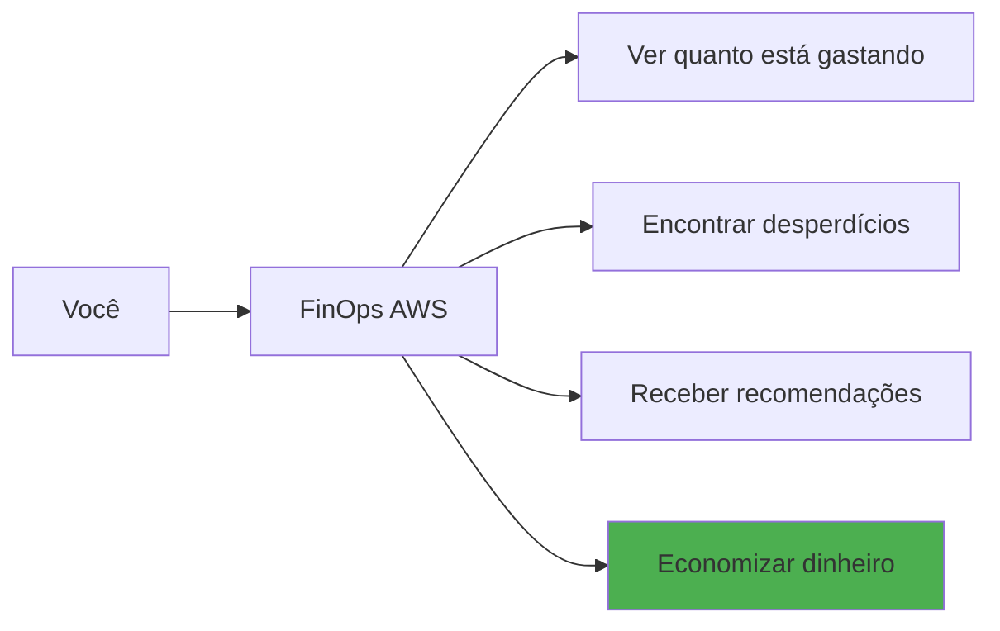
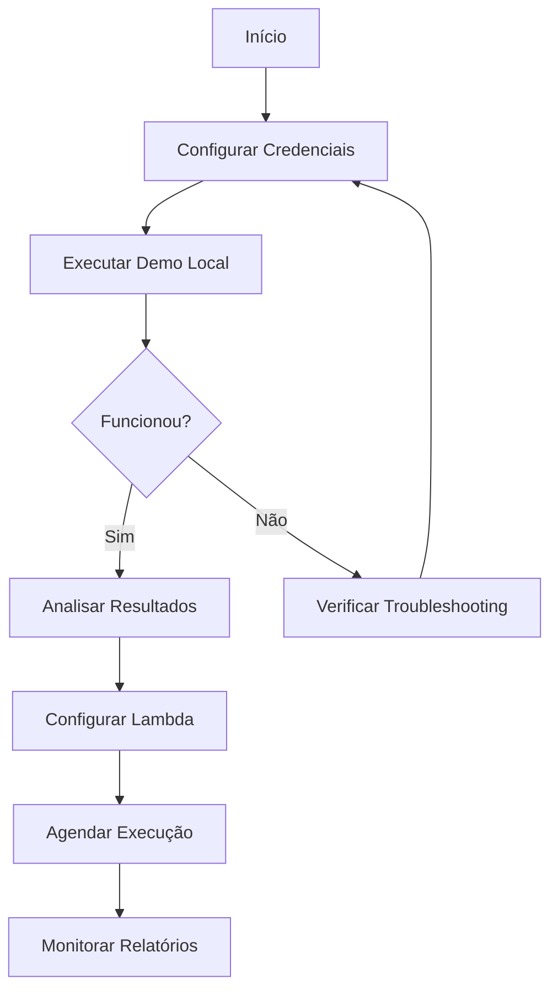
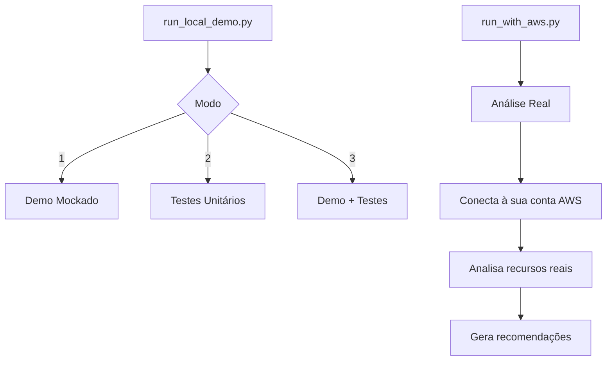
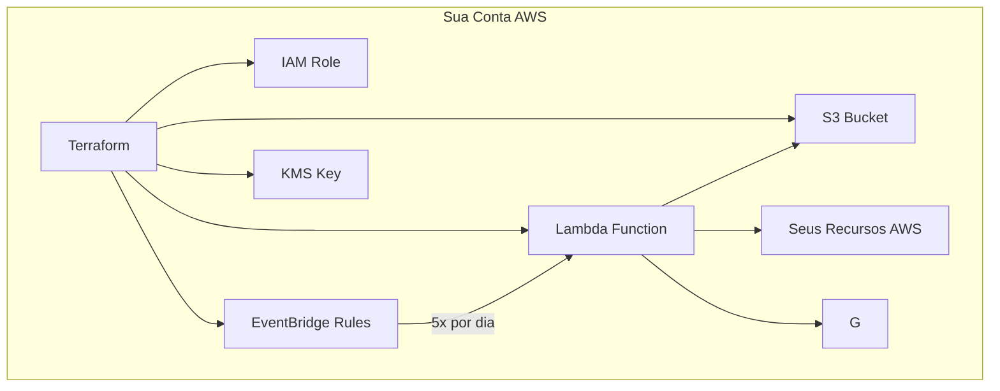
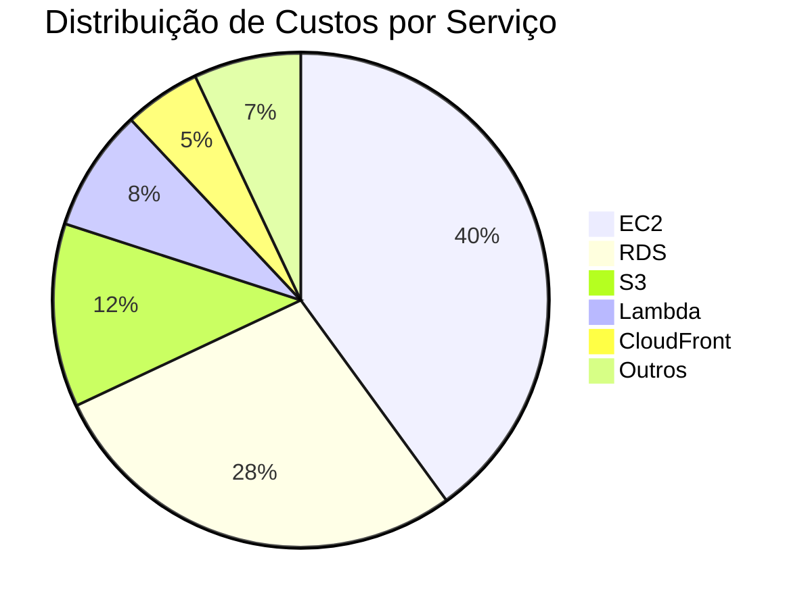

# FinOps AWS - Manual do Usuário

## Índice

1. [Introdução](#1-introdução)
2. [Requisitos](#2-requisitos)
3. [Instalação e Configuração](#3-instalação-e-configuração)
4. [Primeiro Uso](#4-primeiro-uso)
5. [Execução Local](#5-execução-local)
6. [Execução no AWS Lambda](#6-execução-no-aws-lambda)
7. [Interpretando Resultados](#7-interpretando-resultados)
8. [Configurações Avançadas](#8-configurações-avançadas)
9. [Troubleshooting](#9-troubleshooting)
10. [FAQ](#10-faq)

---

## 1. Introdução

### 1.1 Bem-vindo ao FinOps AWS

O FinOps AWS é sua ferramenta para **economizar dinheiro na AWS**. Ele analisa automaticamente seus recursos e encontra oportunidades de redução de custos.

### 1.2 O que você pode fazer



### 1.3 Para quem é este manual

- **Administradores de Cloud**: Configuração e execução
- **Engenheiros DevOps**: Análise e otimização
- **Gestores de TI**: Relatórios e dashboards
- **Equipe Financeira**: Controle de custos

---

## 2. Requisitos

### 2.1 Requisitos Mínimos

| Requisito | Especificação |
|-----------|---------------|
| **Python** | 3.11 ou superior |
| **AWS Account** | Com permissões de leitura |
| **IAM User/Role** | Ver seção de permissões |
| **Memória** | 512MB mínimo |
| **Rede** | Acesso às APIs AWS |

### 2.2 Permissões AWS Necessárias

Para funcionar corretamente, o FinOps AWS precisa de permissões de **leitura** nos serviços que você deseja analisar.

**Permissão Mínima Recomendada:**

```
- ec2:Describe*
- rds:Describe*
- s3:GetBucket*, s3:List*
- lambda:List*, lambda:Get*
- cloudwatch:GetMetric*
- ce:GetCostAndUsage
- ce:GetReservation*
```

> **Nota de Segurança**: O FinOps AWS **nunca modifica** seus recursos. Todas as operações são apenas de leitura.

---

## 3. Instalação e Configuração

### 3.1 Passo 1: Obter o Código

```bash
# Clone o repositório
git clone https://github.com/seu-org/finops-aws.git
cd finops-aws
```

### 3.2 Passo 2: Instalar Dependências

```bash
# Instalar pacotes Python
pip install -r requirements.txt
```

**Dependências instaladas:**
- `boto3` - SDK AWS para Python
- `pytest` - Framework de testes
- `moto` - Mock de serviços AWS

### 3.3 Passo 3: Configurar Credenciais AWS

**Opção A: Variáveis de Ambiente (Recomendado)**

```bash
export AWS_ACCESS_KEY_ID="sua-access-key"
export AWS_SECRET_ACCESS_KEY="sua-secret-key"
export AWS_REGION="us-east-1"
```

**Opção B: Arquivo de Credenciais**

Crie ou edite o arquivo `~/.aws/credentials`:

```ini
[default]
aws_access_key_id = sua-access-key
aws_secret_access_key = sua-secret-key
```

**Opção C: IAM Role (Para Lambda/EC2)**

Se estiver executando em uma instância EC2 ou Lambda, use uma IAM Role anexada ao recurso.

### 3.4 Verificar Configuração

```bash
# Testar conexão com AWS
python -c "import boto3; print(boto3.client('sts').get_caller_identity())"
```

Saída esperada:
```json
{
    "UserId": "AIDAXXXXXXXXXX",
    "Account": "123456789012",
    "Arn": "arn:aws:iam::123456789012:user/seu-usuario"
}
```

---

## 4. Primeiro Uso

### 4.1 Fluxo de Primeiro Uso



### 4.2 Execução Rápida de Teste

```bash
# Executar demo com serviços mockados (não requer AWS real)
python run_local_demo.py 1
```

**Opções do menu:**
1. **Demo com Mock** - Testa sem usar AWS real
2. **Executar Testes** - Roda suite de testes
3. **Ambos** - Demo + Testes

### 4.3 Primeira Análise Real

```bash
# Executar análise com sua conta AWS
python run_with_aws.py
```

---

## 5. Execução Local

### 5.1 Modos de Execução



### 5.2 Executando Demo Mockado

```bash
$ python run_local_demo.py 1

================================================================================
FinOps AWS - Local Demo Runner
================================================================================

⚠ No AWS credentials detected
  The demo will use mocked AWS services (moto library)

Running Lambda Handler Demo...
================================================================================

✓ EC2 Service: Healthy
  - 5 instances analyzed
  - 2 recommendations generated

✓ RDS Service: Healthy
  - 3 databases analyzed
  - 1 recommendation generated

✓ S3 Service: Healthy
  - 10 buckets analyzed
  - 4 recommendations generated

================================================================================
Demo completed successfully!
```

### 5.3 Executando com AWS Real

```bash
$ python run_with_aws.py

================================================================================
  FinOps AWS - Análise de Custos e Otimização
  Execução Local com Conta AWS Real
================================================================================

Verificando credenciais AWS...
  ✓ Credenciais válidas
  ✓ Conta: 123456789012
  ✓ Região: us-east-1

Iniciando análise...
  [====================] 100% - 253 serviços analisados

Resultados:
  Total de recursos: 1,234
  Custo estimado: $45,234.56/mês
  Economia potencial: $8,500.00/mês (19%)

Relatório salvo em: output/report_20251127.json
================================================================================
```

### 5.4 Executando Testes

```bash
# Todos os testes
python run_local_demo.py 2

# Ou diretamente com pytest
pytest tests/unit/ -v
```

**Saída esperada:**
```
============================= test session starts =============================
collected 2000 items

tests/unit/test_cleanup_manager.py ............................ [  1%]
tests/unit/test_cost_service.py ............................... [  2%]
...
============================= 1841 passed, 1 skipped ==========================
```

---

## 6. Execução no AWS Lambda

### 6.1 Arquitetura de Deploy



### 6.2 Passo a Passo: Deploy para Lambda

**Passo 1: Configurar variáveis**

```bash
cd infrastructure/terraform
cp terraform.tfvars.example terraform.tfvars
```

Edite `terraform.tfvars`:

```hcl
# Configurações básicas
aws_region  = "us-east-1"
environment = "production"
project     = "finops-aws"

# Configurações do Lambda
lambda_memory_size = 1024
lambda_timeout     = 900  # 15 minutos

# Agendamento (5 execuções diárias)
schedule_expressions = [
  "cron(0 6 * * ? *)",   # 6:00 UTC
  "cron(0 9 * * ? *)",   # 9:00 UTC
  "cron(0 12 * * ? *)",  # 12:00 UTC
  "cron(0 15 * * ? *)",  # 15:00 UTC
  "cron(0 18 * * ? *)"   # 18:00 UTC
]

# Alertas
alert_email = "finops-alerts@sua-empresa.com"
```

**Passo 2: Inicializar Terraform**

```bash
terraform init
```

**Passo 3: Revisar e aplicar**

```bash
# Revisar mudanças
terraform plan

# Aplicar infraestrutura
terraform apply
```

### 6.3 Verificar Deploy

```bash
# Verificar outputs do Terraform
terraform output

# Testar Lambda manualmente
aws lambda invoke \
  --function-name finops-aws-production \
  --payload '{}' \
  response.json

cat response.json
```

### 6.4 Configurar Agendamento

O agendamento é configurado via variável `schedule_expressions` no Terraform:

```hcl
# Em terraform.tfvars
schedule_expressions = [
  "cron(0 6 * * ? *)",   # 6:00 UTC
  "cron(0 12 * * ? *)",  # 12:00 UTC
  "cron(0 18 * * ? *)"   # 18:00 UTC
]
```

Após alterar, execute:
```bash
terraform apply
```

**Exemplos de Cron:**
| Expressão | Frequência |
|-----------|------------|
| `cron(0 6 * * ? *)` | Diário às 6h UTC |
| `cron(0 8 ? * SUN *)` | Domingos às 8h UTC |
| `cron(0 0 1 * ? *)` | Dia 1 de cada mês |
| `rate(4 hours)` | A cada 4 horas |

### 6.5 Recursos Criados pelo Terraform

| Recurso | Descrição |
|---------|-----------|
| Lambda Function | Função principal do FinOps |
| Lambda Layer | Dependências Python |
| IAM Role | Permissões ReadOnly |
| S3 Bucket | Estado e relatórios |
| EventBridge Rules | 5 agendamentos diários |
| KMS Key | Criptografia |
| SNS Topic | Alertas |
| CloudWatch Log Group | Logs da Lambda |

---

## 7. Interpretando Resultados

### 7.1 Estrutura do Relatório

```json
{
  "execution_id": "exec-20251127-143022",
  "timestamp": "2025-11-27T14:30:22Z",
  "status": "completed",
  "summary": {
    "total_resources": 1234,
    "total_cost_monthly": 45234.56,
    "potential_savings": 8500.00,
    "savings_percentage": 18.8,
    "services_analyzed": 253,
    "recommendations_count": 47
  },
  "cost_breakdown": {...},
  "recommendations": [...],
  "services": {...}
}
```

### 7.2 Entendendo o Resumo

```
╔═══════════════════════════════════════════════════════════════╗
║                    RESUMO DA ANÁLISE                          ║
╠═══════════════════════════════════════════════════════════════╣
║                                                               ║
║  📊 RECURSOS                    💰 CUSTOS                     ║
║  ┌─────────────────────┐       ┌─────────────────────┐       ║
║  │ Total: 1,234        │       │ Mensal: $45,234     │       ║
║  │ EC2: 156            │       │ Tendência: ↑12%     │       ║
║  │ RDS: 23             │       │ Previsão: $48,500   │       ║
║  │ S3: 89 buckets      │       │                     │       ║
║  └─────────────────────┘       └─────────────────────┘       ║
║                                                               ║
║  💡 ECONOMIA POTENCIAL          ⚠️ RECOMENDAÇÕES             ║
║  ┌─────────────────────┐       ┌─────────────────────┐       ║
║  │ Total: $8,500/mês   │       │ Alta Prioridade: 12 │       ║
║  │ Percentual: 18.8%   │       │ Média: 25           │       ║
║  │ ROI: 2 semanas      │       │ Baixa: 10           │       ║
║  └─────────────────────┘       └─────────────────────┘       ║
║                                                               ║
╚═══════════════════════════════════════════════════════════════╝
```

### 7.3 Tipos de Recomendações

#### 🔴 Alta Prioridade
Ação imediata recomendada. Alto impacto financeiro.

**Exemplo:**
```
RECOMENDAÇÃO: Desligar instâncias ociosas
- Recurso: i-0abc123def456 (m5.xlarge)
- Problema: CPU média < 1% nos últimos 30 dias
- Economia: $142.00/mês
- Ação: Terminar instância ou investigar uso
```

#### 🟡 Média Prioridade
Ação em 30 dias. Impacto moderado.

**Exemplo:**
```
RECOMENDAÇÃO: Adquirir Reserved Instance
- Recurso: i-0def456abc789 (r5.2xlarge)
- Problema: Uso constante (24/7) há 6+ meses
- Economia: $450.00/mês com RI 1-year
- Ação: Avaliar compromisso e adquirir RI
```

#### 🟢 Baixa Prioridade
Ação quando conveniente. Impacto menor.

**Exemplo:**
```
RECOMENDAÇÃO: Mover objetos S3 para Glacier
- Recurso: bucket-logs-antigos
- Problema: 500GB não acessados há 180 dias
- Economia: $10.00/mês
- Ação: Configurar lifecycle policy
```

### 7.4 Breakdown de Custos



---

## 8. Configurações Avançadas

### 8.1 Variáveis de Ambiente

| Variável | Descrição | Padrão |
|----------|-----------|--------|
| `AWS_REGION` | Região AWS principal | `us-east-1` |
| `LOG_LEVEL` | Nível de log (DEBUG, INFO, WARN) | `INFO` |
| `S3_BUCKET` | Nome do bucket S3 para estado | `finops-aws-{account}` |
| `EXECUTION_TIMEOUT` | Timeout em segundos | `840` |
| `MAX_RETRIES` | Tentativas de retry | `3` |
| `SERVICES_TO_ANALYZE` | Lista de serviços (CSV) | Todos |

### 8.2 Configurar Serviços Específicos

Para analisar apenas alguns serviços:

```bash
export SERVICES_TO_ANALYZE="ec2,rds,s3,lambda"
python run_with_aws.py
```

### 8.3 Configurar Multi-Região

```bash
# Analisar múltiplas regiões
export AWS_REGIONS="us-east-1,us-west-2,eu-west-1"
python run_with_aws.py
```

### 8.4 Configurar Multi-Conta

Para análise cross-account, configure roles assumíveis:

```bash
export CROSS_ACCOUNT_ROLES="arn:aws:iam::111111111111:role/FinOpsRole,arn:aws:iam::222222222222:role/FinOpsRole"
python run_with_aws.py
```

---

## 9. Troubleshooting

### 9.1 Problemas Comuns

#### Erro: "No credentials found"

```
❌ NENHUMA CREDENCIAL AWS ENCONTRADA!
```

**Solução:**
1. Verifique se as variáveis de ambiente estão configuradas
2. Ou verifique o arquivo `~/.aws/credentials`
3. Execute: `aws sts get-caller-identity` para testar

#### Erro: "Access Denied"

```
botocore.exceptions.ClientError: An error occurred (AccessDenied)
```

**Solução:**
1. Verifique as permissões IAM do usuário/role
2. Adicione as políticas necessárias (ver seção 2.2)
3. Verifique se não há SCPs bloqueando

#### Erro: "Timeout"

```
Task timed out after 900 seconds
```

**Solução:**
1. Aumente o timeout do Lambda (máx 15 min)
2. Reduza o número de serviços analisados
3. Considere execução em batch

#### Erro: "Rate exceeded"

```
botocore.exceptions.ClientError: Rate exceeded
```

**Solução:**
1. O retry automático já trata isso
2. Se persistir, aumente o delay entre chamadas
3. Solicite aumento de limites à AWS

### 9.2 Verificar Logs

**Logs Locais:**
```bash
# Ver últimas linhas do log
tail -f /var/log/finops-aws.log
```

**Logs no CloudWatch:**
```bash
# Ver logs do Lambda
aws logs tail /aws/lambda/finops-aws-handler --follow
```

### 9.3 Modo Debug

```bash
# Ativar logs detalhados
export LOG_LEVEL=DEBUG
python run_with_aws.py
```

---

## 10. FAQ

### Perguntas Frequentes

**P: O FinOps AWS modifica meus recursos?**
> R: Não. Todas as operações são apenas de leitura. A ferramenta nunca cria, modifica ou deleta recursos.

**P: Quanto custa executar o FinOps AWS?**
> R: O custo é mínimo:
> - Lambda: ~$0.50/mês (execução diária)
> - S3: ~$0.05/mês (estado e relatórios)
> - Step Functions: ~$1.50/mês (100 execuções/dia)
> - API calls: ~$1.00/mês
> - **Total estimado: ~$3.16/mês**

**P: Posso analisar apenas alguns serviços?**
> R: Sim. Use a variável `SERVICES_TO_ANALYZE` para especificar quais serviços analisar.

**P: Como integrar com Slack/Teams?**
> R: Configure um SNS topic e adicione uma assinatura Lambda que envia para Slack/Teams.

**P: Suporta AWS GovCloud/China?**
> R: Sim, configure a região apropriada e endpoints.

**P: Como exportar para Excel?**
> R: O relatório JSON pode ser convertido com ferramentas como `jq` ou importado diretamente em ferramentas de BI.

**P: Qual a frequência recomendada de execução?**
> R: Diária para monitoramento ativo. Semanal para ambientes estáveis.

**P: Posso customizar as recomendações?**
> R: Sim. Cada serviço tem thresholds configuráveis (CPU, uso, etc).

---

## Suporte

### Recursos Adicionais

- 📖 [Guia Técnico](TECHNICAL_GUIDE.md) - Detalhes de arquitetura
- 📊 [Guia Funcional](FUNCTIONAL_GUIDE.md) - Capacidades da solução
- 📋 [Catálogo de Serviços](APPENDIX_SERVICES.md) - Lista completa de serviços

### Contato

- **Issues**: Abra uma issue no repositório GitHub
- **Email**: suporte@finops-aws.example.com
- **Slack**: #finops-aws-support

---

*Manual do Usuário - FinOps AWS*
*Versão: 1.0*
*Última atualização: Novembro 2025*

---

## 11. Troubleshooting Avançado

### 11.1 Guia de Diagnóstico

```
╔═════════════════════════════════════════════════════════════════════════════╗
║                      GUIA DE DIAGNÓSTICO AVANÇADO                          ║
╚═════════════════════════════════════════════════════════════════════════════╝
```

#### Problema: Lambda Timeout

```
┌─────────────────────────────────────────────────────────────────────────────┐
│  SINTOMA: Task timed out after X seconds                                    │
├─────────────────────────────────────────────────────────────────────────────┤
│                                                                             │
│  DIAGNÓSTICO:                                                               │
│  ───────────────────────────────────────────────────────────────────────    │
│  1. Verificar timeout configurado no Lambda                                │
│     aws lambda get-function-configuration --function-name finops           │
│                                                                             │
│  2. Verificar número de recursos sendo analisados                          │
│     Muitos recursos = mais tempo necessário                                │
│                                                                             │
│  3. Verificar se há throttling da AWS                                      │
│     Logs com "Rate exceeded"                                               │
│                                                                             │
│  SOLUÇÕES:                                                                  │
│  ───────────────────────────────────────────────────────────────────────    │
│  1. Aumentar timeout do Lambda (máximo 15 minutos)                         │
│     aws lambda update-function-configuration \                             │
│       --function-name finops \                                             │
│       --timeout 900                                                         │
│                                                                             │
│  2. Aumentar memória (mais memória = mais CPU)                             │
│     aws lambda update-function-configuration \                             │
│       --function-name finops \                                             │
│       --memory-size 1024                                                   │
│                                                                             │
│  3. Habilitar checkpoint/resume para processar em partes                   │
│     Variável de ambiente: ENABLE_CHECKPOINTING=true                        │
│                                                                             │
│  4. Filtrar serviços analisados                                            │
│     Variável de ambiente: SERVICES_FILTER=ec2,rds,s3                       │
│                                                                             │
└─────────────────────────────────────────────────────────────────────────────┘
```

#### Problema: Memory Error

```
┌─────────────────────────────────────────────────────────────────────────────┐
│  SINTOMA: Runtime.ExitError ou MemoryError                                  │
├─────────────────────────────────────────────────────────────────────────────┤
│                                                                             │
│  DIAGNÓSTICO:                                                               │
│  ───────────────────────────────────────────────────────────────────────    │
│  1. Verificar memória alocada vs usada no CloudWatch                       │
│     Metric: AWS/Lambda/MemoryUtilization                                   │
│                                                                             │
│  2. Conta com muitos recursos (ex: milhares de instâncias EC2)             │
│                                                                             │
│  SOLUÇÕES:                                                                  │
│  ───────────────────────────────────────────────────────────────────────    │
│  1. Aumentar memória do Lambda                                             │
│     aws lambda update-function-configuration \                             │
│       --function-name finops \                                             │
│       --memory-size 3008                                                   │
│                                                                             │
│  2. Processar por região separadamente                                     │
│     Variável: REGION_FILTER=us-east-1                                      │
│                                                                             │
│  3. Habilitar streaming de resultados                                      │
│     Variável: STREAMING_RESULTS=true                                       │
│                                                                             │
└─────────────────────────────────────────────────────────────────────────────┘
```

#### Problema: Dados Incompletos

```
┌─────────────────────────────────────────────────────────────────────────────┐
│  SINTOMA: Alguns serviços não aparecem no relatório                        │
├─────────────────────────────────────────────────────────────────────────────┤
│                                                                             │
│  DIAGNÓSTICO:                                                               │
│  ───────────────────────────────────────────────────────────────────────    │
│  1. Verificar permissões IAM para o serviço faltante                       │
│                                                                             │
│  2. Verificar se o serviço está disponível na região                       │
│                                                                             │
│  3. Verificar logs de erro                                                  │
│     grep "ERROR" /tmp/finops.log                                           │
│                                                                             │
│  SOLUÇÕES:                                                                  │
│  ───────────────────────────────────────────────────────────────────────    │
│  1. Adicionar permissões necessárias                                       │
│     Consultar docs/APPENDIX_SERVICES.md para lista de permissões          │
│                                                                             │
│  2. Verificar SCPs no AWS Organizations                                    │
│     aws organizations list-policies --filter SERVICE_CONTROL_POLICY       │
│                                                                             │
│  3. Executar em região específica                                          │
│     export AWS_REGION=us-west-2                                            │
│                                                                             │
└─────────────────────────────────────────────────────────────────────────────┘
```

---

## 12. Variáveis de Ambiente

### 12.1 Lista Completa de Variáveis

```
┌────────────────────────────┬────────────────────┬────────────────────────────┐
│ Variável                   │ Default            │ Descrição                  │
├────────────────────────────┼────────────────────┼────────────────────────────┤
│ AWS_REGION                 │ us-east-1          │ Região AWS principal       │
│ AWS_ACCESS_KEY_ID          │ -                  │ Access Key (se não IAM)    │
│ AWS_SECRET_ACCESS_KEY      │ -                  │ Secret Key (se não IAM)    │
│ AWS_PROFILE                │ default            │ Perfil do ~/.aws/config    │
├────────────────────────────┼────────────────────┼────────────────────────────┤
│ LOG_LEVEL                  │ INFO               │ DEBUG, INFO, WARNING, ERROR│
│ LOG_FORMAT                 │ json               │ json, text                 │
├────────────────────────────┼────────────────────┼────────────────────────────┤
│ ENABLE_CHECKPOINTING       │ true               │ Habilitar checkpoints      │
│ S3_STATE_BUCKET            │ finops-aws-{acct}  │ Bucket S3 para estado      │
├────────────────────────────┼────────────────────┼────────────────────────────┤
│ SERVICES_FILTER            │ (todos)            │ Lista de serviços: ec2,rds │
│ REGION_FILTER              │ (todas)            │ Lista de regiões           │
│ ACCOUNT_FILTER             │ (todas)            │ Lista de contas AWS        │
├────────────────────────────┼────────────────────┼────────────────────────────┤
│ METRICS_PERIOD_DAYS        │ 30                 │ Período de métricas        │
│ RECOMMENDATION_THRESHOLD   │ 10                 │ % mínimo para recomendar   │
├────────────────────────────┼────────────────────┼────────────────────────────┤
│ REPORT_S3_BUCKET           │ -                  │ Bucket para relatórios     │
│ NOTIFICATION_SNS_TOPIC     │ -                  │ ARN do tópico SNS          │
├────────────────────────────┼────────────────────┼────────────────────────────┤
│ MAX_RETRIES                │ 3                  │ Tentativas em caso de erro │
│ RETRY_BASE_DELAY           │ 1.0                │ Delay base em segundos     │
│ RETRY_MAX_DELAY            │ 60.0               │ Delay máximo em segundos   │
└────────────────────────────┴────────────────────┴────────────────────────────┘
```

---

## 13. Comandos Úteis

### 13.1 Comandos de Diagnóstico

```bash
# Verificar versão do Python
python --version

# Verificar boto3
python -c "import boto3; print(boto3.__version__)"

# Testar conexão AWS
aws sts get-caller-identity

# Verificar permissões EC2
aws ec2 describe-instances --max-items 1

# Verificar permissões RDS
aws rds describe-db-instances --max-items 1

# Verificar permissões Cost Explorer
aws ce get-cost-and-usage \
  --time-period Start=2025-01-01,End=2025-01-02 \
  --granularity DAILY \
  --metrics "BlendedCost"

# Verificar limites de API
aws service-quotas get-service-quota \
  --service-code ec2 \
  --quota-code L-1216C47A
```

### 13.2 Comandos de Execução

```bash
# Execução com mock (sem AWS real)
python run_local_demo.py 1

# Execução real
python run_with_aws.py

# Execução com filtros
SERVICES_FILTER=ec2,rds,s3 python run_with_aws.py

# Execução em região específica
AWS_REGION=eu-west-1 python run_with_aws.py

# Execução com debug
LOG_LEVEL=DEBUG python run_with_aws.py 2>&1 | tee finops_debug.log

# Execução salvando resultado
python run_with_aws.py > report_$(date +%Y%m%d_%H%M%S).json
```

### 13.3 Comandos de Teste

```bash
# Rodar todos os testes
python -m pytest tests/ -v

# Rodar testes de um serviço específico
python -m pytest tests/unit/test_ec2_service.py -v

# Rodar testes com coverage
python -m pytest tests/ --cov=src/finops_aws --cov-report=html

# Rodar apenas testes rápidos
python -m pytest tests/ -m "not slow" -v
```

---

## 14. Melhores Práticas

### 14.1 Checklist de Produção

```
┌─────────────────────────────────────────────────────────────────────────────┐
│                     CHECKLIST PARA PRODUÇÃO                                 │
├─────────────────────────────────────────────────────────────────────────────┤
│                                                                             │
│  SEGURANÇA                                                                  │
│  ☐ Usar IAM Role ao invés de Access Keys                                   │
│  ☐ Permissões mínimas necessárias (read-only)                              │
│  ☐ Habilitar CloudTrail para auditoria                                     │
│  ☐ Não expor credenciais em logs                                           │
│                                                                             │
│  CONFIGURAÇÃO                                                               │
│  ☐ Lambda timeout adequado (recomendado: 900s)                             │
│  ☐ Memória adequada (recomendado: 1024MB+)                                 │
│  ☐ VPC configurada se necessário acessar recursos privados                │
│  ☐ Variáveis de ambiente configuradas                                      │
│                                                                             │
│  MONITORAMENTO                                                              │
│  ☐ CloudWatch Logs habilitado                                               │
│  ☐ Alertas de erro configurados                                            │
│  ☐ Dashboard de métricas                                                    │
│                                                                             │
│  AGENDAMENTO                                                                │
│  ☐ EventBridge rule configurada                                            │
│  ☐ Frequência adequada (recomendado: diária)                               │
│  ☐ Janela de execução fora do horário de pico                              │
│                                                                             │
│  NOTIFICAÇÕES                                                               │
│  ☐ SNS topic configurado                                                    │
│  ☐ Destinatários corretos                                                   │
│  ☐ Filtro de notificações por severidade                                   │
│                                                                             │
│  RELATÓRIOS                                                                 │
│  ☐ Bucket S3 para armazenamento                                             │
│  ☐ Lifecycle policy para arquivamento                                      │
│  ☐ Acesso configurado para stakeholders                                    │
│                                                                             │
└─────────────────────────────────────────────────────────────────────────────┘
```

---

## 15. Atualizações e Versionamento

### 15.1 Como Atualizar

```bash
# 1. Verificar versão atual
cat VERSION

# 2. Fazer backup
cp -r . ../finops-aws-backup

# 3. Atualizar código
git pull origin main

# 4. Atualizar dependências
pip install -r requirements.txt --upgrade

# 5. Rodar testes
python -m pytest tests/ -v

# 6. Verificar changelog
cat CHANGELOG.md
```

---

*Manual do Usuário FinOps AWS - Versão 2.0 Expandida*
*Novembro 2025*
