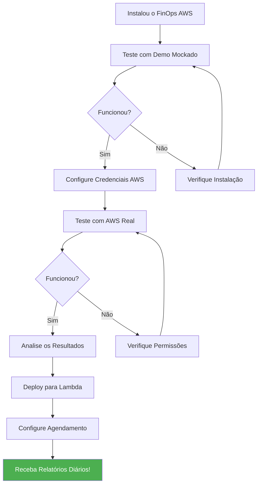

# FinOps AWS - Manual do Usuário

## Bem-vindo ao FinOps AWS!

Este manual vai te guiar passo a passo desde a instalação até a obtenção de relatórios de economia na sua conta AWS.

---

## Índice Detalhado

1. [Introdução](#1-introdução)
2. [Requisitos](#2-requisitos)
3. [Instalação e Configuração](#3-instalação-e-configuração)
4. [Primeiro Uso](#4-primeiro-uso)
5. [Execução Local](#5-execução-local)
6. [Deploy para AWS Lambda](#6-deploy-para-aws-lambda)
7. [Interpretando Resultados](#7-interpretando-resultados)
8. [Configurações Avançadas](#8-configurações-avançadas)
9. [Troubleshooting](#9-troubleshooting)
10. [FAQ - Perguntas Frequentes](#10-faq---perguntas-frequentes)
11. [Glossário](#11-glossário)
12. [Suporte](#12-suporte)

---

# 1. Introdução

## 1.1 O que é o FinOps AWS?

O **FinOps AWS** é uma ferramenta inteligente que analisa sua conta AWS e encontra oportunidades de **economizar dinheiro**. Funciona como um consultor financeiro para sua infraestrutura de nuvem.

```
┌─────────────────────────────────────────────────────────────────────────────┐
│                                                                             │
│                    O QUE O FINOPS AWS FAZ POR VOCÊ                          │
│                                                                             │
│  ┌─────────────────┐         ┌─────────────────┐        ┌────────────────┐ │
│  │                 │         │                 │        │                │ │
│  │   ANALISA       │ ──────► │   IDENTIFICA    │ ─────► │   RECOMENDA    │ │
│  │   253 serviços  │         │   desperdícios  │        │   economia     │ │
│  │   AWS           │         │   e ociosidade  │        │   20-40%       │ │
│  │                 │         │                 │        │                │ │
│  └─────────────────┘         └─────────────────┘        └────────────────┘ │
│                                                                             │
└─────────────────────────────────────────────────────────────────────────────┘
```

## 1.2 Benefícios Principais

| Benefício | Descrição | Você Economiza |
|-----------|-----------|----------------|
| **Encontra Recursos Ociosos** | Identifica máquinas desligadas ou sem uso | 100% do custo desses recursos |
| **Sugere Rightsizing** | Reduz tamanho de máquinas superdimensionadas | 30-50% por recurso |
| **Recomenda Reserved Instances** | Indica quando vale comprar com desconto | 30-60% em reservas |
| **Otimiza Storage** | Move dados antigos para armazenamento mais barato | 40-70% em S3 |
| **Detecta Anomalias** | Alerta sobre gastos inesperados | Evita surpresas na fatura |

## 1.3 Para Quem é Este Manual?

Este manual foi escrito para:

- **Administradores de Cloud** - Configuração e operação
- **Engenheiros DevOps/SRE** - Análise e otimização
- **Gestores de TI** - Relatórios gerenciais
- **Equipe Financeira** - Controle de custos e budgets
- **Desenvolvedores** - Entendimento de custos das aplicações

## 1.4 Segurança - Importante!

```
┌─────────────────────────────────────────────────────────────────────────────┐
│                           🔒 GARANTIA DE SEGURANÇA                          │
├─────────────────────────────────────────────────────────────────────────────┤
│                                                                             │
│  O FinOps AWS é uma ferramenta APENAS DE LEITURA. Ele NUNCA irá:           │
│                                                                             │
│  ❌ Criar recursos na sua conta                                             │
│  ❌ Modificar configurações existentes                                      │
│  ❌ Deletar qualquer coisa                                                  │
│  ❌ Acessar dados sensíveis dos seus sistemas                              │
│                                                                             │
│  ✅ Ele apenas LÊ informações para gerar relatórios                        │
│                                                                             │
└─────────────────────────────────────────────────────────────────────────────┘
```

---

# 2. Requisitos

## 2.1 Requisitos de Sistema

| Requisito | Especificação | Verificação |
|-----------|---------------|-------------|
| **Python** | 3.11 ou superior | `python --version` |
| **pip** | Qualquer versão recente | `pip --version` |
| **Git** | Qualquer versão | `git --version` |
| **Memória** | Mínimo 512MB | - |
| **Disco** | 100MB livre | - |
| **Internet** | Acesso às APIs AWS | - |

## 2.2 Requisitos AWS

| Requisito | Descrição | Obrigatório? |
|-----------|-----------|--------------|
| **Conta AWS** | Conta ativa com recursos para analisar | ✅ Sim |
| **IAM User ou Role** | Com permissões de leitura | ✅ Sim |
| **Access Key** | Para execução local (opcional para Lambda) | ⚠️ Depende |
| **Cost Explorer** | Habilitado na conta | ✅ Sim |

## 2.3 Permissões IAM Necessárias

O FinOps AWS precisa de permissões de **leitura** (Describe, List, Get). Aqui está a política IAM recomendada:

```json
{
    "Version": "2012-10-17",
    "Statement": [
        {
            "Sid": "FinOpsReadOnly",
            "Effect": "Allow",
            "Action": [
                "ec2:Describe*",
                "rds:Describe*",
                "s3:GetBucket*",
                "s3:List*",
                "lambda:List*",
                "lambda:Get*",
                "ecs:Describe*",
                "ecs:List*",
                "eks:Describe*",
                "eks:List*",
                "elasticache:Describe*",
                "dynamodb:Describe*",
                "dynamodb:List*",
                "cloudwatch:GetMetric*",
                "cloudwatch:List*",
                "ce:GetCost*",
                "ce:GetReservation*",
                "ce:GetSavings*",
                "budgets:Describe*",
                "iam:Get*",
                "iam:List*"
            ],
            "Resource": "*"
        }
    ]
}
```

### 2.3.1 Como Criar a Política IAM

**Passo 1**: Acesse o Console AWS > IAM > Policies

**Passo 2**: Clique em "Create policy"

**Passo 3**: Selecione "JSON" e cole a política acima

**Passo 4**: Nomeie como "FinOpsReadOnlyPolicy"

**Passo 5**: Anexe ao seu usuário/role

---

# 3. Instalação e Configuração

## 3.1 Passo 1: Obter o Código

```bash
# Clone o repositório
git clone https://github.com/sua-org/finops-aws.git

# Entre na pasta
cd finops-aws

# Verifique os arquivos
ls -la
```

**Estrutura de pastas que você verá:**

```
finops-aws/
├── src/                    # Código-fonte
├── tests/                  # Testes automatizados
├── docs/                   # Documentação (você está aqui!)
├── infrastructure/         # Terraform para deploy
├── run_local_demo.py       # Script para testar localmente
├── run_with_aws.py         # Script para usar com AWS real
└── requirements.txt        # Dependências Python
```

## 3.2 Passo 2: Instalar Dependências

```bash
# Instalar dependências Python
pip install -r requirements.txt
```

**Dependências instaladas automaticamente:**
- `boto3` - SDK oficial da AWS para Python
- `pytest` - Framework de testes
- `moto` - Simulador de AWS para testes
- `tabulate` - Formatação de tabelas

## 3.3 Passo 3: Configurar Credenciais AWS

Você tem **3 opções** para configurar as credenciais:

### Opção A: Variáveis de Ambiente (Recomendado para desenvolvimento)

```bash
# Linux/Mac
export AWS_ACCESS_KEY_ID="sua-access-key"
export AWS_SECRET_ACCESS_KEY="sua-secret-key"
export AWS_REGION="us-east-1"

# Windows (PowerShell)
$env:AWS_ACCESS_KEY_ID="sua-access-key"
$env:AWS_SECRET_ACCESS_KEY="sua-secret-key"
$env:AWS_REGION="us-east-1"
```

### Opção B: Arquivo de Credenciais

Crie ou edite o arquivo `~/.aws/credentials`:

```ini
[default]
aws_access_key_id = sua-access-key
aws_secret_access_key = sua-secret-key

[finops]
aws_access_key_id = outra-access-key
aws_secret_access_key = outra-secret-key
```

E o arquivo `~/.aws/config`:

```ini
[default]
region = us-east-1
output = json

[profile finops]
region = us-east-1
output = json
```

### Opção C: IAM Role (Para Lambda/EC2)

Se estiver executando em uma instância EC2 ou Lambda, use uma IAM Role anexada ao recurso. Nenhuma configuração adicional é necessária.

## 3.4 Passo 4: Verificar Configuração

```bash
# Testar conexão com AWS
python -c "import boto3; print(boto3.client('sts').get_caller_identity())"
```

**Saída esperada:**
```json
{
    "UserId": "AIDAXXXXXXXXXX",
    "Account": "123456789012",
    "Arn": "arn:aws:iam::123456789012:user/seu-usuario"
}
```

Se aparecer erro, verifique:
- Access Key está correta?
- Secret Key está correta?
- Região é válida?
- Usuário tem as permissões necessárias?

---

# 4. Primeiro Uso

## 4.1 Fluxo Recomendado para Novos Usuários



## 4.2 Teste Rápido (Sem AWS Real)

Execute o demo mockado para verificar se a instalação está funcionando:

```bash
python run_local_demo.py 1
```

**O que você verá:**

```
================================================================================
FinOps AWS - Local Demo Runner
================================================================================

⚠ No AWS credentials detected
  The demo will use mocked AWS services (moto library)

Running Lambda Handler Demo...
================================================================================

Initializing FinOps Analysis...
  ✓ ServiceFactory initialized
  ✓ StateManager initialized
  ✓ ResilientExecutor initialized

Analyzing AWS Services...
  [====================] 100%

Results:
  ✓ EC2 Service: Healthy
    - 5 instances analyzed
    - 2 recommendations generated
  
  ✓ RDS Service: Healthy
    - 3 databases analyzed
    - 1 recommendation generated
  
  ✓ S3 Service: Healthy
    - 10 buckets analyzed
    - 4 recommendations generated

================================================================================
Summary:
  Services Analyzed: 253
  Resources Found: 18
  Recommendations: 7
  Potential Savings: $1,234.00/month
================================================================================

Demo completed successfully!
```

## 4.3 Primeira Análise Real

Agora com as credenciais AWS configuradas:

```bash
python run_with_aws.py
```

**O que você verá:**

```
================================================================================
  FinOps AWS - Análise de Custos e Otimização
  Execução Local com Conta AWS Real
================================================================================

Verificando credenciais AWS...
  ✓ Credenciais válidas
  ✓ Conta: 123456789012
  ✓ Região: us-east-1
  ✓ Usuário: seu-usuario

Verificando permissões...
  ✓ EC2: OK
  ✓ RDS: OK
  ✓ S3: OK
  ✓ Lambda: OK
  ✓ Cost Explorer: OK

Iniciando análise de 253 serviços AWS...
  [====================] 100% - Tempo: 3m 45s

================================================================================
                           RELATÓRIO DE RESULTADOS
================================================================================

Recursos Analisados:
  ├── EC2: 45 instâncias
  ├── RDS: 12 databases
  ├── S3: 28 buckets
  ├── Lambda: 156 funções
  └── Outros: 234 recursos

Custo Atual Estimado: $45,234.56/mês

Recomendações de Economia:
  ┌─────────────────────────────────────────────────────────────────────────┐
  │ #  │ Tipo                  │ Recurso           │ Economia    │ Esforço │
  ├────┼───────────────────────┼───────────────────┼─────────────┼─────────┤
  │ 1  │ Terminate Idle        │ i-abc123 (EC2)    │ $150/mês    │ Baixo   │
  │ 2  │ Rightsizing           │ db-prod-01 (RDS)  │ $89/mês     │ Médio   │
  │ 3  │ S3 Lifecycle          │ logs-bucket       │ $45/mês     │ Baixo   │
  │ 4  │ Reserved Instance     │ 5x t3.large       │ $234/mês    │ Baixo   │
  └────┴───────────────────────┴───────────────────┴─────────────┴─────────┘

  Economia Total Potencial: $8,500.00/mês (18.8%)

Relatório salvo em: output/report_20251202.json
================================================================================
```

---

# 5. Execução Local

## 5.1 Modos de Execução

O script `run_local_demo.py` oferece 3 modos:

| Modo | Comando | Descrição |
|------|---------|-----------|
| **1 - Demo** | `python run_local_demo.py 1` | Simula análise com dados fictícios |
| **2 - Testes** | `python run_local_demo.py 2` | Executa 2.013 testes automatizados |
| **3 - Ambos** | `python run_local_demo.py 3` | Demo + Testes |

## 5.2 Executando os Testes

Para verificar se tudo está funcionando corretamente:

```bash
python run_local_demo.py 2
```

**Saída esperada:**

```
================================================================================
Running Test Suite...
================================================================================

============================= test session starts ==============================
platform linux -- Python 3.11.0, pytest-7.4.0
collected 2013 items

tests/unit/test_factories.py ............................ [ 1%]
tests/unit/test_state_manager.py ........................ [ 2%]
tests/unit/test_resilient_executor.py ................... [ 4%]
...
tests/unit/test_qa_comprehensive.py .................... [99%]

======================== 2013 passed, 7 skipped in 242.19s ====================

✓ All tests passed!
================================================================================
```

## 5.3 Executando com Diferentes Configurações

### Analisar apenas serviços específicos:

```bash
# Apenas EC2 e RDS
python run_with_aws.py --services ec2,rds

# Apenas Storage
python run_with_aws.py --category storage
```

### Analisar região específica:

```bash
python run_with_aws.py --region us-west-2
```

### Gerar relatório em formato específico:

```bash
# JSON (padrão)
python run_with_aws.py --output json

# Tabela no terminal
python run_with_aws.py --output table

# CSV para Excel
python run_with_aws.py --output csv
```

---

# 6. Deploy para AWS Lambda

## 6.1 Arquitetura do Deploy

```
┌─────────────────────────────────────────────────────────────────────────────┐
│                          ARQUITETURA DE PRODUÇÃO                            │
├─────────────────────────────────────────────────────────────────────────────┤
│                                                                             │
│  ┌─────────────┐    ┌─────────────────┐    ┌─────────────────┐             │
│  │ EventBridge │───►│ Step Functions  │───►│ Lambda Workers  │             │
│  │  Scheduler  │    │  Orchestrator   │    │ (5 em paralelo) │             │
│  └─────────────┘    └─────────────────┘    └───────┬─────────┘             │
│        │                                           │                        │
│        │            ┌─────────────────┐            │                        │
│        │            │       S3        │◄───────────┘                        │
│        │            │  (Relatórios)   │                                     │
│        │            └────────┬────────┘                                     │
│        │                     │                                              │
│        │            ┌────────▼────────┐                                     │
│        └───────────►│       SNS       │                                     │
│                     │  (Notificações) │                                     │
│                     └─────────────────┘                                     │
│                                                                             │
│  Custo estimado: ~$3/mês para 100 execuções/dia                            │
│                                                                             │
└─────────────────────────────────────────────────────────────────────────────┘
```

## 6.2 Pré-requisitos para Deploy

- [ ] Terraform instalado (`terraform --version`)
- [ ] AWS CLI configurado
- [ ] Conta AWS com permissões de administrador

## 6.3 Passo a Passo do Deploy

### Passo 1: Configurar variáveis do Terraform

```bash
cd infrastructure/terraform
cp terraform.tfvars.example terraform.tfvars
```

Edite o arquivo `terraform.tfvars`:

```hcl
# Configuração básica
aws_region  = "us-east-1"
environment = "production"
project     = "finops-aws"

# Configuração do Lambda
lambda_memory_size = 1024
lambda_timeout     = 900  # 15 minutos

# Email para notificações
alert_email = "seu-email@empresa.com"

# Agendamento (5 execuções diárias)
schedule_expressions = [
  "cron(0 6 * * ? *)",   # 06:00 UTC
  "cron(0 9 * * ? *)",   # 09:00 UTC
  "cron(0 12 * * ? *)",  # 12:00 UTC
  "cron(0 15 * * ? *)",  # 15:00 UTC
  "cron(0 18 * * ? *)"   # 18:00 UTC
]
```

### Passo 2: Inicializar Terraform

```bash
terraform init
```

**Saída esperada:**

```
Initializing the backend...
Initializing provider plugins...
- Finding latest version of hashicorp/aws...
- Installing hashicorp/aws v5.0.0...

Terraform has been successfully initialized!
```

### Passo 3: Verificar o plano

```bash
terraform plan -out=deploy.plan
```

**Isso vai mostrar tudo que será criado:**
- Lambda Functions (Mapper, Workers, Aggregator)
- Step Functions State Machine
- IAM Roles e Policies
- S3 Bucket para relatórios
- EventBridge Rules para agendamento
- SNS Topic para notificações
- CloudWatch Dashboard e Alarms
- KMS Key para criptografia

### Passo 4: Aplicar o deploy

```bash
terraform apply deploy.plan
```

Digite `yes` quando perguntado.

**Saída esperada:**

```
Apply complete! Resources: 23 added, 0 changed, 0 destroyed.

Outputs:

lambda_function_arn = "arn:aws:lambda:us-east-1:123456789012:function:finops-aws-worker"
s3_bucket = "finops-aws-reports-123456789012"
state_machine_arn = "arn:aws:states:us-east-1:123456789012:stateMachine:finops-aws-orchestrator"
```

### Passo 5: Verificar o deploy

```bash
# Verificar funções Lambda
aws lambda list-functions --query "Functions[?starts_with(FunctionName, 'finops')]"

# Testar execução manual
aws stepfunctions start-execution \
  --state-machine-arn "arn:aws:states:us-east-1:123456789012:stateMachine:finops-aws-orchestrator"
```

## 6.4 Monitoramento Pós-Deploy

Após o deploy, você pode monitorar pelo Console AWS:

1. **CloudWatch Logs** - Ver logs de execução
2. **Step Functions** - Ver histórico de execuções
3. **S3 Bucket** - Ver relatórios gerados
4. **CloudWatch Dashboard** - Métricas e alarmes

---

# 7. Interpretando Resultados

## 7.1 Estrutura do Relatório

O relatório gerado contém as seguintes seções:

```
┌─────────────────────────────────────────────────────────────────────────────┐
│                        ESTRUTURA DO RELATÓRIO                               │
├─────────────────────────────────────────────────────────────────────────────┤
│                                                                             │
│  1. SUMÁRIO EXECUTIVO                                                       │
│     ├── Custo total do período                                             │
│     ├── Economia potencial identificada                                    │
│     └── Top 5 oportunidades de economia                                    │
│                                                                             │
│  2. ANÁLISE POR SERVIÇO                                                     │
│     ├── EC2: X instâncias, $Y custo, Z recomendações                       │
│     ├── RDS: X databases, $Y custo, Z recomendações                        │
│     ├── S3: X buckets, $Y custo, Z recomendações                           │
│     └── ... (253 serviços)                                                 │
│                                                                             │
│  3. RECOMENDAÇÕES DETALHADAS                                                │
│     ├── Lista priorizada por economia                                      │
│     ├── Passos para implementação                                          │
│     ├── Esforço e risco de cada ação                                       │
│     └── ROI estimado                                                       │
│                                                                             │
│  4. ANOMALIAS DETECTADAS                                                    │
│     ├── Gastos fora do padrão                                              │
│     └── Recursos com comportamento anormal                                 │
│                                                                             │
│  5. TENDÊNCIAS E PREVISÕES                                                  │
│     ├── Histórico de custos                                                │
│     └── Previsão para próximos 30 dias                                     │
│                                                                             │
└─────────────────────────────────────────────────────────────────────────────┘
```

## 7.2 Tipos de Recomendações

| Tipo | Ícone | Descrição | Economia Típica |
|------|-------|-----------|-----------------|
| **Terminate Idle** | 🗑️ | Desligar recursos sem uso | 100% |
| **Rightsizing Down** | 📉 | Reduzir tamanho do recurso | 30-50% |
| **Rightsizing Up** | 📈 | Aumentar tamanho (performance) | 0% (custo maior) |
| **Reserved Instance** | 💰 | Compromisso de 1-3 anos | 30-60% |
| **Savings Plan** | 📊 | Compromisso flexível | 20-30% |
| **Spot Instance** | ⚡ | Usar capacidade ociosa | 60-90% |
| **Storage Tiering** | 🗂️ | Mover para storage mais barato | 40-70% |

## 7.3 Níveis de Esforço

| Nível | Descrição | Tempo Estimado |
|-------|-----------|----------------|
| **Baixo** | Apenas alguns cliques no console | < 30 minutos |
| **Médio** | Requer planejamento e janela de manutenção | 1-4 horas |
| **Alto** | Requer refatoração de aplicação | > 8 horas |

## 7.4 Níveis de Risco

| Nível | Descrição | Exemplo |
|-------|-----------|---------|
| **Baixo** | Sem impacto em produção | Criar lifecycle policy no S3 |
| **Médio** | Possível breve interrupção | Mudar tipo de instância EC2 |
| **Alto** | Requer janela de manutenção | Migrar para Spot Instances |

## 7.5 Exemplo de Recomendação Detalhada

```
┌─────────────────────────────────────────────────────────────────────────────┐
│ RECOMENDAÇÃO #1: Rightsizing EC2                                            │
├─────────────────────────────────────────────────────────────────────────────┤
│                                                                             │
│ RECURSO                                                                     │
│ ─────────────────────────────────────                                       │
│ ID:              i-0abc123def456789                                         │
│ Nome:            prod-web-server-01                                         │
│ Tipo Atual:      m5.xlarge (4 vCPU, 16 GB RAM)                             │
│ Região:          us-east-1                                                  │
│ Custo Atual:     $140.16/mês                                               │
│                                                                             │
│ ANÁLISE                                                                     │
│ ─────────────────────────────────────                                       │
│ CPU Média (30 dias):     12.5%                                             │
│ CPU Máxima (30 dias):    35.2%                                             │
│ Memória Média:           22.3%                                             │
│ Memória Máxima:          45.6%                                             │
│                                                                             │
│ CONCLUSÃO: Esta instância está superdimensionada.                          │
│ A CPU nunca passou de 40% nos últimos 30 dias.                             │
│                                                                             │
│ RECOMENDAÇÃO                                                                │
│ ─────────────────────────────────────                                       │
│ Tipo Recomendado: m5.large (2 vCPU, 8 GB RAM)                              │
│ Novo Custo:       $70.08/mês                                               │
│ ECONOMIA:         $70.08/mês (50%)                                         │
│                                                                             │
│ IMPLEMENTAÇÃO                                                               │
│ ─────────────────────────────────────                                       │
│ Esforço: MÉDIO                                                              │
│ Risco:   BAIXO                                                              │
│                                                                             │
│ Passos:                                                                     │
│ 1. Agende uma janela de manutenção de 15 minutos                           │
│ 2. Crie um snapshot AMI da instância (backup)                              │
│ 3. Pare a instância (Stop, não Terminate)                                  │
│ 4. Altere o Instance Type para m5.large                                    │
│ 5. Inicie a instância                                                       │
│ 6. Monitore a performance por 7 dias                                       │
│                                                                             │
│ ROI: Economia de $841/ano com ~30 min de trabalho                          │
│                                                                             │
└─────────────────────────────────────────────────────────────────────────────┘
```

---

# 8. Configurações Avançadas

## 8.1 Variáveis de Ambiente

| Variável | Descrição | Valor Padrão |
|----------|-----------|--------------|
| `AWS_REGION` | Região AWS para análise | us-east-1 |
| `S3_MAX_BUCKETS_METRICS` | Limite de buckets para métricas detalhadas | 20 |
| `LOG_LEVEL` | Nível de log (DEBUG, INFO, WARNING, ERROR) | INFO |
| `FINOPS_BUCKET` | Nome do bucket S3 para relatórios | finops-aws-{account} |

## 8.2 Configurando Multi-Account

Para analisar múltiplas contas AWS:

1. **Conta de Management**: Onde o FinOps AWS será instalado
2. **Contas Filho**: Contas a serem analisadas

**Em cada conta filho, crie uma role:**

```json
{
    "Version": "2012-10-17",
    "Statement": [
        {
            "Effect": "Allow",
            "Principal": {
                "AWS": "arn:aws:iam::MANAGEMENT_ACCOUNT_ID:role/FinOpsRole"
            },
            "Action": "sts:AssumeRole"
        }
    ]
}
```

## 8.3 Configurando Alertas

### Via SNS:

```bash
# Inscrever email para receber alertas
aws sns subscribe \
  --topic-arn arn:aws:sns:us-east-1:123456789012:finops-alerts \
  --protocol email \
  --notification-endpoint seu-email@empresa.com
```

### Tipos de alertas disponíveis:

- Budget excedido
- Anomalia de custo detectada
- Falha na execução
- Novas recomendações de alta economia

---

# 9. Troubleshooting

## 9.1 Problemas Comuns

### Erro: "Unable to locate credentials"

```
botocore.exceptions.NoCredentialsError: Unable to locate credentials
```

**Solução:**
1. Verifique se as credenciais estão configuradas
2. Execute: `aws sts get-caller-identity`
3. Se falhar, reconfigure com `aws configure`

### Erro: "Access Denied"

```
An error occurred (AccessDenied) when calling the DescribeInstances operation
```

**Solução:**
1. Verifique se o usuário tem as permissões necessárias
2. Use a política IAM fornecida na seção 2.3
3. Confirme que a política está anexada ao usuário/role

### Erro: "Cost Explorer not enabled"

```
An error occurred (DataUnavailableException): Cost Explorer has not been enabled
```

**Solução:**
1. Acesse AWS Console > Billing > Cost Explorer
2. Clique em "Enable Cost Explorer"
3. Aguarde até 24h para os dados ficarem disponíveis

### Erro: "Timeout"

```
Task timed out after X seconds
```

**Solução (Lambda):**
1. Aumente o timeout do Lambda (máximo 15 minutos)
2. Aumente a memória (mais memória = mais CPU)
3. Considere processar menos serviços por execução

## 9.2 Logs e Debugging

### Ver logs localmente:

```bash
# Aumentar verbosidade
export LOG_LEVEL=DEBUG
python run_with_aws.py
```

### Ver logs no CloudWatch:

```bash
# Últimos 10 minutos de logs
aws logs tail /aws/lambda/finops-aws-worker --since 10m

# Seguir logs em tempo real
aws logs tail /aws/lambda/finops-aws-worker --follow
```

### Verificar saúde dos serviços:

```bash
python -c "from src.finops_aws.core.factories import ServiceFactory; sf = ServiceFactory(); print(sf.get_ec2_service().health_check())"
```

---

# 10. FAQ - Perguntas Frequentes

## Geral

**P: O FinOps AWS modifica minha infraestrutura?**
R: Não! O FinOps AWS é 100% somente leitura. Ele apenas coleta informações e gera recomendações. Você decide se e quando implementar.

**P: Quantos serviços AWS são analisados?**
R: 253 serviços AWS, cobrindo compute, storage, database, networking, security, AI/ML, analytics e muito mais.

**P: Qual é o custo de operação?**
R: Aproximadamente $3/mês para 100 execuções diárias (5 por dia).

## Segurança

**P: Meus dados estão seguros?**
R: Sim. O FinOps AWS:
- Usa apenas permissões de leitura
- Criptografa dados em trânsito (TLS) e em repouso (KMS)
- Armazena relatórios no seu próprio bucket S3
- Não envia dados para terceiros

**P: Posso usar em ambiente de produção?**
R: Sim! O FinOps AWS foi projetado para produção, com 2.013 testes automatizados (99,6% passando).

## Economia

**P: Quanto posso economizar?**
R: Tipicamente 20-40% da fatura mensal AWS, dependendo da otimização atual da sua infraestrutura.

**P: Como as recomendações são priorizadas?**
R: Por economia potencial, considerando também esforço de implementação e risco.

---

# 11. Glossário

| Termo | Definição |
|-------|-----------|
| **FinOps** | Financial Operations - práticas de gestão financeira em cloud |
| **Rightsizing** | Ajustar o tamanho de recursos ao uso real |
| **Reserved Instance (RI)** | Instância com desconto por compromisso de 1-3 anos |
| **Savings Plan** | Compromisso flexível de uso com desconto |
| **Spot Instance** | Instância com desconto usando capacidade ociosa da AWS |
| **Underutilized** | Recurso usando menos de 40% de sua capacidade |
| **Idle** | Recurso sem uso (0% ou quase) |
| **Anomaly** | Comportamento fora do padrão normal |
| **Circuit Breaker** | Padrão que previne falhas em cascata |
| **Exponential Backoff** | Estratégia de retry com delays crescentes |

---

# 12. Suporte

## Onde Buscar Ajuda

1. **Documentação**: Leia os outros documentos na pasta `/docs`
2. **Issues**: Abra uma issue no GitHub
3. **Logs**: Verifique os logs de execução
4. **Troubleshooting**: Consulte a seção 9 deste manual

## Documentos Relacionados

| Documento | Descrição |
|-----------|-----------|
| [HEAD_FIRST_FINOPS.md](HEAD_FIRST_FINOPS.md) | Guia executivo completo |
| [TECHNICAL_GUIDE.md](TECHNICAL_GUIDE.md) | Detalhes técnicos da arquitetura |
| [FUNCTIONAL_GUIDE.md](FUNCTIONAL_GUIDE.md) | Capacidades funcionais |
| [APPENDIX_SERVICES.md](APPENDIX_SERVICES.md) | Catálogo de 253 serviços |

---

*Manual do Usuário - FinOps AWS Enterprise*
*Versão 2.0 | Dezembro 2025*
*Documentação didática e detalhada para todos os perfis de usuário*
