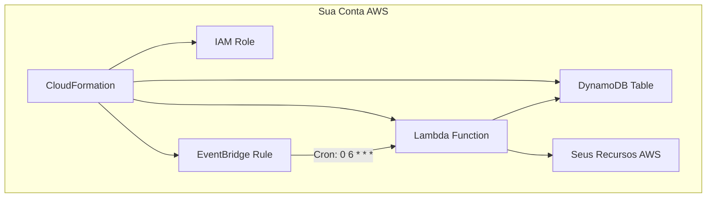

# FinOps AWS - Manual do Usuário

## Índice

1. [Introdução](#1-introdução)
2. [Requisitos](#2-requisitos)
3. [Instalação e Configuração](#3-instalação-e-configuração)
4. [Primeiro Uso](#4-primeiro-uso)
5. [Execução Local](#5-execução-local)
6. [Execução no AWS Lambda](#6-execução-no-aws-lambda)
7. [Interpretando Resultados](#7-interpretando-resultados)
8. [Configurações Avançadas](#8-configurações-avançadas)
9. [Troubleshooting](#9-troubleshooting)
10. [FAQ](#10-faq)

---

## 1. Introdução

### 1.1 Bem-vindo ao FinOps AWS

O FinOps AWS é sua ferramenta para **economizar dinheiro na AWS**. Ele analisa automaticamente seus recursos e encontra oportunidades de redução de custos.

### 1.2 O que você pode fazer

```mermaid
graph LR
    A[Você] --> B[FinOps AWS]
    B --> C[Ver quanto está gastando]
    B --> D[Encontrar desperdícios]
    B --> E[Receber recomendações]
    B --> F[Economizar dinheiro]
    
    style F fill:#4caf50
```



### 1.3 Para quem é este manual

- **Administradores de Cloud**: Configuração e execução
- **Engenheiros DevOps**: Análise e otimização
- **Gestores de TI**: Relatórios e dashboards
- **Equipe Financeira**: Controle de custos

---

## 2. Requisitos

### 2.1 Requisitos Mínimos

| Requisito | Especificação |
|-----------|---------------|
| **Python** | 3.11 ou superior |
| **AWS Account** | Com permissões de leitura |
| **IAM User/Role** | Ver seção de permissões |
| **Memória** | 512MB mínimo |
| **Rede** | Acesso às APIs AWS |

### 2.2 Permissões AWS Necessárias

Para funcionar corretamente, o FinOps AWS precisa de permissões de **leitura** nos serviços que você deseja analisar.

**Permissão Mínima Recomendada:**

```
- ec2:Describe*
- rds:Describe*
- s3:GetBucket*, s3:List*
- lambda:List*, lambda:Get*
- cloudwatch:GetMetric*
- ce:GetCostAndUsage
- ce:GetReservation*
```

> **Nota de Segurança**: O FinOps AWS **nunca modifica** seus recursos. Todas as operações são apenas de leitura.

---

## 3. Instalação e Configuração

### 3.1 Passo 1: Obter o Código

```bash
# Clone o repositório
git clone https://github.com/seu-org/finops-aws.git
cd finops-aws
```

### 3.2 Passo 2: Instalar Dependências

```bash
# Instalar pacotes Python
pip install -r requirements.txt
```

**Dependências instaladas:**
- `boto3` - SDK AWS para Python
- `pytest` - Framework de testes
- `moto` - Mock de serviços AWS

### 3.3 Passo 3: Configurar Credenciais AWS

**Opção A: Variáveis de Ambiente (Recomendado)**

```bash
export AWS_ACCESS_KEY_ID="sua-access-key"
export AWS_SECRET_ACCESS_KEY="sua-secret-key"
export AWS_REGION="us-east-1"
```

**Opção B: Arquivo de Credenciais**

Crie ou edite o arquivo `~/.aws/credentials`:

```ini
[default]
aws_access_key_id = sua-access-key
aws_secret_access_key = sua-secret-key
```

**Opção C: IAM Role (Para Lambda/EC2)**

Se estiver executando em uma instância EC2 ou Lambda, use uma IAM Role anexada ao recurso.

### 3.4 Verificar Configuração

```bash
# Testar conexão com AWS
python -c "import boto3; print(boto3.client('sts').get_caller_identity())"
```

Saída esperada:
```json
{
    "UserId": "AIDAXXXXXXXXXX",
    "Account": "123456789012",
    "Arn": "arn:aws:iam::123456789012:user/seu-usuario"
}
```

---

## 4. Primeiro Uso

### 4.1 Fluxo de Primeiro Uso

```mermaid
flowchart TD
    A[Início] --> B[Configurar Credenciais]
    B --> C[Executar Demo Local]
    C --> D{Funcionou?}
    D -->|Sim| E[Analisar Resultados]
    D -->|Não| F[Verificar Troubleshooting]
    F --> B
    E --> G[Configurar Lambda]
    G --> H[Agendar Execução]
    H --> I[Monitorar Relatórios]
```



### 4.2 Execução Rápida de Teste

```bash
# Executar demo com serviços mockados (não requer AWS real)
python run_local_demo.py 1
```

**Opções do menu:**
1. **Demo com Mock** - Testa sem usar AWS real
2. **Executar Testes** - Roda suite de testes
3. **Ambos** - Demo + Testes

### 4.3 Primeira Análise Real

```bash
# Executar análise com sua conta AWS
python run_with_aws.py
```

---

## 5. Execução Local

### 5.1 Modos de Execução

```mermaid
graph TD
    A[run_local_demo.py] --> B{Modo}
    B -->|1| C[Demo Mockado]
    B -->|2| D[Testes Unitários]
    B -->|3| E[Demo + Testes]
    
    F[run_with_aws.py] --> G[Análise Real]
    G --> H[Conecta à sua conta AWS]
    H --> I[Analisa recursos reais]
    I --> J[Gera recomendações]
```



### 5.2 Executando Demo Mockado

```bash
$ python run_local_demo.py 1

================================================================================
FinOps AWS - Local Demo Runner
================================================================================

⚠ No AWS credentials detected
  The demo will use mocked AWS services (moto library)

Running Lambda Handler Demo...
================================================================================

✓ EC2 Service: Healthy
  - 5 instances analyzed
  - 2 recommendations generated

✓ RDS Service: Healthy
  - 3 databases analyzed
  - 1 recommendation generated

✓ S3 Service: Healthy
  - 10 buckets analyzed
  - 4 recommendations generated

================================================================================
Demo completed successfully!
```

### 5.3 Executando com AWS Real

```bash
$ python run_with_aws.py

================================================================================
  FinOps AWS - Análise de Custos e Otimização
  Execução Local com Conta AWS Real
================================================================================

Verificando credenciais AWS...
  ✓ Credenciais válidas
  ✓ Conta: 123456789012
  ✓ Região: us-east-1

Iniciando análise...
  [====================] 100% - 252 serviços analisados

Resultados:
  Total de recursos: 1,234
  Custo estimado: $45,234.56/mês
  Economia potencial: $8,500.00/mês (19%)

Relatório salvo em: output/report_20251127.json
================================================================================
```

### 5.4 Executando Testes

```bash
# Todos os testes
python run_local_demo.py 2

# Ou diretamente com pytest
pytest tests/unit/ -v
```

**Saída esperada:**
```
============================= test session starts =============================
collected 1842 items

tests/unit/test_cleanup_manager.py ............................ [  1%]
tests/unit/test_cost_service.py ............................... [  2%]
...
============================= 1841 passed, 1 skipped ==========================
```

---

## 6. Execução no AWS Lambda

### 6.1 Arquitetura de Deploy



### 6.2 Passo a Passo: Deploy para Lambda

**Passo 1: Preparar o pacote**

```bash
# Criar pacote de deployment
./deploy.sh package
```

**Passo 2: Configurar parâmetros**

Edite `infrastructure/cloudformation-template.yaml`:

```yaml
Parameters:
  Environment:
    Type: String
    Default: production
  
  ScheduleExpression:
    Type: String
    Default: cron(0 6 * * ? *)  # Diariamente às 6h UTC
  
  MemorySize:
    Type: Number
    Default: 1024
  
  Timeout:
    Type: Number
    Default: 900  # 15 minutos
```

**Passo 3: Deploy via CloudFormation**

```bash
# Deploy completo
./deploy.sh deploy

# Ou via AWS CLI
aws cloudformation deploy \
  --template-file infrastructure/cloudformation-template.yaml \
  --stack-name finops-aws-production \
  --capabilities CAPABILITY_IAM
```

### 6.3 Verificar Deploy

```bash
# Verificar status da stack
aws cloudformation describe-stacks --stack-name finops-aws-production

# Testar Lambda manualmente
aws lambda invoke \
  --function-name finops-aws-handler \
  --payload '{}' \
  response.json

cat response.json
```

### 6.4 Configurar Agendamento

O EventBridge já é configurado pelo CloudFormation. Para alterar:

```bash
# Ver regra atual
aws events describe-rule --name finops-aws-schedule

# Alterar para semanal (domingos às 8h)
aws events put-rule \
  --name finops-aws-schedule \
  --schedule-expression "cron(0 8 ? * SUN *)"
```

**Exemplos de Cron:**
| Expressão | Frequência |
|-----------|------------|
| `cron(0 6 * * ? *)` | Diário às 6h UTC |
| `cron(0 8 ? * SUN *)` | Domingos às 8h UTC |
| `cron(0 0 1 * ? *)` | Dia 1 de cada mês |
| `rate(4 hours)` | A cada 4 horas |

---

## 7. Interpretando Resultados

### 7.1 Estrutura do Relatório

```json
{
  "execution_id": "exec-20251127-143022",
  "timestamp": "2025-11-27T14:30:22Z",
  "status": "completed",
  "summary": {
    "total_resources": 1234,
    "total_cost_monthly": 45234.56,
    "potential_savings": 8500.00,
    "savings_percentage": 18.8,
    "services_analyzed": 252,
    "recommendations_count": 47
  },
  "cost_breakdown": {...},
  "recommendations": [...],
  "services": {...}
}
```

### 7.2 Entendendo o Resumo

```
╔═══════════════════════════════════════════════════════════════╗
║                    RESUMO DA ANÁLISE                          ║
╠═══════════════════════════════════════════════════════════════╣
║                                                               ║
║  📊 RECURSOS                    💰 CUSTOS                     ║
║  ┌─────────────────────┐       ┌─────────────────────┐       ║
║  │ Total: 1,234        │       │ Mensal: $45,234     │       ║
║  │ EC2: 156            │       │ Tendência: ↑12%     │       ║
║  │ RDS: 23             │       │ Previsão: $48,500   │       ║
║  │ S3: 89 buckets      │       │                     │       ║
║  └─────────────────────┘       └─────────────────────┘       ║
║                                                               ║
║  💡 ECONOMIA POTENCIAL          ⚠️ RECOMENDAÇÕES             ║
║  ┌─────────────────────┐       ┌─────────────────────┐       ║
║  │ Total: $8,500/mês   │       │ Alta Prioridade: 12 │       ║
║  │ Percentual: 18.8%   │       │ Média: 25           │       ║
║  │ ROI: 2 semanas      │       │ Baixa: 10           │       ║
║  └─────────────────────┘       └─────────────────────┘       ║
║                                                               ║
╚═══════════════════════════════════════════════════════════════╝
```

### 7.3 Tipos de Recomendações

#### 🔴 Alta Prioridade
Ação imediata recomendada. Alto impacto financeiro.

**Exemplo:**
```
RECOMENDAÇÃO: Desligar instâncias ociosas
- Recurso: i-0abc123def456 (m5.xlarge)
- Problema: CPU média < 1% nos últimos 30 dias
- Economia: $142.00/mês
- Ação: Terminar instância ou investigar uso
```

#### 🟡 Média Prioridade
Ação em 30 dias. Impacto moderado.

**Exemplo:**
```
RECOMENDAÇÃO: Adquirir Reserved Instance
- Recurso: i-0def456abc789 (r5.2xlarge)
- Problema: Uso constante (24/7) há 6+ meses
- Economia: $450.00/mês com RI 1-year
- Ação: Avaliar compromisso e adquirir RI
```

#### 🟢 Baixa Prioridade
Ação quando conveniente. Impacto menor.

**Exemplo:**
```
RECOMENDAÇÃO: Mover objetos S3 para Glacier
- Recurso: bucket-logs-antigos
- Problema: 500GB não acessados há 180 dias
- Economia: $10.00/mês
- Ação: Configurar lifecycle policy
```

### 7.4 Breakdown de Custos

```mermaid
pie title Distribuição de Custos por Serviço
    "EC2" : 40
    "RDS" : 28
    "S3" : 12
    "Lambda" : 8
    "CloudFront" : 5
    "Outros" : 7
```



---

## 8. Configurações Avançadas

### 8.1 Variáveis de Ambiente

| Variável | Descrição | Padrão |
|----------|-----------|--------|
| `AWS_REGION` | Região AWS principal | `us-east-1` |
| `LOG_LEVEL` | Nível de log (DEBUG, INFO, WARN) | `INFO` |
| `DYNAMODB_TABLE` | Nome da tabela de estado | `finops-state` |
| `EXECUTION_TIMEOUT` | Timeout em segundos | `840` |
| `MAX_RETRIES` | Tentativas de retry | `3` |
| `SERVICES_TO_ANALYZE` | Lista de serviços (CSV) | Todos |

### 8.2 Configurar Serviços Específicos

Para analisar apenas alguns serviços:

```bash
export SERVICES_TO_ANALYZE="ec2,rds,s3,lambda"
python run_with_aws.py
```

### 8.3 Configurar Multi-Região

```bash
# Analisar múltiplas regiões
export AWS_REGIONS="us-east-1,us-west-2,eu-west-1"
python run_with_aws.py
```

### 8.4 Configurar Multi-Conta

Para análise cross-account, configure roles assumíveis:

```bash
export CROSS_ACCOUNT_ROLES="arn:aws:iam::111111111111:role/FinOpsRole,arn:aws:iam::222222222222:role/FinOpsRole"
python run_with_aws.py
```

---

## 9. Troubleshooting

### 9.1 Problemas Comuns

#### Erro: "No credentials found"

```
❌ NENHUMA CREDENCIAL AWS ENCONTRADA!
```

**Solução:**
1. Verifique se as variáveis de ambiente estão configuradas
2. Ou verifique o arquivo `~/.aws/credentials`
3. Execute: `aws sts get-caller-identity` para testar

#### Erro: "Access Denied"

```
botocore.exceptions.ClientError: An error occurred (AccessDenied)
```

**Solução:**
1. Verifique as permissões IAM do usuário/role
2. Adicione as políticas necessárias (ver seção 2.2)
3. Verifique se não há SCPs bloqueando

#### Erro: "Timeout"

```
Task timed out after 900 seconds
```

**Solução:**
1. Aumente o timeout do Lambda (máx 15 min)
2. Reduza o número de serviços analisados
3. Considere execução em batch

#### Erro: "Rate exceeded"

```
botocore.exceptions.ClientError: Rate exceeded
```

**Solução:**
1. O retry automático já trata isso
2. Se persistir, aumente o delay entre chamadas
3. Solicite aumento de limites à AWS

### 9.2 Verificar Logs

**Logs Locais:**
```bash
# Ver últimas linhas do log
tail -f /var/log/finops-aws.log
```

**Logs no CloudWatch:**
```bash
# Ver logs do Lambda
aws logs tail /aws/lambda/finops-aws-handler --follow
```

### 9.3 Modo Debug

```bash
# Ativar logs detalhados
export LOG_LEVEL=DEBUG
python run_with_aws.py
```

---

## 10. FAQ

### Perguntas Frequentes

**P: O FinOps AWS modifica meus recursos?**
> R: Não. Todas as operações são apenas de leitura. A ferramenta nunca cria, modifica ou deleta recursos.

**P: Quanto custa executar o FinOps AWS?**
> R: O custo é mínimo:
> - Lambda: ~$0.50/mês (execução diária)
> - DynamoDB: ~$1.00/mês (estado)
> - API calls: ~$2.00/mês
> - **Total estimado: $3-5/mês**

**P: Posso analisar apenas alguns serviços?**
> R: Sim. Use a variável `SERVICES_TO_ANALYZE` para especificar quais serviços analisar.

**P: Como integrar com Slack/Teams?**
> R: Configure um SNS topic e adicione uma assinatura Lambda que envia para Slack/Teams.

**P: Suporta AWS GovCloud/China?**
> R: Sim, configure a região apropriada e endpoints.

**P: Como exportar para Excel?**
> R: O relatório JSON pode ser convertido com ferramentas como `jq` ou importado diretamente em ferramentas de BI.

**P: Qual a frequência recomendada de execução?**
> R: Diária para monitoramento ativo. Semanal para ambientes estáveis.

**P: Posso customizar as recomendações?**
> R: Sim. Cada serviço tem thresholds configuráveis (CPU, uso, etc).

---

## Suporte

### Recursos Adicionais

- 📖 [Guia Técnico](TECHNICAL_GUIDE.md) - Detalhes de arquitetura
- 📊 [Guia Funcional](FUNCTIONAL_GUIDE.md) - Capacidades da solução
- 📋 [Catálogo de Serviços](APPENDIX_SERVICES.md) - Lista completa de serviços

### Contato

- **Issues**: Abra uma issue no repositório GitHub
- **Email**: suporte@finops-aws.example.com
- **Slack**: #finops-aws-support

---

*Manual do Usuário - FinOps AWS*
*Versão: 1.0*
*Última atualização: Novembro 2025*
